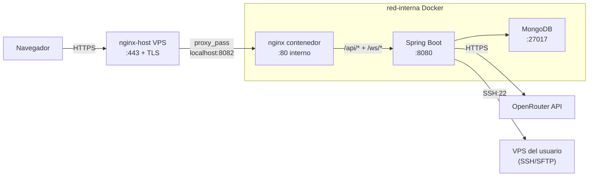

# AutoDeploy

Panel SaaS de gestión y despliegue automático para servidores VPS. Permite conectar tus VPS por SSH, desplegar aplicaciones desde Git o ZIP, configurar backups, firewall, DNS y SSL, monitorizar métricas en vivo y ejecutar comandos con un asistente IA — todo desde el navegador.

[](https://github.com/Kruhale/AutoDeploy/actions/workflows/ci.yml)
[](https://github.com/Kruhale/AutoDeploy/actions/workflows/cd.yml)


**Producción**: https://autodeploy.kruhale.com


**Figma**: https://www.figma.com/design/sNOYtZb7Oclv3pFLv5xY4Z/AutoDeployService?node-id=338-18&t=MWyZEmhlbzjXqj2D-1


**GitHub Project**: https://github.com/users/Kruhale/projects/2

## Stack tecnológico

| Capa | Tecnología |
|------|------------|
| Frontend | Angular 20 (standalone components, signals, lazy routes), ngx-translate (5 idiomas) |
| Servidor web | nginx (reverse proxy + TLS terminator + estáticos) |
| Backend | Spring Boot 3.4 sobre Java 21 (record DTOs, Spring Security, Spring Data MongoDB) |
| Base de datos | MongoDB 8 (Docker oficial) |
| Comunicación tiempo real | WebSocket (Spring) + xterm.js |
| SSH/SFTP a VPS | Apache MINA SSHD 2.12.1 |
| DNS lookups | dnsjava 3.6.2 |
| IA | OpenRouter API (modelo por defecto: `google/gemini-2.5-pro`) |
| Documentación API | springdoc-openapi (Swagger UI) |
| Tests | Karma + Jasmine (unit), Playwright (E2E) |
| CI/CD | GitHub Actions + GitHub Container Registry |

## Arquitectura



El VPS ya tiene un nginx-host gestionando otras webs y los certificados Let's Encrypt centralizados. AutoDeploy se publica en un puerto interno del host (`8082` por defecto) y el nginx-host hace `proxy_pass` desde el dominio público. Backend y MongoDB no se exponen nunca al exterior. Detalle completo en [`docs/ARCHITECTURE.md`](docs/ARCHITECTURE.md).

## Quick start

### Requisitos

- Docker 24+ y Docker Compose v2.
- 2 GB RAM y 3 GB disco libres.

### Levantar el stack

```bash
git clone https://github.com/Kruhale/AutoDeploy.git
cd AutoDeploy
cp .env.example .env
# Editar .env con los valores reales (ver tabla abajo)
docker compose -f docker-compose.prod.yml up -d --build
```

Espera ~30 s a que los cuatro servicios (`mongodb`, `backend`, `sandbox-ssh`, `frontend`) estén `(healthy)`:

```bash
docker compose -f docker-compose.prod.yml ps
```

Abre `http://localhost:8082/` en el navegador (en local sin nginx-host por delante).
En producción con dominio + nginx-host: `https://autodeploy.kruhale.com/` con cert Let's Encrypt válido.

### Verificación rápida (local sin nginx-host)

```bash
curl -I http://localhost:8082/                  # HTTP/1.1 200
curl -s http://localhost:8082/api/estado | jq   # {"success":true,"data":{"estadoGeneral":"UP",...}}
curl -s http://localhost:8082/actuator/health   # {"status":"UP","groups":["liveness","readiness"]}
```

### Verificación rápida (producción real)

```bash
curl -I https://autodeploy.kruhale.com/                # HTTP/2 200, server: nginx
curl -s https://autodeploy.kruhale.com/api/estado | jq # estadoGeneral: UP, 6 servicios operativos
```

## Variables de entorno

| Variable | Obligatoria | Descripción |
|----------|-------------|-------------|
| `AUTODEPLOY_JWT_SECRET` | Sí | Clave HMAC para firmar JWTs (mín. 256 bits Base64) |
| `AUTODEPLOY_CIFRADO_CLAVE` | Sí | Clave AES-256 para cifrar credenciales SSH en MongoDB |
| `OPENROUTER_API_KEY` | No | API key del asistente IA (https://openrouter.ai/keys) |
| `OPENROUTER_MODEL` | No | Slug del modelo. Default: `google/gemini-2.5-pro` |
| `IMAGE_TAG` | No | Tag Docker a desplegar. Default: `latest` |

Generación de secretos:

```bash
openssl rand -base64 48   # AUTODEPLOY_JWT_SECRET
openssl rand -base64 32   # AUTODEPLOY_CIFRADO_CLAVE
```

## Documentación

| Tema | Archivo |
|------|---------|
| Arquitectura completa, diagramas, ADRs | [`docs/ARCHITECTURE.md`](docs/ARCHITECTURE.md) |
| Guía de despliegue paso a paso + troubleshooting | [`docs/DEPLOY.md`](docs/DEPLOY.md) |
| API REST con ejemplos curl | [`docs/API.md`](docs/API.md) |
| Verificación de red post-despliegue | [`docs/VERIFICATION.md`](docs/VERIFICATION.md) |
| Artefactos y ficheros del proyecto | [`docs/ARTIFACTS.md`](docs/ARTIFACTS.md) |
| Evidencias reales (salidas, capturas) | [`docs/EVIDENCIA.md`](docs/EVIDENCIA.md) |
| Documentación DIW (7 secciones) | [`docs/design/DOCUMENTACION.md`](docs/design/DOCUMENTACION.md) |
| Análisis de accesibilidad (8 secciones) | [`docs/accesibilidad/README.md`](docs/accesibilidad/README.md) |
| Auditoría WCAG con Lighthouse | [`docs/accesibilidad/AUDITORIA.md`](docs/accesibilidad/AUDITORIA.md) |
| Documentación del Proyecto Final (10 secciones) | [`docs/01-introduccion.md`](docs/01-introduccion.md) → [`docs/10-conclusiones.md`](docs/10-conclusiones.md) |
| Swagger UI interactivo | `https://autodeploy.kruhale.com/swagger-ui.html` |
| OpenAPI JSON | `https://autodeploy.kruhale.com/v3/api-docs` |

## Seguridad

Las credenciales SSH y las API keys de OpenRouter se guardan cifradas con **AES-256/GCM/NoPadding** (IV aleatorio + tag de autenticación de 128 bits, clave derivada con SHA-256). El JWT se firma con **HMAC-SHA** (HS512 con el secreto recomendado de 48 bytes) y la app se niega a arrancar si `AUTODEPLOY_JWT_SECRET` o `AUTODEPLOY_CIFRADO_CLAVE` no están definidas o miden menos de 32 bytes (fail-fast).

La capa HTTP usa **CORS con whitelist** (sin `*`), Spring Security con filtros JWT, `@PreAuthorize` con verificación de ownership (`#id == authentication.name`) en 11 endpoints sensibles, y un `JwtHandshakeInterceptor` que valida el JWT en el query param antes del upgrade WebSocket. Los campos `passwordHash`, `passwordCifrada` y `claveSshPrivada` llevan `@JsonIgnore` para no filtrarse en respuestas API.

Detalle completo en la sección "Endurecimiento de seguridad" de [`docs/10-conclusiones.md`](docs/10-conclusiones.md#endurecimiento-de-seguridad).

## Desarrollo local

Si quieres iterar sin reconstruir contenedores:

```bash
# 1. Solo MongoDB en Docker
docker compose up mongodb

# 2. Backend con Maven (puerto 8080)
cd backend && ./mvnw spring-boot:run

# 3. Frontend con Angular CLI (puerto 4200, proxifica /api a localhost:8080)
cd autodeploy && npm install && npm start
```

Tests:

```bash
# Frontend unit tests
cd autodeploy && npm run test:unit

# Frontend E2E (necesita stack corriendo)
cd autodeploy && npm run e2e

# Backend tests
cd backend && ./mvnw test
```

## Estructura del proyecto

```
AutoDeploy/
├── backend/                # API REST Spring Boot
│   ├── src/main/java/com/autodeploy/  # controllers, services, models, repos
│   ├── pom.xml
│   └── Dockerfile           # multi-stage (build + JRE)
├── autodeploy/             # SPA Angular
│   ├── src/app/             # pages, components, services, guards, interceptors
│   ├── public/i18n/         # traducciones es/en/fr/de/it
│   ├── e2e/                 # tests Playwright
│   ├── nginx.conf           # reverse proxy + TLS
│   └── Dockerfile           # multi-stage (build + nginx alpine)
├── docs/                   # documentación completa
│   ├── ARCHITECTURE.md
│   ├── DEPLOY.md
│   ├── API.md
│   ├── VERIFICATION.md
│   ├── ARTIFACTS.md
│   └── EVIDENCIA.md
├── .github/workflows/      # CI/CD GitHub Actions
│   ├── ci.yml
│   └── cd.yml
├── docker-compose.yml      # Entorno dev (solo MongoDB)
├── docker-compose.prod.yml # Stack completo
├── .env.example
└── README.md
```

## Troubleshooting rápido

| Síntoma | Acción |
|---------|--------|
| `(unhealthy)` en `docker compose ps` | `docker compose logs <servicio> --tail 50` |
| 413 al subir ZIP | Subir `client_max_body_size` en `autodeploy/nginx.conf` |
| 403 en endpoints `/api/*` | Hacer login; el JWT puede haber expirado |
| Asistente IA no responde | Configurar API key OpenRouter en `/app/asistente-ia/ajustes` (cada usuario la suya) |
| Cert no válido en `http://localhost:8082` | Es esperado: el contenedor sirve sólo HTTP; el TLS lo termina el nginx-host del VPS (Let's Encrypt centralizado) |

Más detalles en [`docs/DEPLOY.md`](docs/DEPLOY.md#troubleshooting).

## Licencia

MIT. Uso libre con atribución. El texto íntegro se encuentra en el archivo `LICENSE` de la raíz del repositorio.

## Autor

Alejandro Bravo Calderón (Kruhale) — Proyecto final 2º DAW · IES Rafael Alberti, Cádiz · curso 2025/2026.
