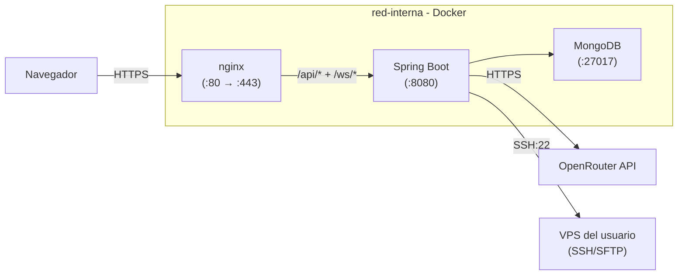

# AutoDeploy

Panel SaaS de gestión y despliegue automático para servidores VPS. Permite conectar tus VPS por SSH, desplegar aplicaciones desde Git o ZIP, configurar backups, firewall, DNS y SSL, monitorizar métricas en vivo y ejecutar comandos con un asistente IA — todo desde el navegador.

[](https://github.com/Kruhale/AutoDeploy/actions/workflows/ci.yml)
[](https://github.com/Kruhale/AutoDeploy/actions/workflows/cd.yml)


## Capturas

<!-- Las capturas se generan al desplegar (ver docs/EVIDENCIA.md) -->
- Dashboard con métricas en vivo: `docs/img/dashboard.png`
- Asistente IA ejecutando un comando: `docs/img/asistente-ia.png`
- Swagger UI: `docs/img/swagger.png`
- Workflow CI/CD en verde: `docs/img/workflow-verde.png`

## Stack tecnológico

| Capa | Tecnología |
|------|------------|
| Frontend | Angular 20 (standalone components, signals, lazy routes), ngx-translate (5 idiomas) |
| Servidor web | nginx (reverse proxy + TLS terminator + estáticos) |
| Backend | Spring Boot 3.4 sobre Java 21 (record DTOs, Spring Security, Spring Data MongoDB) |
| Base de datos | MongoDB 8 (Docker oficial) |
| Comunicación tiempo real | WebSocket (Spring) + xterm.js |
| SSH/SFTP a VPS | Apache MINA SSHD 2.12.1 |
| DNS lookups | dnsjava 3.6.2 |
| IA | OpenRouter API (modelo por defecto: openai/gpt-4o-mini) |
| Documentación API | springdoc-openapi (Swagger UI) |
| Tests | Karma + Jasmine (unit), Playwright (E2E) |
| CI/CD | GitHub Actions + GitHub Container Registry |

## Arquitectura



Solo los puertos 80 y 443 están expuestos al host. Detalle completo en [`docs/ARCHITECTURE.md`](docs/ARCHITECTURE.md).

## Quick start

### Requisitos

- Docker 24+ y Docker Compose v2.
- 2 GB RAM y 3 GB disco libres.

### Levantar el stack

```bash
git clone https://github.com/Kruhale/AutoDeploy.git
cd AutoDeploy
cp .env.example .env
# Editar .env con los valores reales (ver tabla abajo)
docker compose -f docker-compose.prod.yml up -d --build
```

Espera ~30 s a que los tres servicios estén `(healthy)`:

```bash
docker compose -f docker-compose.prod.yml ps
```

Abre `https://localhost/` en el navegador (acepta el cert autofirmado).

### Verificación rápida

```bash
curl -I http://localhost/                  # 301 → HTTPS
curl -ksI https://localhost/               # 200 (Angular SPA)
curl -ks https://localhost/api/estado | jq # {"success":true,...}
```

## Variables de entorno

| Variable | Obligatoria | Descripción |
|----------|-------------|-------------|
| `AUTODEPLOY_JWT_SECRET` | Sí | Clave HMAC para firmar JWTs (mín. 256 bits Base64) |
| `AUTODEPLOY_CIFRADO_CLAVE` | Sí | Clave AES-256 para cifrar credenciales SSH en MongoDB |
| `OPENROUTER_API_KEY` | No | API key del asistente IA (https://openrouter.ai/keys) |
| `OPENROUTER_MODEL` | No | Slug del modelo. Default: `openai/gpt-4o-mini` |
| `IMAGE_TAG` | No | Tag Docker a desplegar. Default: `latest` |

Generación de secretos:

```bash
openssl rand -base64 48   # AUTODEPLOY_JWT_SECRET
openssl rand -base64 32   # AUTODEPLOY_CIFRADO_CLAVE
```

## Documentación

| Tema | Archivo |
|------|---------|
| Arquitectura completa, diagramas, ADRs | [`docs/ARCHITECTURE.md`](docs/ARCHITECTURE.md) |
| Guía de despliegue paso a paso + troubleshooting | [`docs/DEPLOY.md`](docs/DEPLOY.md) |
| API REST con ejemplos curl | [`docs/API.md`](docs/API.md) |
| Verificación de red post-despliegue | [`docs/VERIFICATION.md`](docs/VERIFICATION.md) |
| Artefactos y ficheros del proyecto | [`docs/ARTIFACTS.md`](docs/ARTIFACTS.md) |
| Evidencias reales (salidas, capturas) | [`docs/EVIDENCIA.md`](docs/EVIDENCIA.md) |
| Swagger UI interactivo | `https://<host>/swagger-ui.html` |
| OpenAPI JSON | `https://<host>/v3/api-docs` |
| Rúbricas de evaluación | [`Rublicas.md`](Rublicas.md) |

## Desarrollo local

Si quieres iterar sin reconstruir contenedores:

```bash
# 1. Solo MongoDB en Docker
docker compose up mongodb

# 2. Backend con Maven (puerto 8080)
cd backend && ./mvnw spring-boot:run

# 3. Frontend con Angular CLI (puerto 4200, proxifica /api a localhost:8080)
cd autodeploy && npm install && npm start
```

Tests:

```bash
# Frontend unit tests
cd autodeploy && npm run test:unit

# Frontend E2E (necesita stack corriendo)
cd autodeploy && npm run e2e

# Backend tests
cd backend && ./mvnw test
```

## Estructura del proyecto

```
AutoDeploy/
├── backend/                # API REST Spring Boot
│   ├── src/main/java/com/autodeploy/  # controllers, services, models, repos
│   ├── pom.xml
│   └── Dockerfile           # multi-stage (build + JRE)
├── autodeploy/             # SPA Angular
│   ├── src/app/             # pages, components, services, guards, interceptors
│   ├── public/i18n/         # traducciones es/en/fr/de/it
│   ├── e2e/                 # tests Playwright
│   ├── nginx.conf           # reverse proxy + TLS
│   └── Dockerfile           # multi-stage (build + nginx alpine)
├── docs/                   # documentación completa
│   ├── ARCHITECTURE.md
│   ├── DEPLOY.md
│   ├── API.md
│   ├── VERIFICATION.md
│   ├── ARTIFACTS.md
│   └── EVIDENCIA.md
├── .github/workflows/      # CI/CD GitHub Actions
│   ├── ci.yml
│   └── cd.yml
├── docker-compose.yml      # Entorno dev (solo MongoDB)
├── docker-compose.prod.yml # Stack completo
├── .env.example
└── README.md
```

## Troubleshooting rápido

| Síntoma | Acción |
|---------|--------|
| `(unhealthy)` en `docker compose ps` | `docker compose logs <servicio> --tail 50` |
| 413 al subir ZIP | Subir `client_max_body_size` en `autodeploy/nginx.conf` |
| 403 en endpoints `/api/*` | Hacer login; el JWT puede haber expirado |
| Asistente IA no responde | Configurar API key OpenRouter en `/app/asistente-ia/ajustes` (cada usuario la suya) |
| "Tu conexión no es privada" en navegador | Cert autofirmado: aceptar excepción o sustituir por uno real |

Más detalles en [`docs/DEPLOY.md`](docs/DEPLOY.md#troubleshooting).

## Licencia

MIT — ver [LICENSE](LICENSE) si existe, o copia estándar de MIT en otro caso.

## Autor

Alejandro Bravo Calderón (Kruhale) — Proyecto final 2º DAW · IES Rafael Alberti, Cádiz · curso 2025/2026.
