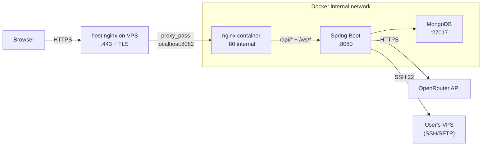

# AutoDeploy

Self-hosted management and auto-deployment panel for VPS servers. Connect your VPS over SSH, deploy applications from Git or ZIP, configure backups, firewall, DNS and SSL, monitor live metrics and run commands with an AI assistant — all from the browser.

[](https://github.com/Kruhale/AutoDeploy/actions/workflows/ci.yml)
[](https://github.com/Kruhale/AutoDeploy/actions/workflows/cd.yml)


**Live demo** → [autodeploy.kruhale.com](https://autodeploy.kruhale.com)

## Tech stack

| Layer | Technology |
|------|------------|
| Frontend | Angular 20 (standalone components, signals, lazy routes), ngx-translate (5 languages) |
| Web server | nginx (reverse proxy + TLS terminator + static assets) |
| Backend | Spring Boot 3.4 on Java 21 (record DTOs, Spring Security, Spring Data MongoDB) |
| Database | MongoDB 8 (official Docker image) |
| Real-time communication | WebSocket (Spring) + xterm.js |
| SSH/SFTP to VPS | Apache MINA SSHD 2.12.1 |
| DNS lookups | dnsjava 3.6.2 |
| AI | OpenRouter API (default model: `google/gemini-2.5-pro`) |
| API documentation | springdoc-openapi (Swagger UI) |
| Tests | Karma + Jasmine (unit), Playwright (E2E) |
| CI/CD | GitHub Actions + GitHub Container Registry |

## Architecture


```mermaid
flowchart LR
    user["Browser"]
    host_nginx["host nginx on VPS<br/>:443 + TLS"]
    nginx["nginx container<br/>:80 internal"]
    backend["Spring Boot<br/>:8080"]
    mongo["MongoDB<br/>:27017"]
    openrouter["OpenRouter API"]
    vps["User's VPS<br/>(SSH/SFTP)"]

    user -->|HTTPS| host_nginx
    host_nginx -->|"proxy_pass<br/>localhost:8082"| nginx
    nginx -->|"/api/* + /ws/*"| backend
    backend --> mongo
    backend -->|HTTPS| openrouter
    backend -->|SSH:22| vps

    subgraph docker[Docker internal network]
        nginx
        backend
        mongo
    end
```

The VPS already runs a host-level nginx serving other sites with centralized Let's Encrypt certificates. AutoDeploy is published on an internal host port (`8082` by default) and the host nginx does `proxy_pass` from the public domain. Backend and MongoDB are never exposed to the outside. Full details in [`docs/ARCHITECTURE.md`](docs/ARCHITECTURE.md).

## Quick start

### Requirements

- Docker 24+ and Docker Compose v2.
- 2 GB RAM and 3 GB free disk.

### Bring up the stack

```bash
git clone https://github.com/Kruhale/AutoDeploy.git
cd AutoDeploy
cp .env.example .env
# Edit .env with real values (see table below)
docker compose -f docker-compose.prod.yml up -d --build
```

Wait ~30 s for the four services (`mongodb`, `backend`, `sandbox-ssh`, `frontend`) to become `(healthy)`:

```bash
docker compose -f docker-compose.prod.yml ps
```

Open `http://localhost:8082/` in the browser (locally, without a host nginx in front).
In production with a domain + host nginx: `https://autodeploy.kruhale.com/` with a valid Let's Encrypt cert.

### Quick verification (local, no host nginx)

```bash
curl -I http://localhost:8082/                  # HTTP/1.1 200
curl -s http://localhost:8082/api/estado | jq   # {"success":true,"data":{"estadoGeneral":"UP",...}}
curl -s http://localhost:8082/actuator/health   # {"status":"UP","groups":["liveness","readiness"]}
```

### Quick verification (live production)

```bash
curl -I https://autodeploy.kruhale.com/                # HTTP/2 200, server: nginx
curl -s https://autodeploy.kruhale.com/api/estado | jq # estadoGeneral: UP, 6 services operational
```

## Environment variables

| Variable | Required | Description |
|----------|-------------|-------------|
| `AUTODEPLOY_JWT_SECRET` | Yes | HMAC key for signing JWTs (min. 256-bit Base64) |
| `AUTODEPLOY_CIFRADO_CLAVE` | Yes | AES-256 key to encrypt SSH credentials in MongoDB |
| `OPENROUTER_API_KEY` | No | AI assistant API key (https://openrouter.ai/keys) |
| `OPENROUTER_MODEL` | No | Model slug. Default: `google/gemini-2.5-pro` |
| `IMAGE_TAG` | No | Docker tag to deploy. Default: `latest` |

Secret generation:

```bash
openssl rand -base64 48   # AUTODEPLOY_JWT_SECRET
openssl rand -base64 32   # AUTODEPLOY_CIFRADO_CLAVE
```

## Documentation

| Topic | File |
|------|---------|
| Architecture, diagrams and design decisions | [`docs/ARCHITECTURE.md`](docs/ARCHITECTURE.md) |
| Deployment guide and troubleshooting | [`docs/DEPLOY.md`](docs/DEPLOY.md) |
| REST API reference (with curl examples) | [`docs/API.md`](docs/API.md) |
| Post-deploy network verification | [`docs/VERIFICATION.md`](docs/VERIFICATION.md) |
| Design system and UI | [`docs/design/README.md`](docs/design/README.md) |
| Accessibility (WCAG) analysis | [`docs/accessibility/README.md`](docs/accessibility/README.md) |
| Accessibility audit (Lighthouse) | [`docs/accessibility/AUDIT.md`](docs/accessibility/AUDIT.md) |
| Interactive API docs (Swagger UI) | `https://autodeploy.kruhale.com/swagger-ui.html` |
| OpenAPI spec (JSON) | `https://autodeploy.kruhale.com/v3/api-docs` |

## Security

SSH credentials and OpenRouter API keys are stored encrypted with **AES-256/GCM/NoPadding** (random IV + 128-bit authentication tag, key derived with SHA-256). JWTs are signed with **HMAC-SHA** (HS512 with the recommended 48-byte secret) and the app refuses to start if `AUTODEPLOY_JWT_SECRET` or `AUTODEPLOY_CIFRADO_CLAVE` are undefined or shorter than 32 bytes (fail-fast).

The HTTP layer uses **CORS with a whitelist** (no `*`), Spring Security with JWT filters, `@PreAuthorize` with ownership checks (`#id == authentication.name`) on 11 sensitive endpoints, and a `JwtHandshakeInterceptor` that validates the JWT in the query param before the WebSocket upgrade. The `passwordHash`, `passwordCifrada` and `claveSshPrivada` fields carry `@JsonIgnore` so they never leak in API responses.

Full details in [`SECURITY.md`](SECURITY.md).

## Local development

To iterate without rebuilding containers:

```bash
# 1. MongoDB only, in Docker
docker compose up mongodb

# 2. Backend with Maven (port 8080)
cd backend && ./mvnw spring-boot:run

# 3. Frontend with Angular CLI (port 4200, proxies /api to localhost:8080)
cd autodeploy && npm install && npm start
```

Tests:

```bash
# Frontend unit tests
cd autodeploy && npm run test:unit

# Frontend E2E (requires the stack running)
cd autodeploy && npm run e2e

# Backend tests
cd backend && ./mvnw test
```

## Project structure

```
AutoDeploy/
├── backend/                # Spring Boot REST API
│   ├── src/main/java/com/autodeploy/  # controllers, services, models, repos
│   ├── pom.xml
│   └── Dockerfile           # multi-stage (build + JRE)
├── autodeploy/             # Angular SPA
│   ├── src/app/             # pages, components, services, guards, interceptors
│   ├── public/i18n/         # es/en/fr/de/it translations
│   ├── e2e/                 # Playwright tests
│   ├── nginx.conf           # reverse proxy + TLS
│   └── Dockerfile           # multi-stage (build + nginx alpine)
├── docs/                   # full documentation
│   ├── ARCHITECTURE.md
│   ├── DEPLOY.md
│   ├── API.md
│   └── VERIFICATION.md
├── .github/workflows/      # GitHub Actions CI/CD
│   ├── ci.yml
│   └── cd.yml
├── docker-compose.yml      # Dev environment (MongoDB only)
├── docker-compose.prod.yml # Full stack
├── .env.example
└── README.md
```

## Quick troubleshooting

| Symptom | Action |
|---------|--------|
| `(unhealthy)` in `docker compose ps` | `docker compose logs <service> --tail 50` |
| 413 when uploading a ZIP | Raise `client_max_body_size` in `autodeploy/nginx.conf` |
| 403 on `/api/*` endpoints | Log in again; the JWT may have expired |
| AI assistant not responding | Set the OpenRouter API key in `/app/asistente-ia/ajustes` (per user) |
| Invalid cert on `http://localhost:8082` | Expected: the container serves HTTP only; TLS is terminated by the host nginx on the VPS (centralized Let's Encrypt) |

More details in [`docs/DEPLOY.md`](docs/DEPLOY.md#troubleshooting).

## License

MIT. Free to use with attribution. The full text is in the `LICENSE` file at the repository root.

## Author

Alejandro Bravo Calderón (Kruhale)
