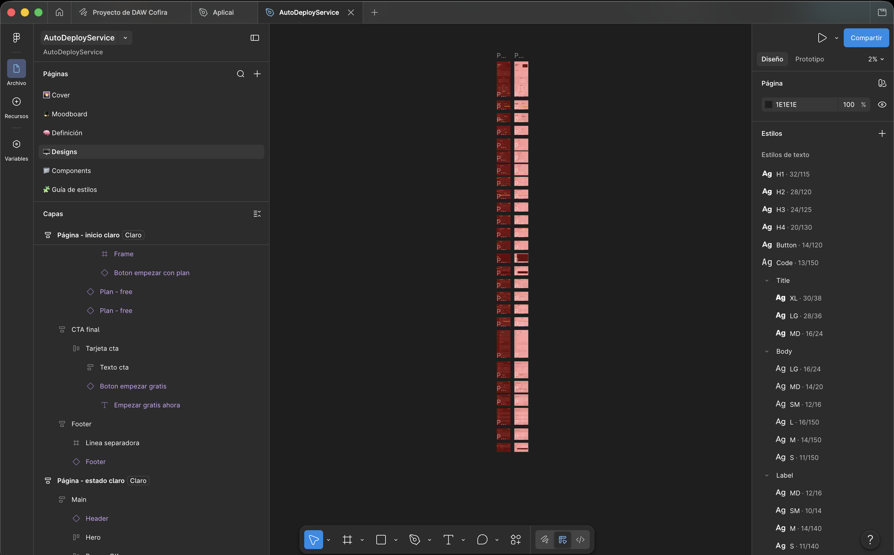
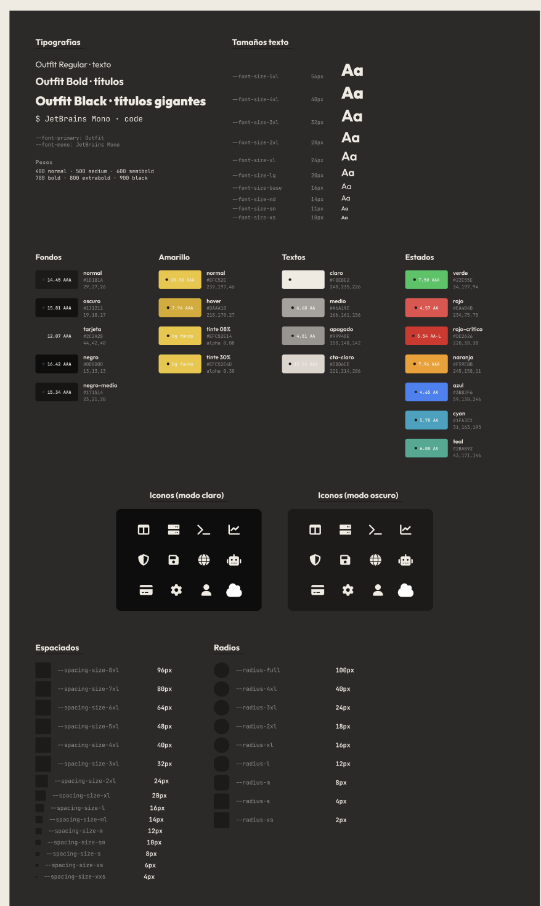
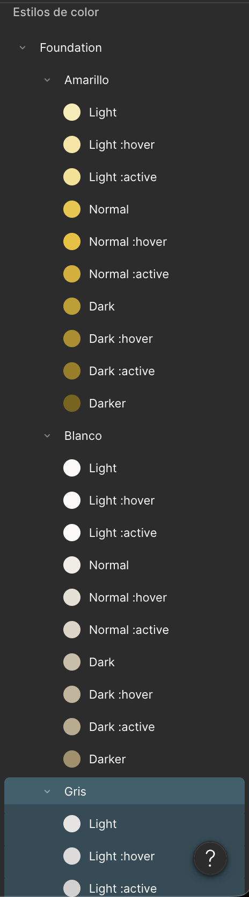
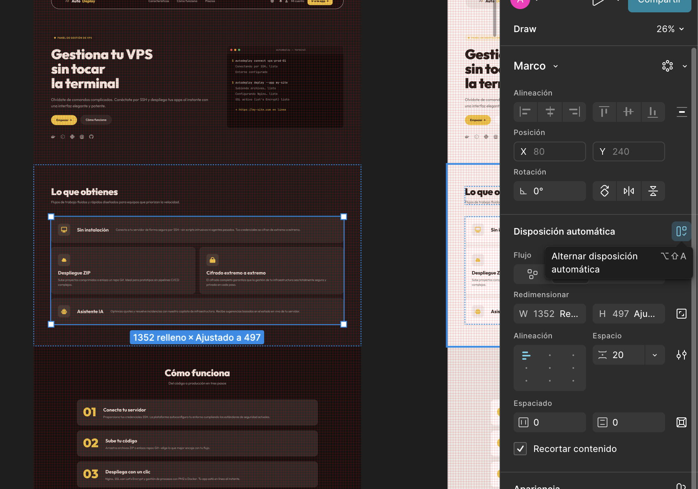
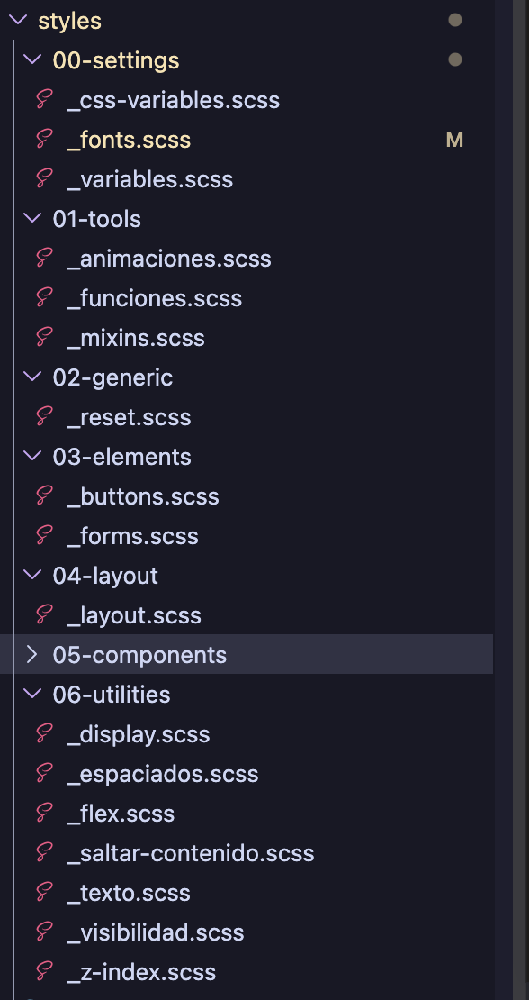

# 04 · Guía de estilos y prototipado

> Documento de detalle: [`docs/design/DOCUMENTACION.md`](./design/DOCUMENTACION.md) (7 secciones que pide Rublicas10).

## Prototipo Figma

**Enlace al prototipo:** https://www.figma.com/design/sNOYtZb7Oclv3pFLv5xY4Z/AutoDeployService?node-id=338-18&t=MWyZEmhlbzjXqj2D-1

El archivo contiene las siguientes páginas (visibles en la captura):

1. **Cover** — Portada del archivo.
2. **Moodboard** — Dirección estética con palabras clave (oscuro, profesional, cálido, técnico) y referencias visuales (Linear, Stripe, Coolify).
3. **Definición** — Sitemap completo de las rutas (públicas, autenticadas, legales) y wireframes de baja fidelidad de las pantallas core.
4. **Designs** — Pantallas finales con contenido real: bienvenida, login, dashboard, billing, asistente-ia, terminal, onboarding.
5. **Components** — Biblioteca de componentes con todos los estados (default / hover / focus / active / disabled / invalid) construidos con Auto-layout.
6. **Guía de estilos** — Paleta de color HSL con escalas semánticas, escala tipográfica de 10 niveles (Outfit), librería de iconos (FontAwesome 6) y sistema de espaciado de 15 niveles.

Todos los tokens están sistematizados como **variables de Figma**, lo que permite cambiar un color o un espaciado y propagarlo a todo el archivo sin tocar instancia por instancia. Los tokens viven en colecciones separadas (Color, Spacing, Typography) y se replican exactamente en `00-settings/_variables.scss`:

Cada componente se ha construido con **Auto-layout** y propiedades reutilizables (variantes para estados, tamaños y acentos). Así, los cambios de espaciado o tipografía se propagan a todas las instancias sin retocar a mano:

## Sistema de color

Tokens en HSL (`00-settings/_variables.scss`):

| Token | Valor | Uso |
|---|---|---|
| `--fondo-normal` | `hsl(30, 4.65%, 10.78%)` | Fondo principal del documento (oscuro). |
| `--fondo-tarjeta` | `hsl(32, 4.11%, 16.47%)` | Tarjetas, paneles, modales. |
| `--amarillo-normal` | `hsl(47, 86%, 56%)` | Acento principal (CTA, foco, indicadores). |
| `--amarillo-normal-hover` | `hsl(45, 78%, 48%)` | Estado hover del acento. |
| `--texto-claro` | `hsl(40, 33.33%, 91.37%)` | Texto principal sobre fondo oscuro (contraste WCAG AA verificado). |
| `--texto-medio` | `hsl(30, 5.08%, 63.14%)` | Subtítulos y texto secundario. |
| `--texto-apagado` | `hsl(33, 4.12%, 40%)` | Metadatos, helpers de form. |
| `--verde-normal` | `hsl(142.09, 70.56%, 45.29%)` | Estado éxito. |
| `--rojo-normal` | `hsl(0, 79.17%, 60.59%)` | Estado error. |

Modo claro definido en `.tema-claro { ... }` con overrides sólo en fondos, textos, bordes y sombras (acento y semánticos se mantienen).

## Tipografía

Familias:
- **Outfit** (Google Fonts) — cuerpo y títulos. Pesos importados: 400, 500, 600, 700, 800, 900 (`--font-weight-normal..black`).
- **JetBrains Mono** (Google Fonts, fallback Fira Code y Cascadia Code) — terminales, snippets, código monoespaciado.

Escala (`--font-size-*`):

| Token | Valor | Uso |
|---|---|---|
| `xs` | 0.625rem | Tags, badges. |
| `sm` | 0.6875rem | Metadatos. |
| `md` | 0.875rem | Botones, inputs. |
| `base` | 1rem | Cuerpo. |
| `lg` | 1.25rem | Subtítulos. |
| `xl` | 1.5rem | Títulos de sección. |
| `2xl` | 1.75rem | H2 destacados. |
| `3xl` | 2rem | H1 de página interna. |
| `4xl` | 2.5rem | Hero secundario. |
| `5xl` | 3.5rem | Hero principal. |

Línea-altura: `1.2` (títulos), `1.5` (cuerpo), `1.75` (textos largos).

Tipografía fluida: hero de bienvenida usa `font-size: fluido(2.5rem, 4.5rem)` (clamp generado por la función Sass `fluido()`).

## Espaciado

15 niveles de `--spacing-size-xxs` (0.25rem) a `--spacing-size-8xl` (6rem) en `00-settings/_variables.scss`. Reglas:

- 8-12px entre elementos muy relacionados.
- 16-24px entre elementos relacionados.
- 32-48px entre secciones.
- 64px+ entre bloques principales.

## Wireframes

Diseñados en la página "Wireframes" del prototipo Figma (no se exportan a carpeta local: viven en el propio archivo de diseño):

- Pantalla de inicio / landing
- Login y registro
- Dashboard principal
- Asistente IA
- Onboarding
- Perfil de usuario

## Componentes reutilizables

| Componente | Variantes | Estados | Archivo SCSS |
|---|---|---|---|
| `.boton` | `--primario`, `--secundario`, `--ghost`, `--peligro` | `:hover`, `:active`, `:focus-visible`, `:disabled` | `03-elements/_buttons.scss` |
| `.campo` (input/textarea/select) | — | `:focus`, `:focus-visible`, `:disabled`, `:invalid:not(:focus)` | `03-elements/_forms.scss` |
| `.toggle` (segmented) | `__opcion--activa` | `:hover`, `:focus-visible`, `:disabled` | `03-elements/_forms.scss` |
| `.interruptor` (switch) | `--activo` | `:focus-visible`, `:disabled` | `03-elements/_forms.scss` |
| `.tarjeta-servidor` | `--destacada` + container queries (peq/medio/grande) | `:hover`, `:active`, `:focus-within` | `05-components/_tarjeta-servidor.scss` |
| `.tarjeta-stat` | 5 acentos (`--primario/teal/cyan/exito/advertencia`) + container queries | `:hover`, `:active`, `:focus-within` | `05-components/_tarjeta-estadistica.scss` |
| `.tarjeta-plan` | `--destacado` + container queries | `:hover`, `:active`, `:focus-within` | `05-components/_seccion-precios.scss` |
| `.barra-lateral` | `--abierta`, `--colapsada` | `:hover`, `:focus-visible`, `[aria-current="page"]` | `05-components/_barra-lateral.scss` |
| `.tabla-sitios` | `__fila` interactiva | `:hover`, `:active`, `:focus-within` | `05-components/_tabla-sitios.scss` |
| `.spinner` | `--grande`, `--cyan`, `--verde` | keyframe `giro-spinner` 0.8 s linear | `01-tools/_animaciones.scss` |
| `app-galeria-capturas` | reutilizable con input `[capturas]` | container queries (1↔2 columnas) | `05-components/_galeria-capturas.scss` |

## Arquitectura CSS — ITCSS + BEM

El SCSS se organiza con **ITCSS** (especificidad creciente por capa) y nomenclatura **BEM** en los componentes:

| Capa | Contenido |
|---|---|
| `00-settings/` | Custom Properties (colores, espaciados, tipografías), breakpoints Sass, z-index. **Fuente única** del sistema de diseño. |
| `01-tools/` | Mixins (`@include movimiento-permitido`, `@include media-arriba(...)`), funciones (`fluido()`), animaciones globales. |
| `02-generic/` | Reset + box-sizing. |
| `03-elements/` | Estilos base de elementos HTML (`button`, `input`, `form`). |
| `04-layout/` | Estructuras macro (cabecera, sidebar, footer, grids). |
| `05-components/` | Componentes BEM (`.tarjeta-servidor`, `.pagina-firewall__regla`, `.spinner--cyan`). Estilos locales por página viven en `pages/X/X.scss`. |
| `06-utilities/` | Clases utilitarias finales (skip link `.visually-hidden`, helpers de accesibilidad) con la mayor especificidad. |

## Referencia completa

Para mixins, funciones, tokens, ITCSS y arquitectura completa, ver [`autodeploy/src/styles/README.md`](../autodeploy/src/styles/README.md) y [`docs/design/DOCUMENTACION.md`](./design/DOCUMENTACION.md).
