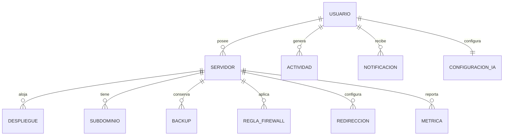
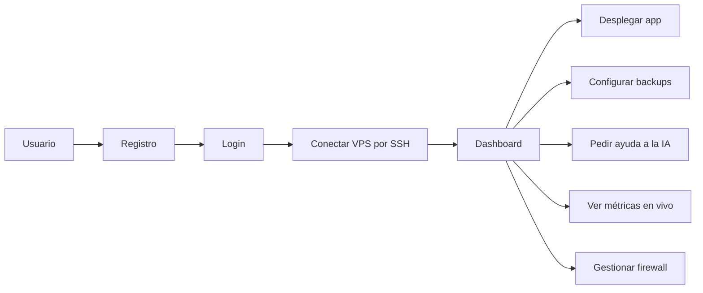
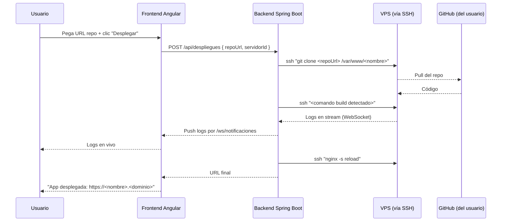
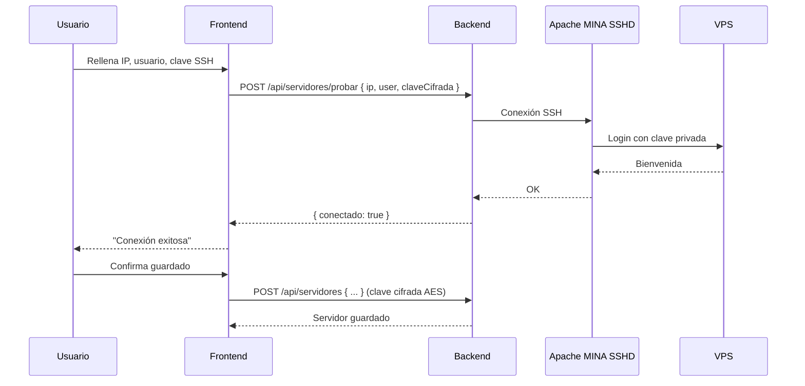
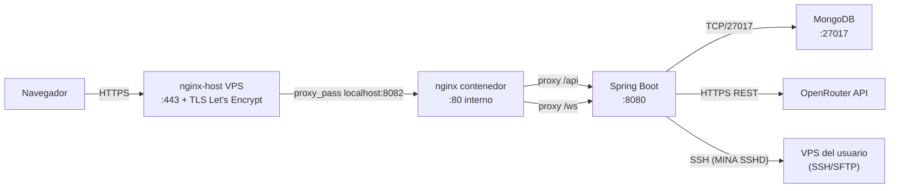

# 05 · Diseño

> Documentos técnicos complementarios:
> - [`ARCHITECTURE.md`](./ARCHITECTURE.md) — arquitectura técnica completa.
> - [`API.md`](./API.md) — endpoints REST, parámetros, ejemplos.
> - [`ARTIFACTS.md`](./ARTIFACTS.md) — ficheros y volúmenes de despliegue.

## Modelo de datos (MongoDB)

Colecciones principales:

| Colección | Documento | Relación |
|---|---|---|
| `usuarios` | id, nombre, email, password (BCrypt), plan, idioma, fechaRegistro | 1 usuario → N servidores |
| `servidores` | id, nombre, ip, usuario, passwordCifrada (AES), claveSshPrivadaCifrada, estado, fechaConexion, usuarioId | N:1 con usuario |
| `despliegues` | id, servidorId, repositorioUrl, stack, fechaDespliegue, estado, logs | N:1 con servidor |
| `subdominios` | id, servidorId, nombre, registroTipo, registroValor | N:1 con servidor |
| `backups` | id, servidorId, nombreArchivo, tamano, fechaCreacion, automatico | N:1 con servidor |
| `reglas-firewall` | id, servidorId, puerto, protocolo, accion (allow/deny), comentario | N:1 con servidor |
| `redirecciones` | id, servidorId, origen, destino, tipo | N:1 con servidor |
| `metricas-servidor` | id, servidorId, fecha, cpu, ram, disco, red | N:1 con servidor (TTL 30 días) |
| `actividad-log` | id, usuarioId, accion, detalle, fecha | N:1 con usuario |
| `notificaciones` | id, usuarioId, tipo, mensaje, leida, fecha | N:1 con usuario |
| `configuracion-asistente-ia` | id, usuarioId, modelo, temperatura, instrucciones | 1:1 con usuario |

### Diagrama entidad-relación



## Casos de uso



## Diagramas de flujo

### Desplegar una app desde Git



### Conectar un VPS por SSH



## Arquitectura de la aplicación

Resumen — para diagrama completo ver [`ARCHITECTURE.md`](./ARCHITECTURE.md).



Servicios Docker (`docker-compose.prod.yml`):

- `frontend` — nginx + estáticos Angular. Único puerto HTTP expuesto al host (8082).
- `backend` — Spring Boot. Sólo accesible por la red Docker `red-interna`.
- `mongodb` — MongoDB 8. Idem, sólo red interna.
- `sandbox-ssh` — Contenedor `linuxserver/openssh-server` que publica el puerto del contenedor `2222` en el host como `2223` (el `2222` del host lo ocupa el `sshd` del propio VPS). El backend conecta a él por la red Docker `red-interna` usando el hostname `sandbox-ssh:2222`. Sirve como VPS demo para que el asistente IA pueda probar comandos sin necesidad de un servidor real.

## Diseño de la API

Documentación completa con `springdoc-openapi` en `/swagger-ui.html` (proxificado por nginx). Resumen de endpoints principales en [`API.md`](./API.md).

Estructura general de respuesta — patrón **ApiResponse wrapper** (todos los endpoints devuelven el mismo formato):

```java
public record ApiResponse<T>(
    boolean success,
    String message,
    T data
) {}
```

Ejemplo:

```bash
curl -X POST https://autodeploy.kruhale.com/api/login \
  -H "Content-Type: application/json" \
  -d "$LOGIN_PAYLOAD"
# donde $LOGIN_PAYLOAD es un JSON con campos "email" y "password" (placeholder, no commitear contraseñas reales)
```

```json
{
  "success": true,
  "message": "Inicio de sesión correcto",
  "data": {
    "token": "eyJhbGciOiJIUzM4NCJ9...",
    "usuario": { "id": "...", "email": "demo@autodeploy.dev", "plan": "free" }
  }
}
```

WebSockets:
- `/ws/terminal` — Sesión SSH interactiva (xterm.js ↔ MINA SSHD).
- `/ws/metricas` — Streaming de CPU/RAM/disco/red cada 30 segundos.
- `/ws/notificaciones/{usuarioId}` — Notificaciones push (toast, badge contador).
