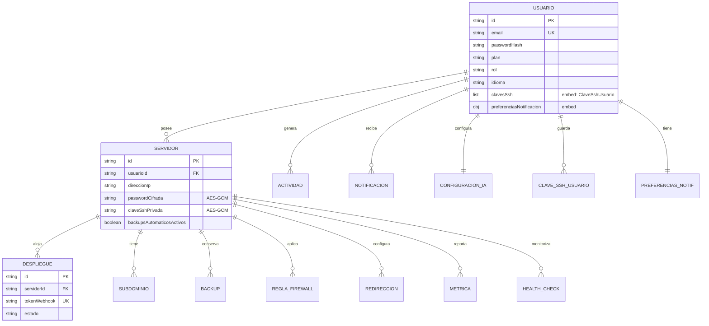
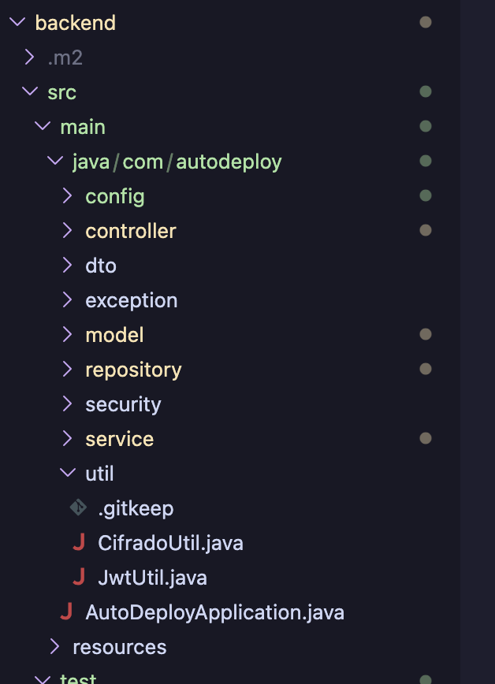
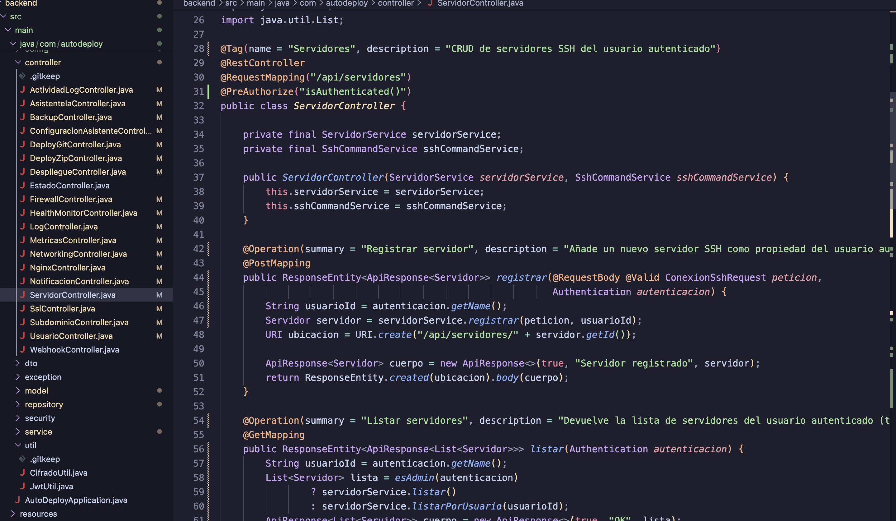
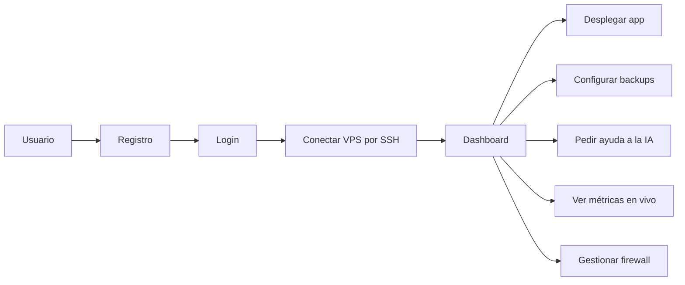
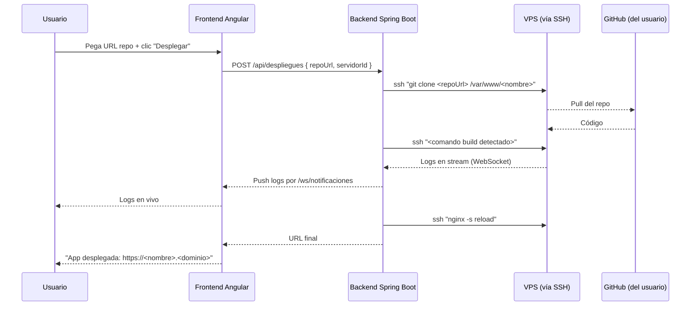
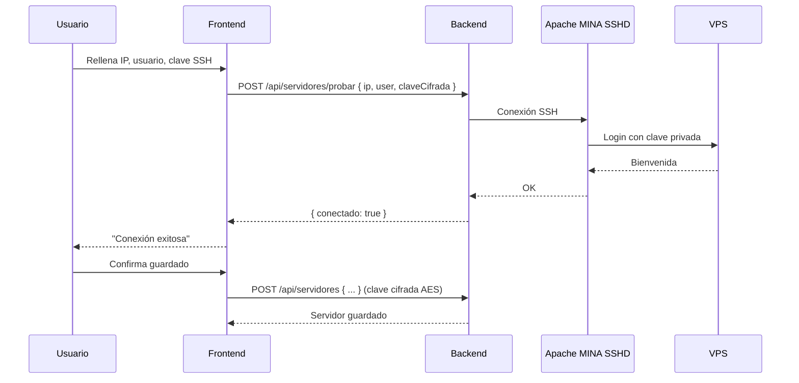
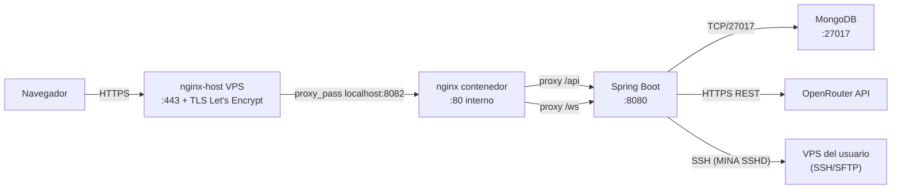

# 05 · Diseño

> Documentos técnicos complementarios:
> - [`ARCHITECTURE.md`](./ARCHITECTURE.md) — arquitectura técnica completa.
> - [`API.md`](./API.md) — endpoints REST, parámetros, ejemplos.
> - [`ARTIFACTS.md`](./ARTIFACTS.md) — ficheros y volúmenes de despliegue.

## Modelo de datos (MongoDB)

Colecciones principales:

| Colección | Documento | Relación |
|---|---|---|
| `usuarios` | id, nombre, email, password (BCrypt), plan, idioma, fechaRegistro | 1 usuario → N servidores |
| `servidores` | id, nombre, ip, usuario, passwordCifrada (AES-GCM), claveSshPrivada (AES-GCM), estado, fechaConexion, usuarioId | N:1 con usuario |
| `despliegues` | id, servidorId, repositorioUrl, stack, fechaDespliegue, estado, logs | N:1 con servidor |
| `subdominios` | id, servidorId, nombre, registroTipo, registroValor | N:1 con servidor |
| `backups` | id, servidorId, nombreArchivo, tamano, fechaCreacion, automatico | N:1 con servidor |
| `reglas-firewall` | id, servidorId, puerto, protocolo, accion (allow/deny), comentario | N:1 con servidor |
| `redirecciones` | id, servidorId, origen, destino, tipo | N:1 con servidor |
| `metricas-servidor` | id, servidorId, fecha, cpu, ram, disco, red | N:1 con servidor (TTL 30 días) |
| `actividad-log` | id, usuarioId, accion, detalle, fecha | N:1 con usuario |
| `notificaciones` | id, usuarioId, tipo, mensaje, leida, fecha | N:1 con usuario |
| `configuracion-asistente-ia` | id, usuarioId, modelo, temperatura, instrucciones | 1:1 con usuario |

### Diagrama entidad-relación



### Relaciones y justificación del diseño

**Modelo orientado a documentos (MongoDB)**: agrupamos los datos por agregado raíz (`Usuario`, `Servidor`) y guardamos referencias por id (claves foráneas) para las relaciones 1:N. Para datos pequeños que SIEMPRE se acceden con el agregado raíz (claves SSH del usuario, preferencias de notificación) usamos **documentos embebidos** en lugar de colecciones aparte para reducir consultas.

**Claves foráneas explícitas**:
- `Servidor.usuarioId` → `Usuario.id` (1:N, un usuario tiene varios servidores)
- `Despliegue.servidorId` → `Servidor.id` (1:N)
- `Backup.servidorId` → `Servidor.id` (1:N)
- `ReglaFirewall.servidorId` → `Servidor.id` (1:N)
- `Redireccion.servidorId` → `Servidor.id` (1:N)
- `Subdominio.servidorId` → `Servidor.id` (1:N)
- `MetricaServidor.servidorId` → `Servidor.id` (1:N)
- `HealthCheck.servidorId` → `Servidor.id` (1:N)
- `Notificacion.usuarioId` → `Usuario.id` (1:N)
- `ConfiguracionAsistenteIa.usuarioId` → `Usuario.id` (1:1, UK)

**Cardinalidades reales en la app**:
- 1 usuario tiene de 0 a ~20 servidores (free plan: 1, pro: 5, business: ilimitado)
- 1 servidor tiene de 0 a ~100 backups + métricas históricas (con retención automática de 7 días para `auto-*.tar.gz`)
- 1 servidor tiene de 0 a ~10 reglas de firewall típicamente
- 1 usuario tiene de 0 a ~50 notificaciones (las leídas se borran automáticamente al cabo de 30 días)

### Consultas personalizadas con `@Query`

Para superar el CRUD básico de `MongoRepository<T, String>` usamos consultas custom de MongoDB con `@Query`. Ejemplos relevantes:

```java
// ServidorRepository — filtro multivalor por usuario + estado
@Query(value = "{ 'usuarioId': ?0, 'estado': ?1 }")
List<Servidor> findByUsuarioIdAndEstado(String usuarioId, String estado);

// UsuarioRepository — usuarios con suscripción vencida en una fecha dada
@Query("{ 'fechaFinSuscripcion': { '$ne': null, '$lt': ?0 } }")
List<Usuario> findConSuscripcionVencidaAntesDe(LocalDateTime fecha);

// UsuarioRepository — usuarios en uno de dos planes (Pro o Business)
@Query("{ 'plan': { '$in': [?0, ?1] } }")
List<Usuario> findByPlanIn(String plan1, String plan2);

// MetricaServidorRepository — métricas de un servidor en un rango de fechas (para gráficos)
@Query("{ 'servidorId': ?0, 'fechaMedicion': { '$gte': ?1, '$lte': ?2 } }")
List<MetricaServidor> findByServidorIdEntreFechas(String servidorId, LocalDateTime desde, LocalDateTime hasta);

// MetricaServidorRepository — servidores con CPU saturada por encima de un umbral
@Query("{ 'cpuPorcentaje': { '$gt': ?0 } }")
List<MetricaServidor> findConCpuMayorQue(double porcentajeUmbral);

// ReglaFirewallRepository — solo las reglas allow (las que abren puertos)
@Query("{ 'servidorId': ?0, 'accion': 'allow' }")
List<ReglaFirewall> findAllowsByServidor(String servidorId);
```

También usamos métodos derivados de Spring Data: `findByUsuarioId`, `countByPlan`, `findByServidorIdOrderByFechaCreacionDesc`, paginados con `Pageable` (`Page<Servidor> findByUsuarioId(String, Pageable)`), etc.

### Índices recomendados (creación manual en producción)

Aunque MongoDB indexa `_id` por defecto, conviene añadir índices secundarios para los campos consultados con frecuencia:

```javascript
db.servidor.createIndex({ usuarioId: 1 });
db.servidor.createIndex({ usuarioId: 1, estado: 1 });
db.despliegue.createIndex({ servidorId: 1, fechaInicio: -1 });
db.despliegue.createIndex({ tokenWebhook: 1 }, { unique: true, sparse: true });
db.backup.createIndex({ servidorId: 1, fechaCreacion: -1 });
db.notificacion.createIndex({ usuarioId: 1, fechaCreacion: -1 });
db.notificacion.createIndex({ usuarioId: 1, leida: 1 });
db.metricaServidor.createIndex({ servidorId: 1, fechaMedicion: -1 });
db.usuario.createIndex({ email: 1 }, { unique: true });
```

### Cifrado de datos sensibles

`Servidor.passwordCifrada` y `Servidor.claveSshPrivada` se persisten cifradas con **AES-256-GCM** usando `CifradoUtil`. La clave maestra (`AUTODEPLOY_CIFRADO_CLAVE`) NO se almacena en MongoDB: se inyecta como variable de entorno al contenedor del backend. Si se compromete la BBDD, el atacante no puede descifrar las claves SSH.

## Estructura MVC del backend

La separación en capas se aplica de forma estricta: cada paquete tiene una responsabilidad y no se mezclan.



| Capa | Paquete | Responsabilidad |
|---|---|---|
| Vista (entrada/salida) | `controller/` | Reciben la petición HTTP, validan con `@Valid`, delegan al servicio, devuelven `ApiResponse<T>`. No contienen lógica de negocio. |
| Modelo | `model/` | Entidades de dominio (`Usuario`, `Servidor`, `Despliegue`…) anotadas con `@Document`. |
| DTOs | `dto/` | Records de Java 21 para request/response. Mantienen el modelo desacoplado de la API pública. |
| Lógica de negocio | `service/` | Reglas, validaciones cruzadas, llamadas a repositorios y a otros servicios (`SshCommandService`, `CifradoUtil`). |
| Persistencia | `repository/` | Interfaces `MongoRepository` con métodos derivados y `@Query` para consultas custom. |
| Configuración | `config/` | `SecurityConfig`, `WebSocketConfig`, `OpenApiConfig`, `MongoConfig`. |
| Excepciones | `exception/` | `GlobalExceptionHandler` con `@RestControllerAdvice` traduce excepciones a códigos HTTP estándar (400, 401, 403, 404, 409, 422, 500). |

### Autorización a nivel de método

La rúbrica exige autenticación y autorización **con roles**. Sobre la cadena Spring Security + JWT se aplica `@PreAuthorize` con SpEL para combinar rol y ownership:



- `@PreAuthorize("hasRole('ADMIN')")` — endpoints estrictamente administrativos.
- `@PreAuthorize("hasRole('ADMIN') or #id == authentication.principal")` — ownership: el dueño del recurso o un admin.
- `@PreAuthorize("isAuthenticated()")` — endpoints estándar, basta con sesión.

Esto evita el bug clásico de "el usuario A pide `/api/usuarios/<id-de-B>` y lo recibe". Cubierto con tests reales en `UsuarioControllerTest` (escenarios "sin permiso" y "con permiso").

## Casos de uso



## Diagramas de flujo

### Desplegar una app desde Git



### Conectar un VPS por SSH



## Arquitectura de la aplicación

Resumen — para diagrama completo ver [`ARCHITECTURE.md`](./ARCHITECTURE.md).



Servicios Docker (`docker-compose.prod.yml`):

- `frontend` — nginx + estáticos Angular. Único puerto HTTP expuesto al host (8082).
- `backend` — Spring Boot. Sólo accesible por la red Docker `red-interna`.
- `mongodb` — MongoDB 8. Idem, sólo red interna.
- `sandbox-ssh` — Contenedor `linuxserver/openssh-server` que publica el puerto del contenedor `2222` en el host como `2223` (el `2222` del host lo ocupa el `sshd` del propio VPS). El backend conecta a él por la red Docker `red-interna` usando el hostname `sandbox-ssh:2222`. Sirve como VPS demo para que el asistente IA pueda probar comandos sin necesidad de un servidor real.

## Diseño de la API

Documentación completa con `springdoc-openapi` en `/swagger-ui.html` (proxificado por nginx). Resumen de endpoints principales en [`API.md`](./API.md).

Estructura general de respuesta — patrón **ApiResponse wrapper** (todos los endpoints devuelven el mismo formato):

```java
public record ApiResponse<T>(
    boolean success,
    String message,
    T data
) {}
```

Ejemplo:

```bash
curl -X POST https://autodeploy.kruhale.com/api/login \
  -H "Content-Type: application/json" \
  -d "$LOGIN_PAYLOAD"
# donde $LOGIN_PAYLOAD es un JSON con campos "email" y "password" (placeholder, no commitear contraseñas reales)
```

```json
{
  "success": true,
  "message": "Inicio de sesión correcto",
  "data": {
    "token": "eyJhbGciOiJIUzM4NCJ9...",
    "usuario": { "id": "...", "email": "demo@autodeploy.dev", "plan": "free" }
  }
}
```

WebSockets:
- `/ws/terminal` — Sesión SSH interactiva (xterm.js ↔ MINA SSHD).
- `/ws/metricas` — Streaming de CPU/RAM/disco/red cada 30 segundos.
- `/ws/notificaciones/{usuarioId}` — Notificaciones push (toast, badge contador).
