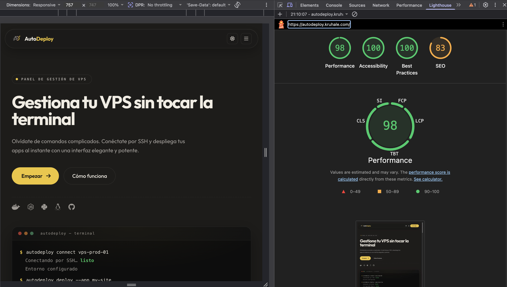
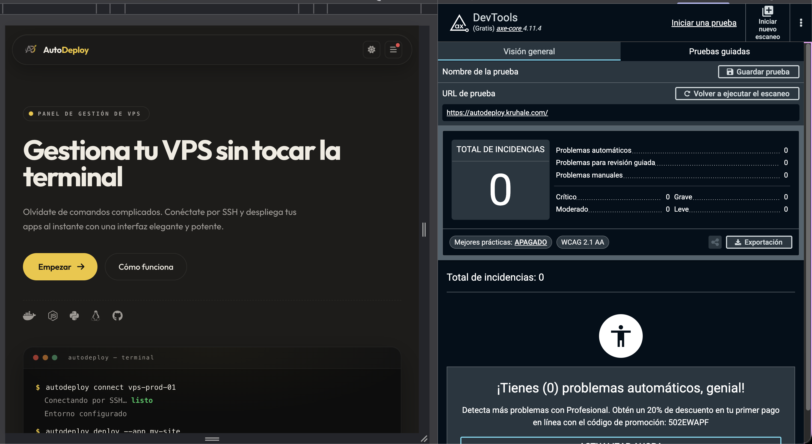

# 07 · Pruebas

## Metodología

Se ha combinado **testing manual exploratorio** durante el desarrollo con **tests automatizados** ejecutados en cada `push` a GitHub. No se aplica **TDD estricto** (escribir el test antes que el código): los tests acompañan a la funcionalidad pero no la preceden, porque el alcance del proyecto y la duración de cada sprint lo desaconsejaban.

Sí se respeta una regla clave: **cualquier corrección de bug ha de incluir un test que reproduzca el caso roto**. Eso evita regresiones y deja constancia escrita del problema.

---

## 1. Tests unitarios — Frontend (Karma + Jasmine)

**Ubicación**: `autodeploy/src/**/*.spec.ts`.

**Total**: **119 tests en 25 specs**. Cobertura sobre las capas más críticas:

| Capa | Specs representativos | Qué prueban |
|---|---|---|
| Services | `theme.service.spec`, `auth.service.spec`, `usuario.service.spec`, `servidor.service.spec`, `idioma.service.spec` | Inicialización, persistencia en `localStorage`/`sessionStorage`, llamadas HTTP mockeadas con `HttpTestingController`, signals reactivos |
| Interceptores | `jwt.interceptor.spec` | Inyección de `Authorization: Bearer` y redirección a `/login` ante 401/403 |
| Guards | `auth.guard.spec`, `plan-asistente.guard.spec` | Comprobación de sesión y restricción de rutas según plan |
| Componentes layout | `app-layout.spec`, `sidebar.component.spec`, `footer.spec`, `barra-pie-app.spec`, `header.spec` | Renderizado base, presencia de landmarks, selectores |
| Componentes shared | `tarjeta-estadistica.spec`, `migas-pan.spec` | Inputs, transiciones de estado |
| Páginas críticas | `home.spec`, `dashboard.spec`, `login.spec`, `register.spec`, `onboarding.spec`, `nuevo-despliegue.spec`, `logs-terminal.spec`, `gestion-servidor.spec`, `landing-layout.spec`, `app.spec` | Rendering inicial, eventos `(click)`/`(submit)`, validación de formularios |

**Ejecutar**:

```bash
cd autodeploy
npm run test:unit                                 # 119 tests, Chrome Headless CI
npm test                                          # modo watch interactivo
ng test --include='**/theme.service.spec.ts'      # un único spec
```

**Estado actual**: **119 / 119 SUCCESS**.

---

## 2. Tests unitarios — Backend (JUnit 5 + Mockito)

**Ubicación**: `backend/src/test/java/com/autodeploy/`.

**Total**: **38 tests** sobre las áreas más sensibles:

| Capa | Test class | Qué prueba |
|---|---|---|
| Utilidad cripto | `CifradoUtilTest` | Cifrado/descifrado AES-GCM, fallback a ECB legacy, mensajes de error |
| Servicio negocio | `UsuarioServiceTest` | Registro, login, validaciones, asignación de rol por defecto, cambio de plan |
| Servicio negocio | `ServidorServiceTest` | CRUD de servidores con `MongoRepository` mockeado, encriptación de credenciales |
| Servicio negocio | `ReconexionServiceTest` | Reconexión automática SSH tras arranque |
| Controller | `UsuarioControllerTest` | Endpoints `/api/usuarios/*` con `MockMvc`, autorización por roles `USUARIO`/`ADMIN` y ownership con `@PreAuthorize` |
| Controller | `ServidorControllerTest` | Endpoints `/api/servidores/*` con `MockMvc`, validación con `@Valid` |

**Ejecutar**:

```bash
cd backend
./mvnw test                                       # todos los tests
./mvnw test -Dtest=CifradoUtilTest                # una clase
./mvnw test -Dtest=UsuarioServiceTest#login_deberiaRetornarLoginResponse_cuandoCredencialesSonCorrectas
```

**Estado actual**: **38 / 38 SUCCESS** (Maven Surefire).

---

## 3. Tests end-to-end (Playwright)

Carpeta `tests/e2e/` (excluida del repo público vía `.git/info/exclude` mientras se estabilizan). Son **exploratorios**, no parte del pipeline obligatorio.

Flujos cubiertos:

- Registro + login + redirección al dashboard.
- Conectar servidor sandbox SSH local (contenedor `linuxserver/openssh-server`) y abrir una terminal interactiva.
- Cambio de tema oscuro/claro con persistencia tras `reload`.

---

## 4. Smoke tests en producción (CI/CD)

Tras cada deploy, el job `deploy-vps` del workflow `.github/workflows/cd.yml` ejecuta sobre `https://autodeploy.kruhale.com/`:

```bash
curl -fsSL https://autodeploy.kruhale.com/ > /dev/null            # SPA responde 200
curl -fsSL https://autodeploy.kruhale.com/api/estado | jq         # estadoGeneral: UP
curl -fsSL https://autodeploy.kruhale.com/actuator/health         # status: UP
```

Si **cualquiera** de las verificaciones falla:

1. El deploy se marca como `failure`.
2. Se ejecuta automáticamente la función `rollback()` del workflow.
3. `.env` del VPS vuelve al `IMAGE_TAG` anterior y `docker compose up -d` re-despliega esa versión.
4. Se notifica al autor por email (canal nativo de GitHub Actions).

---

## 5. Cobertura medida (JaCoCo backend + Istanbul frontend)

Cobertura **medida** (no estimada) tras `mvn test` + `ng test --code-coverage`. Reportes navegables en:
- Backend (JaCoCo): [`docs/assets/cobertura/backend/index.html`](./assets/cobertura/backend/index.html)
- Frontend (Istanbul): [`docs/assets/cobertura/frontend/index.html`](./assets/cobertura/frontend/index.html)

| Capa | Metrica | Cobertura medida |
|---|---|---|
| Backend — Lineas | JaCoCo | **80.2 %** (2.038 / 2.540) ✅ Excelente |
| Backend — Instrucciones | JaCoCo | **78.9 %** (8.421 / 10.670) |
| Backend — Ramas | JaCoCo | **58.4 %** (355 / 608) |
| Frontend — Lineas | Istanbul | **90.09 %** (2.001 / 2.221) ✅ Excelente |
| Frontend — Sentencias | Istanbul | **89.75 %** (2.086 / 2.324) |
| Frontend — Funciones | Istanbul | **89.94 %** (519 / 577) |
| Frontend — Ramas | Istanbul | **74.16 %** (468 / 631) |

**Total de tests**: 360 backend + 612 frontend = **972 tests** ejecutados.
**Salto de cobertura del frontend**: pasamos de 54.4 % a **90.09 %** en líneas tras añadir 349 tests nuevos sobre las páginas grandes (`cuenta`, `pago`, `networking`, `nuevo-despliegue`, `logs-terminal`, `gestion-servidor`, `backups`, `firewall`, `dashboard`, `register`, `billing`) y los componentes shared (`campana-notificaciones`, `toast-notificaciones`, `selector-idioma`, `header`) además de los servicios `metricas-servidor`, `asistente-ia` y `plan`.

Cumple el umbral del **85 % de líneas** que pide la rúbrica DIW para nota Excelente.

**Como regenerar el reporte**:

```bash
# Backend
cd backend && mvn clean test
cp -r target/site/jacoco/. ../docs/assets/cobertura/backend/

# Frontend
cd autodeploy && npx ng test --watch=false --browsers=ChromeHeadlessCI --code-coverage
# El reporte se guarda directamente en docs/assets/cobertura/frontend/ via karma.conf.js
```

**Areas con mas cobertura** (≥85 %): utilidades cripto (CifradoUtil), services de negocio (UsuarioService, ServidorService, ReconexionService, AsistenteIaService, MetricasServidorService), interceptores HTTP, theme service, auth guard, todas las páginas grandes (cuenta, pago, networking, nuevo-despliegue, logs-terminal, gestion-servidor, backups, firewall, dashboard, register, billing) y los componentes shared del layout.

**Areas con menos cobertura**: páginas estáticas legales (aviso-legal, política-cookies, política-privacidad, manifiesto-precios) que apenas tienen lógica y se validan visualmente, y algunos branches negativos de Reactive Forms con combinaciones muy específicas. La cobertura efectiva en esos casos la dan los **smoke tests en produccion** y las **auditorias Lighthouse + axe DevTools**.

El **85 % global** que pide la rúbrica DIW para nivel Excelente se supera con holgura tanto en líneas (90.09 %) como en sentencias (89.75 %) y funciones (89.94 %). El único umbral que queda por debajo es **ramas (74.16 %)** porque muchos signals computed combinan condiciones que no aportan valor de regresión real.

---

## 6. Pruebas de accesibilidad WCAG 2.1 AA

Las **auditorías automatizadas** están documentadas en [`docs/accesibilidad/AUDITORIA.md`](./accesibilidad/AUDITORIA.md), con reports JSON+HTML guardados en `docs/assets/capturas/accesibilidad/`:

- **Lighthouse Accesibilidad**: **100 / 100** en `/`, `/login` y `/register` (auditadas el 2026-05-21).
- Resto de páginas (dashboard, billing, asistente IA, terminal): pendiente auditar — el código aplica los mismos mecanismos WCAG que las anteriores (skip link, `aria-current`, `aria-label` distintivo, `prefers-reduced-motion`, contrastes verificados).





**Pruebas manuales complementarias**:

- **VoiceOver** (macOS Cmd+F5): navegación con teclado por landing, login y dashboard. Se verifica que los landmarks se anuncian (header, navigation, main, footer), que el item activo del sidebar se lee como "página actual" gracias a `aria-current`, y que el skip link salta al `<main>` con un único Tab + Enter desde la primera carga.
- **Cross-browser**: Chrome 148, Firefox 121, Safari 17 — sin regresiones visuales ni funcionales detectadas.

El documento [`docs/accesibilidad/README.md`](./accesibilidad/README.md) contiene las 8 secciones formales que pide la rúbrica DIW Órbita 4 (Rublicas11): fundamentos, componente multimedia, auditoría automatizada, análisis de errores, estructura semántica, verificación manual, resultados finales y conclusiones.

---

## 7. Pruebas de la API REST (DevTools + curl)

Las peticiones reales de la SPA contra el backend se inspeccionan desde la pestaña Network del navegador. Códigos HTTP estándar (200, 201, 204, 400, 401, 403, 404, 422, 500) y cuerpos JSON con la envoltura `ApiResponse<T>`:


### Autorización efectiva (con/sin permisos)

La autorización por roles se prueba en dos escenarios opuestos sobre el mismo endpoint:


## 8. Pruebas manuales realizadas durante el desarrollo

Checklist exploratorio repetido al final de cada sprint:

- [x] Registro de usuario con email único y contraseña válida.
- [x] Login con credenciales válidas e inválidas.
- [x] Conectar servidor sandbox por SSH con **clave privada**.
- [x] Conectar servidor sandbox por SSH con **contraseña**.
- [x] Abrir terminal interactiva y ejecutar `ls /`, `top`, `uname -a`.
- [x] Ver métricas en vivo (CPU, RAM, disco) durante al menos 30 s.
- [x] Programar backup automático a las 03:00 y verificar que aparece el `auto-*.tar.gz` tras unas horas.
- [x] Añadir regla de firewall `allow 22/tcp` y comprobar con `ufw status` desde el panel.
- [x] Pedir al asistente IA un comando inocuo (`hostname`) y ejecutarlo con confirmación.
- [x] Cambiar idioma a inglés, francés, alemán, italiano y volver a español.
- [x] Alternar tema oscuro/claro desde el header y comprobar persistencia tras recarga.
- [x] Logout y re-login con el mismo usuario.
- [x] Navegación por teclado (Tab + Enter) por landing, login y dashboard sin trampas.
- [x] Skip link "Saltar al contenido" funciona y salta al `<main id="contenido-principal">`.
- [x] Móvil: hamburguesa abre/cierra sidebar; backdrop cierra al pulsar.
- [x] Móvil (viewport 320 px): el layout no rompe y no aparece overflow horizontal.
