# 09 · Manual de usuario

## Empezar

1. Visitar **https://autodeploy.kruhale.com**.
2. Pulsar **"Empezar gratis"** en la cabecera (móvil: abrir hamburguesa primero).
3. Completar el formulario de registro con email y contraseña (mínimo 8 caracteres).

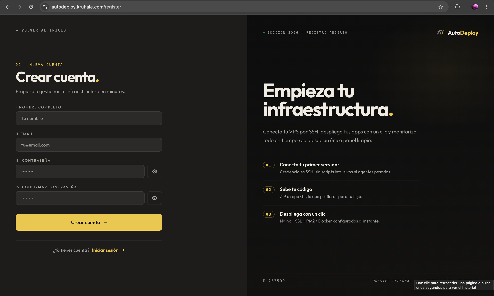

4. Iniciar sesión.

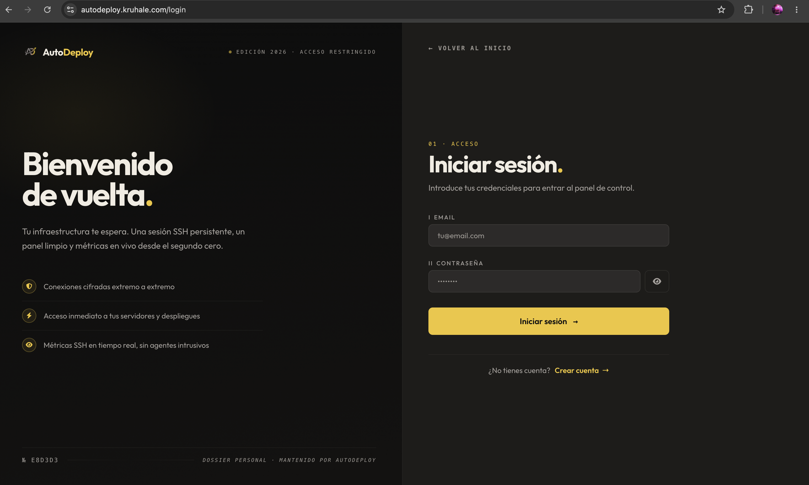

> Si el correo electrónico ya existe, el sistema avisa y propone iniciar sesión. La página de login tiene un enlace "¿Has olvidado tu contraseña?" para recuperación (envía email con un código de un solo uso).

## Conectar tu primer servidor

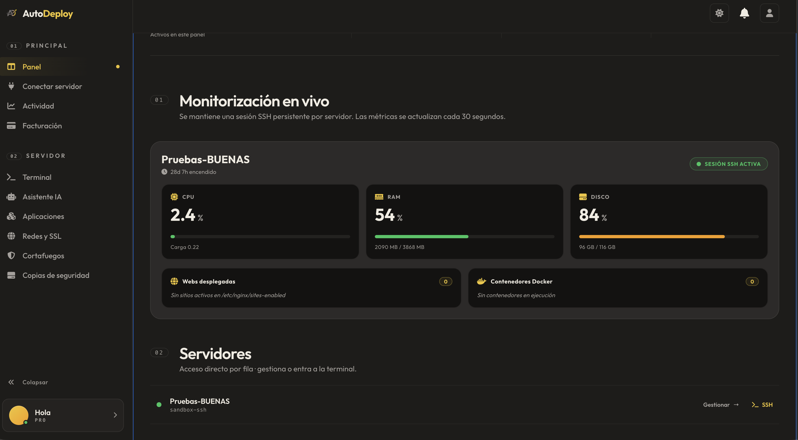

1. Tras el login, el sistema lleva directamente a **Onboarding** (`/app/onboarding`).
2. Rellenar:
   - **Nombre del servidor** (alias para identificarlo, ej. "prod-vps").
   - **IP** (ej. `203.0.113.42`).
   - **Usuario** (típicamente `root` o `ubuntu`).
   - **Método de autenticación**: contraseña *o* clave SSH privada.

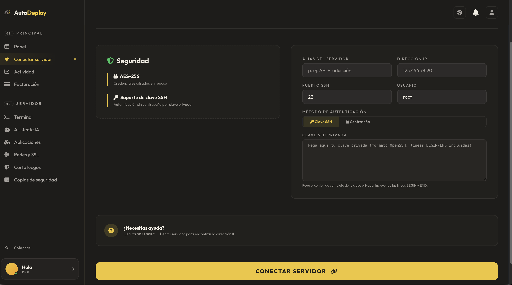

3. Pulsar **"Probar conexión"**. AutoDeploy intentará un SSH al VPS y mostrará si funciona o falla.
4. Si funciona, pulsar **"Guardar"**. Las credenciales se cifran con AES antes de persistir.

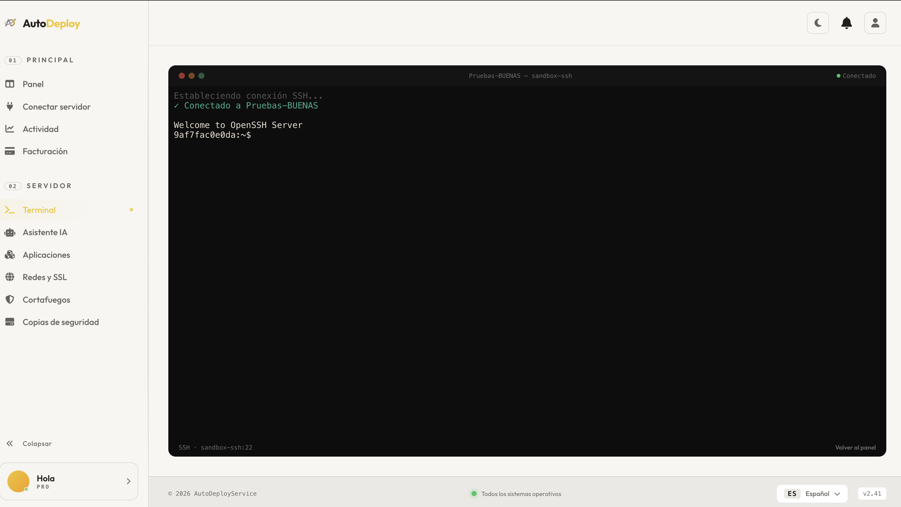

> AutoDeploy nunca guarda credenciales en texto plano. La clave de cifrado vive en el servidor del SaaS y nunca se expone al frontend.

## Panel principal (Dashboard)

`/app/dashboard` muestra:

- **Tarjeta por servidor** con indicador de estado (verde/naranja/rojo) y métricas en vivo (CPU, RAM, disco).
- **Acciones rápidas**: ir a terminal, ver métricas, configurar backups.
- **Actividad reciente**: log de las últimas acciones del usuario.

Las tarjetas usan **container queries**: en el sidebar plegado o en una columna estrecha muestran sólo el nombre + estado; al ampliar, aparecen las métricas en una rejilla de 2 columnas.

> La terminal SSH integrada permite ejecutar comandos directamente desde el navegador, con colores ANSI y latencia muy baja gracias al WebSocket persistente:

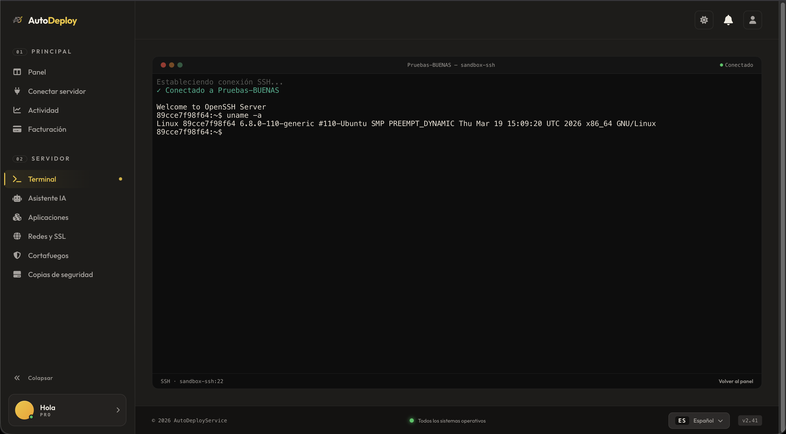

## Desplegar una aplicación

1. En el dashboard, pulsar **"Aplicaciones"** en la barra lateral.
2. **"Nuevo despliegue"** → elegir servidor.
3. Indicar URL del repositorio Git (público) o subir un ZIP.
4. AutoDeploy detecta automáticamente el stack (Node, Python, Java, Docker) y ofrece una receta de build.
5. Confirmar → ver logs en vivo en streaming.
6. Al terminar, aparece la URL pública del despliegue.

## Backups automáticos

1. Servidor → **"Copias de seguridad"**.
2. Pulsar **"Activar automáticos"**.
3. Elegir hora (formato HH:MM) → AutoDeploy instala un cron en el VPS que ejecuta `tar -czf $HOME/.autodeploy/auto-$(date +%F).tar.gz $HOME` cada día a esa hora.
4. Cada 2 minutos, AutoDeploy escanea `$HOME/.autodeploy/` por SSH y registra los nuevos `auto-*.tar.gz` en MongoDB.

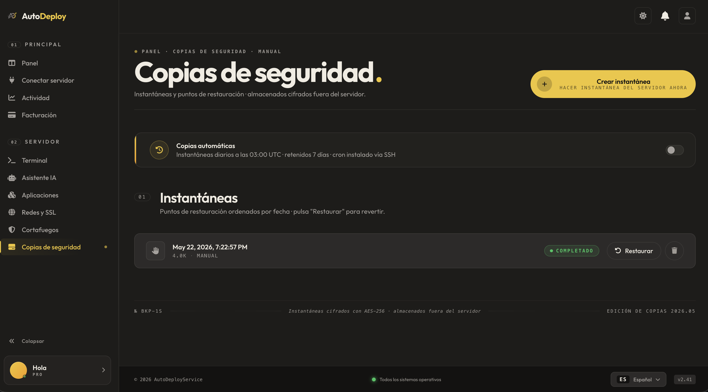

## Firewall

1. Servidor → **"Firewall"**.
2. Ver el estado de `ufw` y la lista de reglas activas con puerto, protocolo, acción y comentario.
3. Añadir nueva regla con `allow`/`deny` y el comentario que ayude a recordar para qué es.

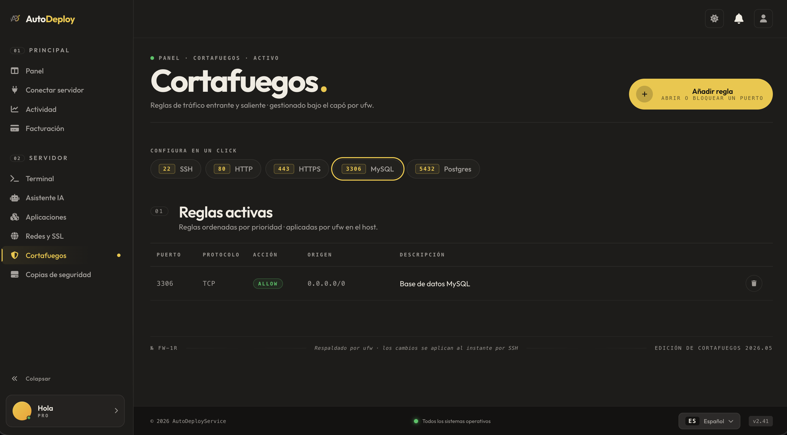

## Networking y DNS

1. Servidor → **"Networking"**.
2. Resolver registros DNS (`A`, `AAAA`, `MX`, `TXT`) de cualquier dominio desde el propio VPS gracias a `dnsjava`.
3. Configurar subdominios y redirecciones que se materializan en bloques de nginx en el VPS.

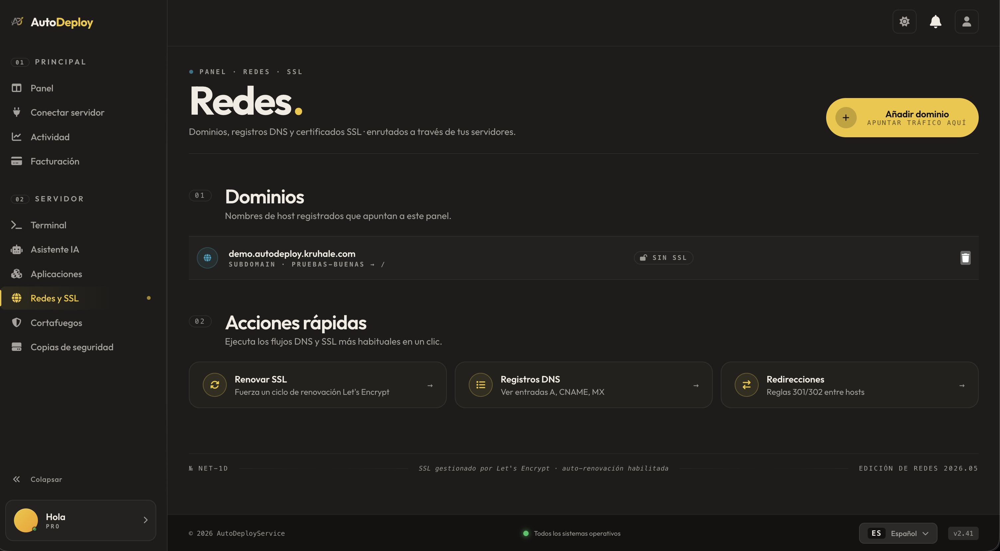

## Asistente IA

1. Sidebar → **"Asistente IA"**.
2. Caja de chat: pregunta en lenguaje natural (ej. "¿cómo abro el puerto 5432?").
3. La IA responde con la explicación y el comando sugerido.
4. Si quieres ejecutarlo, pulsa **"Ejecutar"** → AutoDeploy lo manda por SSH al servidor activo y muestra la salida.

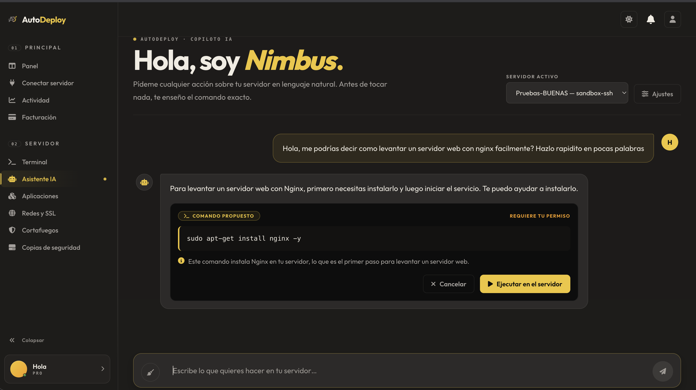

> La IA requiere un plan **Pro** o **Business**. En plan **Free** la sección está visible pero el botón "Enviar" muestra un mensaje invitando a actualizar.

## Billing y planes

Tres planes con dominios y servidores incluidos según el tier. Cambio de plan inmediato; el cobro se prorratea con la pasarela.

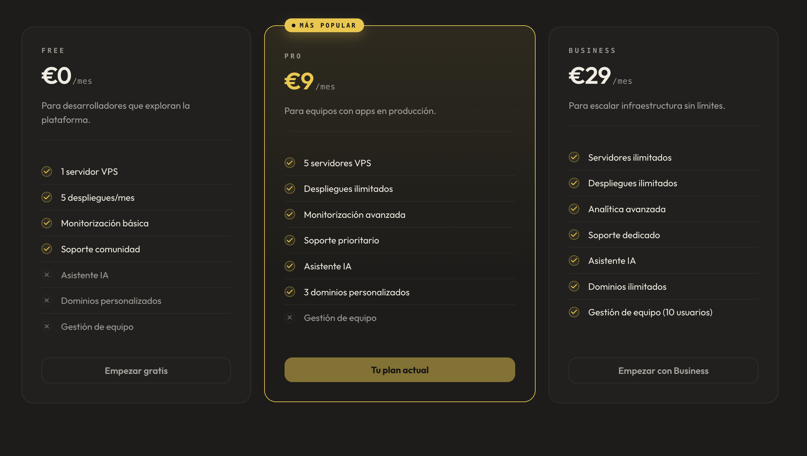

## Notificaciones

Notificaciones push servidas por el WebSocket `/ws/notificaciones/{usuarioId}`. Toast en la esquina + badge contador en la campana del header. Las leídas se borran solas a los 30 días.

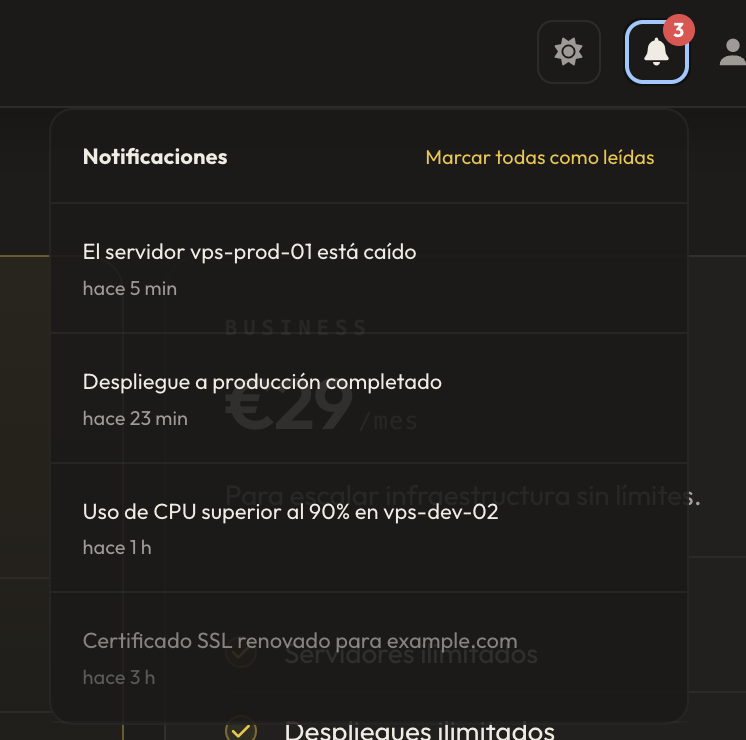

## Cambiar idioma y tema

- **Idioma**: footer → selector desplegable (es / en / fr / de / it).
- **Tema oscuro/claro**: cabecera → icono ☀/🌙 → alterna instantáneamente con fundido.

Si nunca has tocado el botón de tema, AutoDeploy sigue automáticamente la preferencia de tu sistema operativo. En cuanto pulsas el botón, tu elección prevalece.

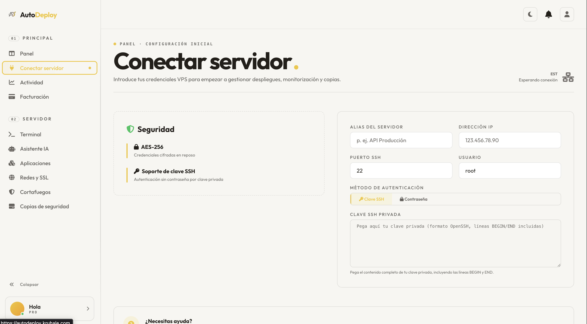

## Diseño responsive

La aplicación está probada a 320 px, 375 px, 768 px y 1024 px. La barra lateral pasa a menú hamburguesa, las tarjetas se apilan y los inputs aumentan de tamaño para tap accesible:

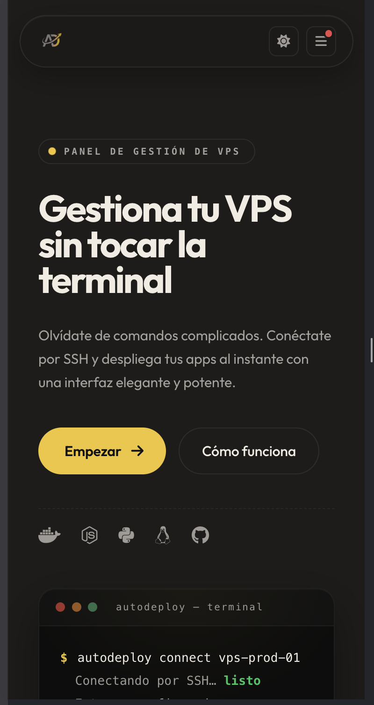

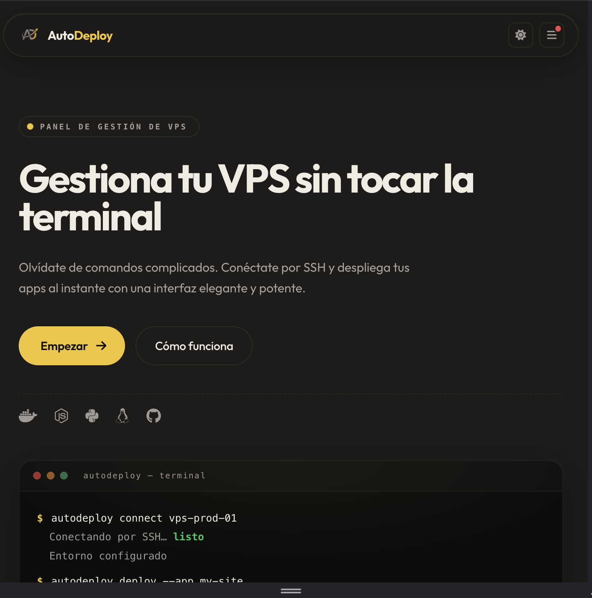

## Atajos de teclado y accesibilidad

- **Tab** desde la primera carga: el primer foco es el skip link "Saltar al contenido". Enter para saltar directamente al `<main>` y obviar el menú.
- **Tab** dentro del sidebar: navega por todos los items. El item de la página actual se anuncia como "página actual" (`aria-current="page"`) por los lectores de pantalla.
- **Escape** dentro del menú móvil: lo cierra.

## FAQ

**¿AutoDeploy guarda mis claves SSH en texto plano?**
No. Toda credencial sensible se cifra con AES antes de persistir. La clave AES vive en el servidor y no se expone al frontend ni a logs.

**¿Necesito instalar algo en mi VPS?**
No. AutoDeploy se conecta exclusivamente por SSH. El VPS sólo necesita un servidor SSH funcional y un usuario con permisos para los comandos que vayas a usar (algunos requieren `sudo`).

**¿Qué pasa si AutoDeploy se cae?**
Tus VPS siguen funcionando como siempre. AutoDeploy es sólo un panel de gestión, no aloja tus aplicaciones. Cuando el SaaS vuelva, todo seguirá disponible.

**¿Puedo usar AutoDeploy desde el móvil?**
Sí. La interfaz es completamente responsive: la barra lateral pasa a un menú hamburguesa, las tarjetas se apilan en una columna, y los inputs aumentan de tamaño para tap accesible. Probado a 320px, 375px, 768px y 1024px.

**¿Cómo cancelo mi suscripción?**
Cuenta → "Suscripción" → "Cancelar plan". El cobro se detiene en el próximo ciclo y todos tus datos se conservan durante 30 días por si quieres recuperarlos.

**¿Tienes lector de pantalla?**
Sí. La aplicación cumple WCAG 2.1 nivel AA: HTML semántico, landmarks etiquetados, `aria-current`, `aria-label` en todos los `<nav>`, skip link, foco visible con `:focus-visible`, contraste ≥ 4.5:1, animaciones desactivadas con `prefers-reduced-motion`.

## Solución de problemas

| Síntoma | Causa probable | Solución |
|---|---|---|
| "No se pudo conectar al servidor" en onboarding | Firewall del VPS bloquea SSH | Comprobar `ufw status` en el VPS, asegurar que el puerto 22 (o el que uses) está abierto |
| Backup automático no aparece | El cron del VPS aún no se ha ejecutado | Esperar 24h o ejecutar manualmente `~/.autodeploy/backup.sh` y refrescar |
| Métricas en vivo paradas | El WebSocket se desconectó | El cliente reintenta solo cada 5 s. Si tras 30 s no vuelve, refrescar la página |
| Tema no cambia | localStorage bloqueado (modo incógnito) | Salir del incógnito o aceptar cookies de primera parte para `autodeploy.kruhale.com` |
| 401 al refrescar | Token JWT expirado (24 h de validez) | Re-login |
