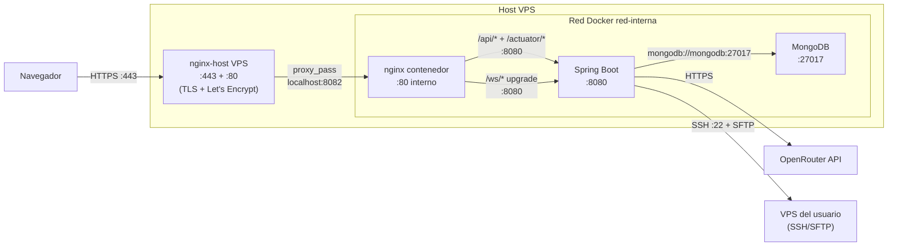
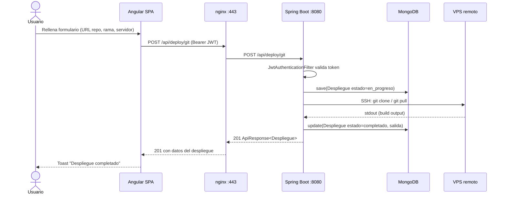

# Arquitectura — AutoDeploy

AutoDeploy es una aplicación web SaaS de **3 capas + servicios externos** que permite a los usuarios gestionar sus servidores VPS desde un panel centralizado: despliegues Git/ZIP, métricas en vivo, terminal SSH en el navegador, asistente IA con ejecución de comandos, backups, firewall, DNS y SSL.

## Vista general (despliegue en VPS compartido)



El `nginx-host` ya está corriendo en el VPS gestionando otros dominios (lo típico es 2-3 webs en un mismo VPS). AutoDeploy se añade como **un server block más**, apuntando a `http://localhost:8082` donde el compose publica el frontend.

**Ventaja clave**: los certificados Let's Encrypt se gestionan centralizadamente en el host con `certbot --nginx`; no hay que reemitir nada al actualizar la app.

## Servicios

| Servicio | Imagen / Stack | Puerto interno | Puerto expuesto al host | Red | Volumen |
|----------|----------------|----------------|--------------------------|-----|---------|
| `frontend` (nginx) | `ghcr.io/kruhale/autodeploy-frontend` (build local de Angular 20 + nginx alpine) | 80 | **8082** (configurable con `HOST_PORT`) | `red-interna` | `nginx-logs` |
| `backend` (Spring Boot) | `ghcr.io/kruhale/autodeploy-backend` (Eclipse Temurin 21 JRE) | 8080 | — *(solo accesible vía nginx-contenedor)* | `red-interna` | `backend-logs` |
| `mongodb` | `mongo:8` oficial | 27017 | — *(solo accesible vía red interna)* | `red-interna` | `mongodb-datos` |

Solo el **frontend nginx publica un puerto interno del VPS** (`8082` por defecto). Backend y MongoDB son inaccesibles desde fuera por diseño. Y el puerto `8082` **tampoco** está expuesto al exterior: solo lo usa el `nginx-host` del VPS para hacer `proxy_pass` desde el dominio público.

**Cadena completa** desde fuera:

```
Internet :443 → nginx-host VPS (TLS) → localhost:8082 → nginx-container → backend:8080 → mongodb:27017
```

## Comunicaciones

| Origen | Destino | Protocolo | Propósito |
|--------|---------|-----------|-----------|
| Navegador | nginx :443 | HTTPS | Toda la app (estáticos + API + WS) |
| nginx | backend :8080 | HTTP | Reverse proxy de `/api/*`, `/ws/*`, `/swagger-ui/*` |
| backend | mongodb :27017 | MongoDB wire | Persistencia de usuarios, servidores, despliegues, etc. |
| backend | openrouter.ai :443 | HTTPS | Llamadas al modelo IA (`POST /api/v1/chat/completions`) |
| backend | VPS remoto :22 | SSH / SFTP | Ejecutar comandos, subir ZIPs, gestionar backups |

## Capa por capa

### 1. Frontend — Angular 20 (SPA)

- **Standalone components** con signals para estado reactivo.
- **Routing lazy-loaded**: cada página principal se carga bajo demanda.
- **i18n** con `ngx-translate` en 5 idiomas (es, en, fr, de, it).
- **HTTP interceptor** que inyecta JWT en `Authorization: Bearer` y redirige a `/login` si recibe 401/403.
- **WebSocket** para terminal SSH (xterm.js), métricas en streaming y notificaciones push.
- Build de producción: `ng build` → `dist/autodeploy/browser` → servido por nginx.

### 2. Frontend nginx (reverse proxy + TLS)

- Termina **TLS 1.2/1.3** con certificado autofirmado generado en build (`/etc/nginx/ssl/autodeploy.crt`).
- **Redirige HTTP→HTTPS** (301) en el puerto 80.
- **Reverse proxy** para `/api/*` y `/ws/*` (con `Upgrade`/`Connection: upgrade` para WS).
- Sirve **SPA Angular** desde `/usr/share/nginx/html` con `try_files` para history fallback.
- Logs de acceso y error a archivos en volumen `nginx-logs`.
- `client_max_body_size 60M` para la subida de ZIPs.
- Compresión gzip de assets estáticos.

### 3. Backend — Spring Boot 3.4 (Java 21)

- **API REST** (`/api/**`) con `ApiResponse<T>` wrapper común.
- **WebSocket** (`/ws/**`) para:
  - `/ws/terminal` — sesión SSH interactiva (xterm.js ↔ MINA SSHD)
  - `/ws/metricas` — métricas en streaming cada 30s
  - `/ws/notificaciones/{usuarioId}` — notificaciones push al usuario
- **Seguridad JWT**: `JwtAuthenticationFilter` valida el Bearer; `SecurityFilterChain` con whitelist mínima.
- **Persistencia**: Spring Data MongoDB con repos `MongoRepository<T, String>`.
- **SSH a VPS remotos**: punto único `SshCommandService.ejecutarComando(servidor, comando)` con autenticación por contraseña o clave privada (ambas cifradas con AES en MongoDB).
- **SFTP**: `SftpUploadService` para subir ZIPs antes del build remoto.
- **Cifrado**: `CifradoUtil` (AES-256) con `AUTODEPLOY_CIFRADO_CLAVE` para credenciales SSH.
- **Healthcheck**: `/actuator/health` expone estado de MongoDB y de la app.
- **Logs**: a `/var/log/autodeploy/backend.log` (rolling 10 MB × 7 días, 200 MB total).

### 4. MongoDB

- Imagen oficial `mongo:8`.
- Colecciones principales: `usuario`, `servidor`, `despliegue`, `subdominio`, `backup`, `regla_firewall`, `redireccion`, `metrica_servidor`, `actividad_log`, `notificacion`, `configuracion_asistente_ia`.
- Persistencia en volumen `mongodb-datos` montado en `/data/db`.
- Sin autenticación dentro de la red Docker (red aislada). En despliegues abiertos a internet conviene habilitar `--auth`.

### 5. Servicios externos

- **OpenRouter API** — backend hace `POST https://openrouter.ai/api/v1/chat/completions` con la API key personal del usuario (cifrada en MongoDB por usuario, no global).
- **VPS del usuario** — cada usuario añade sus propios servidores; el backend abre conexiones SSH/SFTP bajo demanda usando Apache MINA SSHD 2.12.1.

## Decisiones arquitectónicas (ADRs)

### MongoDB en lugar de PostgreSQL

Modelos con campos heterogéneos por usuario (configuración del asistente IA, preferencias de notificación, colección variable de claves SSH por usuario, lista de comandos auto-aprobados) y escritura frecuente de eventos (`metrica_servidor`, `actividad_log`, `notificacion`). Schema-less acelera la iteración y elimina la necesidad de migraciones para añadir campos opcionales.

### Apache MINA SSHD en lugar de JSch

JSch lleva sin mantenimiento desde 2018 y no soporta los algoritmos modernos por defecto (rsa-sha2-512, ecdsa-sha2-nistp521). MINA SSHD está mantenido por la Apache Software Foundation, expone una API moderna asíncrona y soporta SFTP nativo sin librería extra.

### WebSocket en lugar de polling

Las métricas del servidor (`top`, `free`, `df`) y el terminal SSH son flujos continuos. Polling cada 5s para 50+ servidores conectados saturaría el backend y daría una experiencia laggy. WebSockets reducen latencia, ancho de banda y carga CPU.

### Reverse proxy con nginx en lugar de exponer el backend directamente

- Termina TLS una sola vez (no hay que duplicar certificados en Spring Boot).
- Permite cachear estáticos y comprimir respuestas (gzip) sin cambiar el backend.
- Aísla la API en una red interna Docker; el único puerto expuesto al host es el 443 (y el 80 que redirige).
- Punto único para añadir rate limiting, autenticación adicional o WAF en el futuro.

### Cifrado AES en lugar de almacenar credenciales en plano

Cualquier filtración de la BBDD comprometería todos los VPS de todos los usuarios si se guardasen las contraseñas/claves SSH en plano. Se cifra con AES-256 usando `AUTODEPLOY_CIFRADO_CLAVE` (env var, no en BBDD), y se descifra solo en memoria justo antes de abrir la conexión SSH.

## Flujo end-to-end: desplegar una app desde Git



## Volúmenes y persistencia

| Volumen | Servicio | Ruta interna | Contiene | ¿Se borra al `docker compose down`? |
|---------|----------|--------------|----------|--------------------------------------|
| `mongodb-datos` | mongodb | `/data/db` | Base de datos | No (named volume) |
| `backend-logs`  | backend | `/var/log/autodeploy` | Logs del backend rolling | No |
| `nginx-logs`    | frontend | `/var/log/nginx` | access.log y error.log | No |

Para borrar también los volúmenes: `docker compose -f docker-compose.prod.yml down -v`.

## Diagrama de red

```
                          host (VPS o local)
                         ┌──────────────────────────────────┐
                         │   Puerto 80  ──┐                 │
   Internet ─────────────┤                ├─►  frontend     │
                         │   Puerto 443 ──┘   (nginx alpine)│
                         │                       │          │
                         │      red-interna ─────┤          │
                         │                       │          │
                         │   backend ◄───────────┤          │
                         │  (Spring Boot)        │          │
                         │       │               │          │
                         │       └────► mongodb (mongo:8)   │
                         └──────────────────────────────────┘
```
