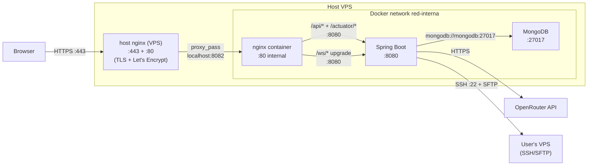
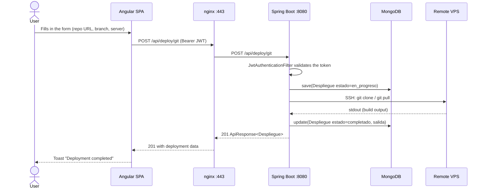

# Architecture — AutoDeploy

AutoDeploy is a **3-tier + external services** SaaS web application that lets users manage their VPS servers from a centralized panel: Git/ZIP deployments, live metrics, in-browser SSH terminal, AI assistant with command execution, backups, firewall, DNS and SSL.

## Overview (deployment on a shared VPS)


```mermaid
flowchart LR
    navegador["Browser"]
    host_nginx["host nginx (VPS)<br/>:443 + :80<br/>(TLS + Let's Encrypt)"]
    container_nginx["nginx container<br/>:80 internal"]
    backend["Spring Boot<br/>:8080"]
    mongo["MongoDB<br/>:27017"]
    openrouter["OpenRouter API"]
    vps_remoto["User's VPS<br/>(SSH/SFTP)"]

    navegador -->|"HTTPS :443"| host_nginx
    host_nginx -->|"proxy_pass<br/>localhost:8082"| container_nginx
    container_nginx -->|"/api/* + /actuator/*<br/>:8080"| backend
    container_nginx -->|"/ws/* upgrade<br/>:8080"| backend

    backend -->|"mongodb://mongodb:27017"| mongo
    backend -->|"HTTPS"| openrouter
    backend -->|"SSH :22 + SFTP"| vps_remoto

    subgraph host_vps["Host VPS"]
        host_nginx
        subgraph red_docker["Docker network red-interna"]
            container_nginx
            backend
            mongo
        end
    end
```

The host `nginx` is typically already running on the VPS serving other domains (2-3 sites on a single VPS is common). AutoDeploy is added as **one more server block**, pointing to `http://localhost:8082` where the compose stack publishes the frontend.

**Key advantage**: Let's Encrypt certificates are managed centrally on the host with `certbot --nginx`; nothing needs to be reissued when updating the app.

## Services

| Service | Image / Stack | Internal port | Port exposed to host | Network | Volume |
|----------|----------------|----------------|--------------------------|-----|---------|
| `frontend` (nginx) | `ghcr.io/kruhale/autodeploy-frontend` (local build of Angular 20 + nginx alpine) | 80 | **8082** (configurable via `HOST_PORT`) | `red-interna` | `nginx-logs` |
| `backend` (Spring Boot) | `ghcr.io/kruhale/autodeploy-backend` (Eclipse Temurin 21 JRE) | 8080 | — *(only reachable through the nginx container)* | `red-interna` | `backend-logs` |
| `mongodb` | official `mongo:8` | 27017 | — *(only reachable through the internal network)* | `red-interna` | `mongodb-datos` |
| `sandbox-ssh` | `linuxserver/openssh-server` | 2222 | **2223** *(host port `2222` is taken by the VPS's own `sshd`, moved off 22 for security)* | `red-interna` | `sandbox-ssh-config` |

The **frontend** publishes HTTP port `8082` to the host (no TLS — TLS is terminated by the host `nginx` on the VPS). The **sandbox-ssh** service publishes port `2223→2222` (host:container) as the SaaS's internal "demo box": a demo Linux box the backend connects to over the Docker network so the AI assistant can try out commands without needing a real VPS. Backend and MongoDB are unreachable from outside by design.

**Full chain** from the outside:

```
Internet :443 → host nginx (VPS, TLS) → localhost:8082 → nginx container → backend:8080 → mongodb:27017
```

## Communications

| Source | Destination | Protocol | Purpose |
|--------|---------|-----------|-----------|
| Browser | nginx :443 | HTTPS | The whole app (static assets + API + WS) |
| nginx | backend :8080 | HTTP | Reverse proxy for `/api/*`, `/ws/*`, `/swagger-ui/*` |
| backend | mongodb :27017 | MongoDB wire | Persistence of users, servers, deployments, etc. |
| backend | openrouter.ai :443 | HTTPS | AI model calls (`POST /api/v1/chat/completions`) |
| backend | remote VPS :22 | SSH / SFTP | Run commands, upload ZIPs, manage backups |

## Layer by layer

### 1. Frontend — Angular 20 (SPA)

- **Standalone components** with signals for reactive state.
- **Lazy-loaded routing**: each main page is loaded on demand.
- **i18n** with `ngx-translate` in 5 languages (es, en, fr, de, it).
- **HTTP interceptor** that injects the JWT into `Authorization: Bearer` and redirects to `/login` on 401/403.
- **WebSocket** for the SSH terminal (xterm.js), streaming metrics and push notifications.
- Production build: `ng build` → `dist/autodeploy/browser` → served by nginx.

### 2. Frontend nginx (internal reverse proxy)

- Listens on **HTTP :80** inside the container (no TLS). TLS is terminated by the host `nginx` on the VPS with a centralized Let's Encrypt certificate.
- **Reverse proxy** for `/api/*`, `/ws/*`, `/actuator/*`, `/swagger-ui/*`, `/v3/api-docs` towards `backend:8080` (with `Upgrade`/`Connection: upgrade` for WS).
- Serves the **Angular SPA** from `/usr/share/nginx/html` with `try_files` for history fallback.
- Access and error logs written to files in the `nginx-logs` volume.
- `client_max_body_size 60M` for ZIP uploads.
- gzip compression of static assets.

### 3. Backend — Spring Boot 3.4 (Java 21)

- **REST API** (`/api/**`) with a shared `ApiResponse<T>` wrapper.
- **WebSocket** (`/ws/**`) for:
  - `/ws/terminal` — interactive SSH session (xterm.js ↔ MINA SSHD)
  - `/ws/metricas` — streaming metrics every 30s
  - `/ws/notificaciones/{usuarioId}` — push notifications to the user
- **JWT security**: `JwtAuthenticationFilter` validates the Bearer token; `SecurityFilterChain` with a minimal whitelist.
- **Persistence**: Spring Data MongoDB with `MongoRepository<T, String>` repositories.
- **SSH to remote VPS**: single entry point `SshCommandService.ejecutarComando(servidor, comando)` with password or private-key authentication (both encrypted with AES-GCM in MongoDB).
- **SFTP**: `SftpUploadService` to upload ZIPs before the remote build.
- **Encryption**: `CifradoUtil` with **AES-256/GCM/NoPadding** (random 12-byte IV prepended to the ciphertext + 128-bit authentication tag) using `AUTODEPLOY_CIFRADO_CLAVE` derived with SHA-256.
- **Healthcheck**: `/actuator/health` exposes MongoDB and app status.
- **Logs**: to `/var/log/autodeploy/backend.log` (rolling 10 MB × 7 days, 200 MB total).

### 4. MongoDB

- Official `mongo:8` image.
- Main collections: `usuario`, `servidor`, `despliegue`, `subdominio`, `backup`, `regla_firewall`, `redireccion`, `metrica_servidor`, `actividad_log`, `notificacion`, `configuracion_asistente_ia`.
- Persistence in the `mongodb-datos` volume mounted at `/data/db`.
- No authentication inside the Docker network (isolated network). For internet-facing deployments, enabling `--auth` is recommended.

### 5. External services

- **OpenRouter API** — the backend issues `POST https://openrouter.ai/api/v1/chat/completions` with the user's personal API key (encrypted in MongoDB per user, not global).
- **User's VPS** — each user adds their own servers; the backend opens SSH/SFTP connections on demand using Apache MINA SSHD 2.12.1.

## Architecture decisions (ADRs)

### MongoDB instead of PostgreSQL

Models have heterogeneous per-user fields (AI assistant configuration, notification preferences, a variable collection of SSH keys per user, list of auto-approved commands) and frequent event writes (`metrica_servidor`, `actividad_log`, `notificacion`). Schema-less speeds up iteration and removes the need for migrations when adding optional fields.

### Apache MINA SSHD instead of JSch

JSch has been unmaintained since 2018 and does not support modern algorithms by default (rsa-sha2-512, ecdsa-sha2-nistp521). MINA SSHD is maintained by the Apache Software Foundation, exposes a modern asynchronous API and supports SFTP natively without an extra library.

### WebSocket instead of polling

Server metrics (`top`, `free`, `df`) and the SSH terminal are continuous streams. Polling every 5s for 50+ connected servers would saturate the backend and produce a laggy experience. WebSockets reduce latency, bandwidth and CPU load.

### Reverse proxy with nginx instead of exposing the backend directly

- Allows caching static assets and compressing responses (gzip) without touching the backend.
- Isolates the API and MongoDB in an internal Docker network; the only HTTP port exposed to the host is `8082` (configurable via `HOST_PORT`).
- TLS centralized in the host `nginx` on the VPS (Let's Encrypt + `certbot.timer`); no need to duplicate certificates or reissue them when updating the app.
- Single point to add rate limiting, extra authentication or a WAF in the future.

### AES-GCM encryption instead of storing credentials in plaintext

Any database leak would compromise every VPS of every user if SSH passwords/keys were stored in plaintext. Credentials are encrypted with **AES-256/GCM/NoPadding** (random 12-byte IV + 128-bit authentication tag) using `AUTODEPLOY_CIFRADO_CLAVE` (env var, never stored in the DB), and decrypted only in memory right before opening the SSH connection.

GCM was chosen over the classic CBC + HMAC because it provides built-in authentication: if the ciphertext were modified in the DB (tampering), decryption fails with `AEADBadTagException`. It also avoids the ECB pattern of an early draft (same plaintext → same ciphertext, vulnerable to frequency analysis). Older records encrypted with AES/ECB remain readable thanks to a legacy fallback decryptor.

## End-to-end flow: deploying an app from Git


```mermaid
sequenceDiagram
    actor U as User
    participant FE as Angular SPA
    participant NX as nginx :443
    participant BE as Spring Boot :8080
    participant DB as MongoDB
    participant VPS as Remote VPS

    U->>FE: Fills in the form (repo URL, branch, server)
    FE->>NX: POST /api/deploy/git (Bearer JWT)
    NX->>BE: POST /api/deploy/git
    BE->>BE: JwtAuthenticationFilter validates the token
    BE->>DB: save(Despliegue estado=en_progreso)
    BE->>VPS: SSH: git clone / git pull
    VPS-->>BE: stdout (build output)
    BE->>DB: update(Despliegue estado=completado, salida)
    BE-->>NX: 201 ApiResponse<Despliegue>
    NX-->>FE: 201 with deployment data
    FE-->>U: Toast "Deployment completed"
```

## Volumes and persistence

| Volume | Service | Internal path | Contains | Removed on `docker compose down`? |
|---------|----------|--------------|----------|--------------------------------------|
| `mongodb-datos` | mongodb | `/data/db` | Database | No (named volume) |
| `backend-logs`  | backend | `/var/log/autodeploy` | Rolling backend logs | No |
| `nginx-logs`    | frontend | `/var/log/nginx` | access.log and error.log | No |

To also remove the volumes: `docker compose -f docker-compose.prod.yml down -v`.

## Network diagram

```
   Internet                  host (VPS)
   ────────                 ┌─────────────────────────────────────────────┐
                            │                                             │
                            │   host nginx :443/:80 (TLS Let's Encrypt)   │
   Browser    ─── HTTPS ───►│           │                                 │
                            │           │ proxy_pass localhost:8082       │
                            │           ▼                                 │
                            │      ┌─────────────────────────────────┐    │
                            │      │  Docker network red-interna     │    │
                            │      │                                 │    │
                            │      │  frontend (nginx) :80           │    │
                            │      │     │                           │    │
                            │      │     │ proxy /api /ws /actuator  │    │
                            │      │     ▼                           │    │
                            │      │  backend (Spring Boot) :8080    │    │
                            │      │     │                           │    │
                            │      │     ▼                           │    │
                            │      │  mongodb :27017                 │    │
                            │      │                                 │    │
                            │      │  sandbox-ssh :2222              │    │
   SSH client ─── :2223 ───►│──────┼─►(public SaaS demo box,         │    │
                            │      │   host:2223 → container:2222)   │    │
                            │      └─────────────────────────────────┘    │
                            └─────────────────────────────────────────────┘
```
