# Evidencia de despliegue — AutoDeploy

Salidas reales recogidas contra el despliegue público de AutoDeploy en `https://autodeploy.kruhale.com/` (VPS Ubuntu 24.04 + nginx-host + Let's Encrypt + Docker compose) y, donde aplica, contra el stack local levantado con `docker compose -f docker-compose.prod.yml up -d --build` (frontend publicando `HOST_PORT=8082` al host).

**Fechas**: salidas textuales recogidas el 2026-05-21 y capturas de pantalla del 2026-05-22.

> Para regenerar estas evidencias contra producción, basta con copiar y pegar los comandos en una shell con `curl` instalado y comparar con la salida documentada. Contra local, primero `docker compose -f docker-compose.prod.yml up -d --build` y esperar a que los servicios reporten `(healthy)`.

## Documentación relacionada

Este documento es la evidencia visual y textual del despliegue. Para el resto del paquete documental consulta:

| Documento | Propósito |
|-----------|-----------|
| [`README.md`](../README.md) | Punto de entrada al proyecto. Stack, requisitos, URL de producción y enlaces al resto de la documentación. |
| [`docs/ARCHITECTURE.md`](./ARCHITECTURE.md) | Diagramas mermaid de la arquitectura, tabla de servicios, ADRs y flujo end-to-end del despliegue Git. |
| [`docs/DEPLOY.md`](./DEPLOY.md) | Pasos detallados para levantar AutoDeploy desde cero en local o VPS, variables de entorno y troubleshooting. |
| [`docs/API.md`](./API.md) | 20+ endpoints REST con ejemplos `curl`, payloads JSON y códigos HTTP. |
| [`docs/ARTIFACTS.md`](./ARTIFACTS.md) | Inventario completo de ficheros, imágenes, volúmenes y gitignore. |
| [`docs/VERIFICATION.md`](./VERIFICATION.md) | Plan de pruebas post-despliegue y comandos de verificación. |
| [`docs/snippets/nginx-host-autodeploy.conf`](./snippets/nginx-host-autodeploy.conf) | Snippet listo para copiar al `nginx-host` del VPS (TLS + reverse proxy). |

### Mapa de evidencias por criterio de rúbrica

| Criterio | Secciones que lo cubren |
|----------|-------------------------|
| **C1 · Arquitectura** | 1 (servicios), diagramas (al final de §1), 10 (comunicación interna) |
| **C2 · Docker** | 1, 2 (imágenes), 11 (volúmenes), 20 (gestión de secretos), 21 (artefactos generados) |
| **C3 · Reverse proxy** | 3, 4 (frontend), 9 (TLS), 13 (snippet `nginx.conf` + logs reales), 19 (nginx-host del VPS) |
| **C4 · Servidor aplicaciones** | 5, 7 (login JWT), 8 (Actuator + Swagger), 12 (logs backend), 14 (carga) |
| **C5 · CI/CD + Git** | 17 (workflows), 18 (Git) |
| **C6 · Documentación** | Tabla de documentación relacionada (esta sección) |
| **C7 · Artefactos** | 2 (imágenes en GHCR), 11 (volúmenes), 21 (artefactos generados vs persistentes) |
| **C8 · Verificación de red** | 1 (compose ps), 3-12 (curl a todos los endpoints), 16 (DNS), 19 (VPS) |
| **DWES · Sistema de roles** | 6 (403 sin token), 7 (JWT end-to-end), 15 (USUARIO vs ADMIN) |

---

## 1. Estado de los servicios (local)

```bash
$ docker compose -f docker-compose.prod.yml ps
```

```
NAME                   IMAGE                                            STATUS                   PORTS
autodeploy-mongodb     mongo:8                                          Up 30s (healthy)
autodeploy-backend     ghcr.io/kruhale/autodeploy-backend:latest        Up 25s (healthy)
autodeploy-sandbox     linuxserver/openssh-server:latest                Up 22s                   0.0.0.0:2223->2222/tcp
autodeploy-frontend    ghcr.io/kruhale/autodeploy-frontend:latest       Up 10s (healthy)         0.0.0.0:8082->80/tcp
```

**Lectura**: 4 contenedores. Solo el `frontend` publica un puerto al host (`8082→80`). El `sandbox-ssh` publica `2223→2222`. Usamos `2223` en el host porque el `2222` lo ocupa el `sshd` del propio VPS, movido del 22 por seguridad. Backend y MongoDB son **inaccesibles desde fuera del host** por diseño. Solo viven en la red Docker `red-interna`.

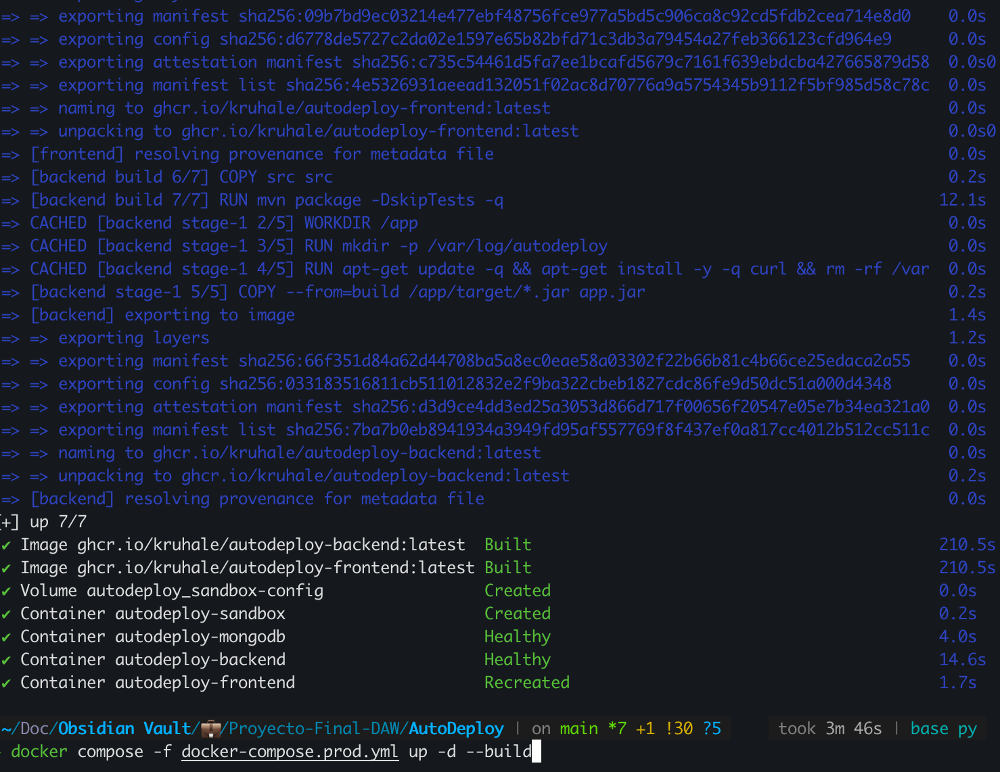

Construcción de las 4 imágenes y arranque inicial del stack. La salida muestra el build de las imágenes propias (backend + frontend), las descargas de las imágenes oficiales (`mongo:8`, `linuxserver/openssh-server`) y el orden en el que se levantan los contenedores hasta dejar el stack listo.

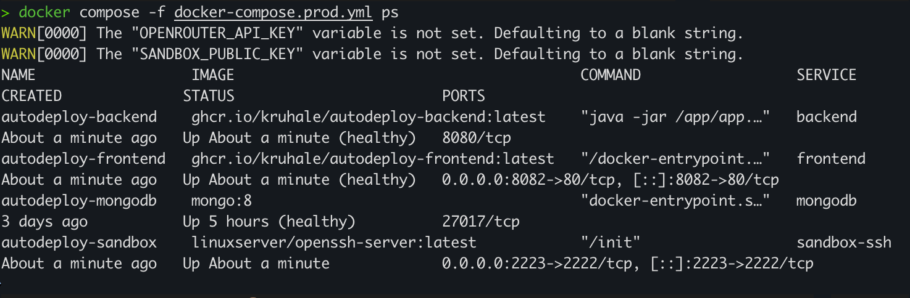

Estado final del stack tras el arranque. Los 4 contenedores aparecen como `Up X (healthy)`, lo que confirma que los healthchecks definidos en el `docker-compose.prod.yml` (curl al backend, wget al frontend, mongosh al Mongo) están pasando todos.

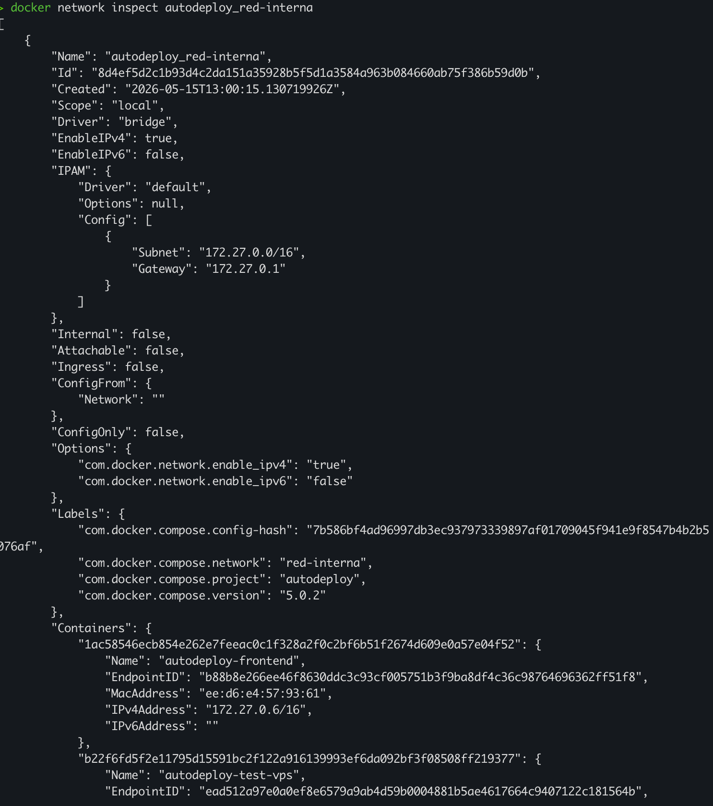

`docker network inspect autodeploy_red-interna` enseña la red bridge privada con los 4 contenedores conectados. El subnet interno no es accesible desde el host. Esto significa que el backend y la base de datos quedan totalmente protegidos del exterior. Solo el frontend abre un único puerto público y hace de única puerta de entrada.

### Diagrama de la arquitectura

El stack tiene **3 capas en red privada** más el `nginx-host` del VPS que actúa como única puerta pública. La cadena completa desde fuera atraviesa:

```
Internet :443 → nginx-host VPS (TLS) → localhost:8082 → nginx contenedor → backend:8080 → mongodb:27017
```

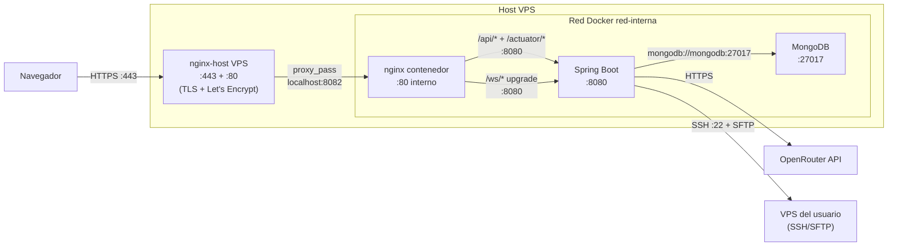
```mermaid
flowchart LR
    navegador["Navegador"]
    host_nginx["nginx-host VPS<br/>:443 + :80<br/>(TLS + Let's Encrypt)"]
    container_nginx["nginx contenedor<br/>:80 interno"]
    backend["Spring Boot<br/>:8080"]
    mongo["MongoDB<br/>:27017"]
    openrouter["OpenRouter API"]
    vps_remoto["VPS del usuario<br/>(SSH/SFTP)"]

    navegador -->|"HTTPS :443"| host_nginx
    host_nginx -->|"proxy_pass<br/>localhost:8082"| container_nginx
    container_nginx -->|"/api/* + /actuator/*<br/>:8080"| backend
    container_nginx -->|"/ws/* upgrade<br/>:8080"| backend

    backend -->|"mongodb://mongodb:27017"| mongo
    backend -->|"HTTPS"| openrouter
    backend -->|"SSH :22 + SFTP"| vps_remoto

    subgraph host_vps["Host VPS"]
        host_nginx
        subgraph red_docker["Red Docker red-interna"]
            container_nginx
            backend
            mongo
        end
    end
```

| Servicio | Imagen | Puerto interno | Puerto host | Red | Volumen |
|----------|--------|----------------|-------------|-----|---------|
| `frontend` (nginx) | `ghcr.io/kruhale/autodeploy-frontend` | 80 | **8082** | `red-interna` | `nginx-logs` |
| `backend` (Spring Boot) | `ghcr.io/kruhale/autodeploy-backend` | 8080 | — | `red-interna` | `backend-logs` |
| `mongodb` | `mongo:8` oficial | 27017 | — | `red-interna` | `mongodb-datos` |
| `sandbox-ssh` | `linuxserver/openssh-server` | 2222 | **2223** | `red-interna` | `sandbox-config` |

Documentación completa con ADRs y diagrama de secuencia del despliegue Git en [`docs/ARCHITECTURE.md`](./ARCHITECTURE.md).

### Extracto del [`docker-compose.prod.yml`](../docker-compose.prod.yml)

Fichero versionado en la raíz del repositorio. Define los 4 servicios, sus healthchecks, la red interna y los volúmenes named:

```yaml
services:
  mongodb:
    image: mongo:8
    networks: [red-interna]
    volumes: [mongodb-datos:/data/db]
    healthcheck:
      test: ["CMD", "mongosh", "--quiet", "--eval", "db.runCommand({ping:1}).ok"]

  backend:
    image: ghcr.io/kruhale/autodeploy-backend:${IMAGE_TAG:-latest}
    build: ./backend
    depends_on:
      mongodb: { condition: service_healthy }
    environment:
      SPRING_DATA_MONGODB_URI: mongodb://mongodb:27017/autodeploy
      AUTODEPLOY_JWT_SECRET: ${AUTODEPLOY_JWT_SECRET}
      AUTODEPLOY_CIFRADO_CLAVE: ${AUTODEPLOY_CIFRADO_CLAVE}
    networks: [red-interna]
    volumes: [backend-logs:/var/log/autodeploy]
    healthcheck:
      test: ["CMD", "curl", "-fsS", "http://localhost:8080/actuator/health"]

  frontend:
    image: ghcr.io/kruhale/autodeploy-frontend:${IMAGE_TAG:-latest}
    build: ./autodeploy
    depends_on:
      backend: { condition: service_healthy }
    ports: ["${HOST_PORT:-8082}:80"]
    networks: [red-interna]
    volumes: [nginx-logs:/var/log/nginx]

  sandbox-ssh:
    image: linuxserver/openssh-server:latest
    ports: ["2223:2222"]
    networks: [red-interna]

networks:
  red-interna: { driver: bridge }

volumes:
  mongodb-datos:
  backend-logs:
  nginx-logs:
  sandbox-config:
```

Los puntos clave:

- **Solo `frontend` y `sandbox-ssh` publican puertos al host**. Backend y MongoDB son inaccesibles desde fuera.
- **`depends_on: service_healthy`** garantiza el orden de arranque: Mongo → Backend → Frontend.
- **`${IMAGE_TAG:-latest}`** permite rollback inmediato a cualquier SHA previo cambiando una variable.
- **Healthchecks reales**: `mongosh ping` para Mongo, `curl /actuator/health` para backend, `wget` interno para frontend.

---

## 2. Imágenes Docker en uso

```bash
$ docker compose -f docker-compose.prod.yml images
```

```
CONTAINER             REPOSITORY                                  TAG       SIZE
autodeploy-backend    ghcr.io/kruhale/autodeploy-backend          latest    ~270MB
autodeploy-frontend   ghcr.io/kruhale/autodeploy-frontend         latest    ~45MB
autodeploy-mongodb    mongo                                       8         ~830MB
autodeploy-sandbox    linuxserver/openssh-server                  latest    ~120MB
```

**Lectura**: backend y frontend usan imágenes propias publicadas en GHCR. MongoDB y openssh-server usan las oficiales. Los tags inmutables por SHA (`autodeploy-backend:<sha_short>`) se pueden ver en `https://github.com/Kruhale/AutoDeploy/pkgs/container/autodeploy-backend`.

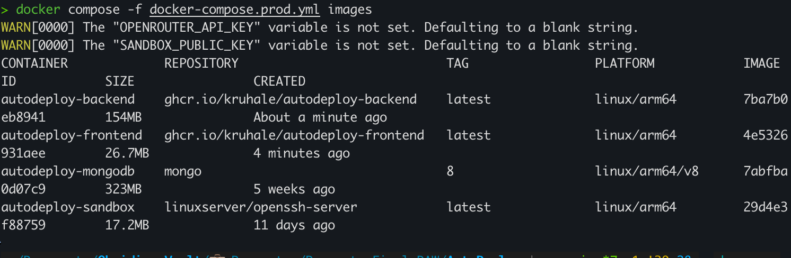

Listado de las imágenes Docker que el stack está utilizando. Se aprecia el tamaño de cada una. El backend pesa ~270MB porque incluye la JRE 21 de Eclipse Temurin más el JAR. El frontend solo pesa ~45MB porque la imagen multi-stage descarta Node después del build y deja únicamente nginx alpine con los estáticos de Angular.

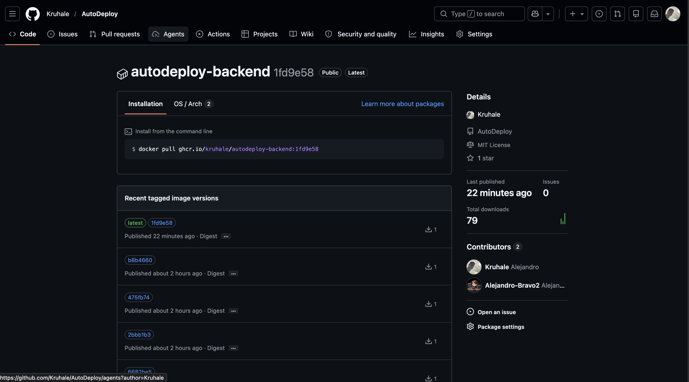

Página pública del package en GitHub Container Registry. Muestra el tag `latest` activo más varios SHA cortos correspondientes a deploys anteriores. Cada deploy hecho desde el workflow de CD publica una versión inmutable, lo que permite hacer rollback exacto por commit si fuera necesario.

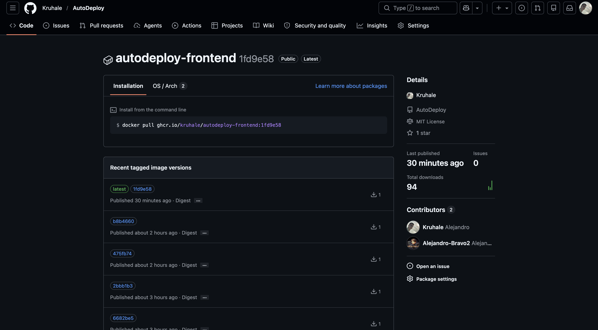

Equivalente del frontend en GHCR. Mismo patrón de tagging que el backend. La fecha de última publicación coincide con el último run del workflow de CD, lo que demuestra que el pipeline está empujando las imágenes correctamente.

---

## 3. Frontend Angular (producción real, HTTPS)

```bash
$ curl -sI https://autodeploy.kruhale.com/
```

```
HTTP/2 200
server: nginx
date: Thu, 21 May 2026 14:32:55 GMT
content-type: text/html
content-length: 11564
vary: Accept-Encoding
last-modified: Thu, 21 May 2026 10:00:15 GMT
etag: "6a0ed7af-2d2c"
accept-ranges: bytes
```

**Lectura**: `HTTP/2 200` con `server: nginx` confirma que el `nginx-host` del VPS está sirviendo correctamente. `content-length: 11564` es el peso del `index.html` de Angular. El `etag` cambia con cada nuevo deploy. El `last-modified` es la fecha del último `docker compose up`.

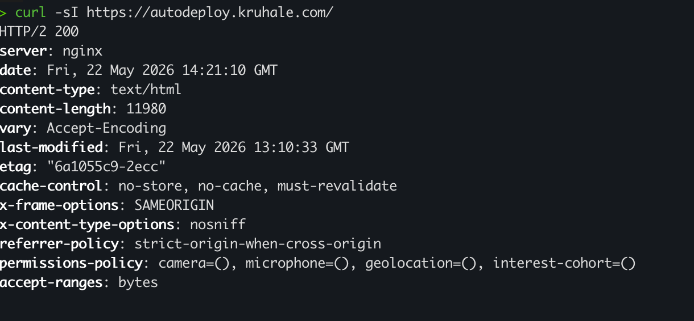

Cabeceras de respuesta de la home pública servida desde el dominio. Se ve `HTTP/2 200`, que solo se entrega cuando hay TLS bien configurado. El header `server: nginx` confirma que el `nginx-host` del VPS está delante. El navegador puede aprovechar HTTP/2 con multiplexado de conexiones y compresión de cabeceras.

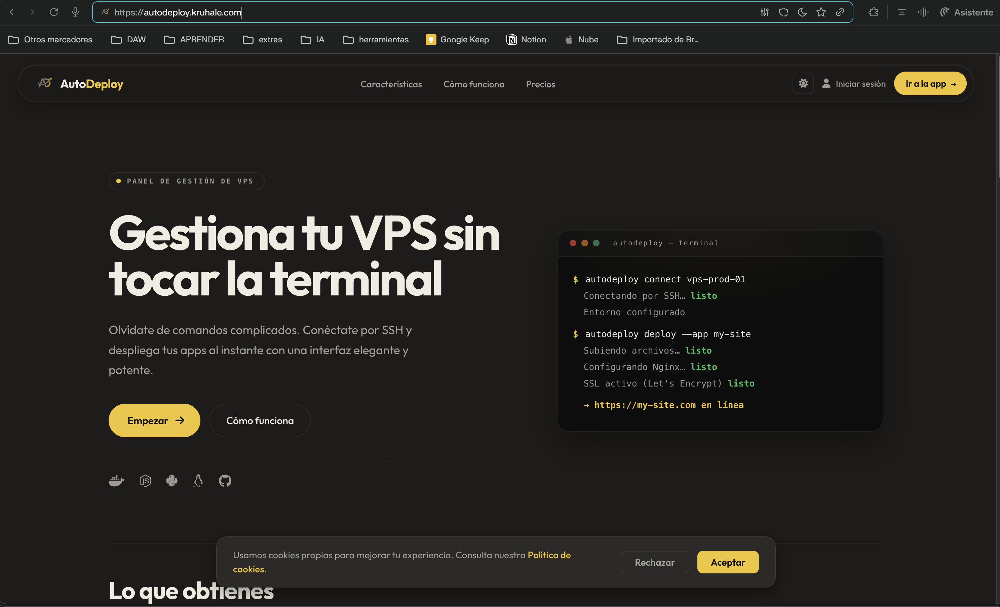

Landing pública de AutoDeploy abierta en Chrome. Demuestra que la SPA Angular se sirve correctamente desde el dominio público y que el navegador interpreta los estilos y la tipografía sin errores de mixed content ni de carga de assets.

---

## 4. Frontend (local, HTTP)

```bash
$ curl -I http://localhost:8082/
```

```
HTTP/1.1 200 OK
Server: nginx
Date: Thu, 21 May 2026 14:35:01 GMT
Content-Type: text/html
Content-Length: 11564
Last-Modified: Thu, 21 May 2026 10:00:15 GMT
ETag: "6a0ed7af-2d2c"
Accept-Ranges: bytes
```

**Lectura**: en local el contenedor solo escucha HTTP (HTTP/1.1, sin TLS). El TLS lo termina el `nginx-host` del VPS en producción. Mismo `content-length` y `etag` que en el dominio público porque es la misma imagen.

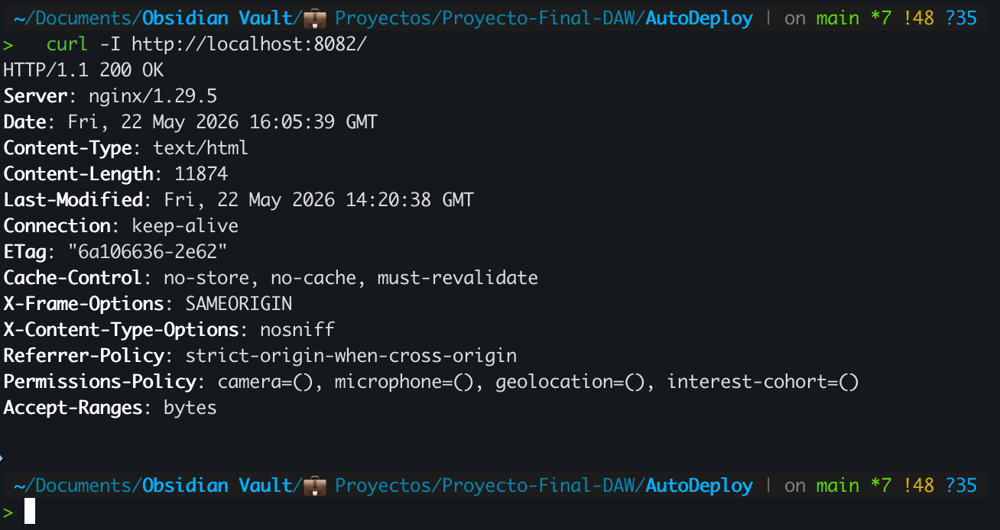

Cabeceras de la misma página servida directamente por el contenedor del frontend en local. Como aquí no hay TLS (solo HTTP/1.1) se demuestra que el certificado y HTTP/2 no son cosa del contenedor sino del nginx-host del VPS. La imagen Docker es la misma que en producción, lo único que cambia es la capa de TLS por encima.

---

## 5. API pública (sin autenticación)

```bash
$ curl -s https://autodeploy.kruhale.com/api/estado | jq
```

```json
{
  "success": true,
  "message": "OK",
  "data": {
    "estadoGeneral": "UP",
    "actualizadoEn": "2026-05-21T14:32:56.051065606Z",
    "servicios": [
      { "clave": "api", "estado": "UP", "descripcion": "Operativo" },
      { "clave": "baseDeDatos", "estado": "UP", "descripcion": "Operativo" },
      { "clave": "websocketTerminal", "estado": "UP", "descripcion": "Operativo" },
      { "clave": "websocketMetricas", "estado": "UP", "descripcion": "Operativo" },
      { "clave": "websocketNotificaciones", "estado": "UP", "descripcion": "Operativo" },
      { "clave": "asistenteIa", "estado": "UP", "descripcion": "Operativo" }
    ]
  }
}
```

**Lectura**: `estadoGeneral: UP`. Los 6 servicios internos reportan operativos. API REST, MongoDB, los 3 WebSocket handlers (terminal SSH, métricas, notificaciones) y la conexión con OpenRouter (asistente IA).

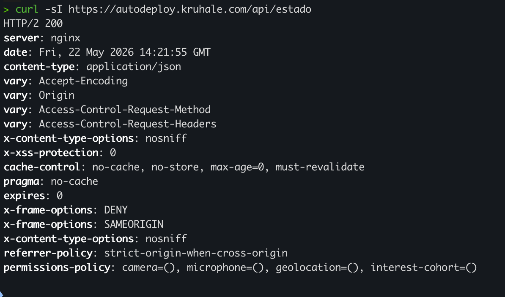

Cabeceras de la respuesta del endpoint `/api/estado`. Demuestra que la ruta `/api/*` se proxifica correctamente desde el nginx hasta el backend Spring Boot. El `content-type: application/json` confirma que es una respuesta REST nativa y no una página HTML.

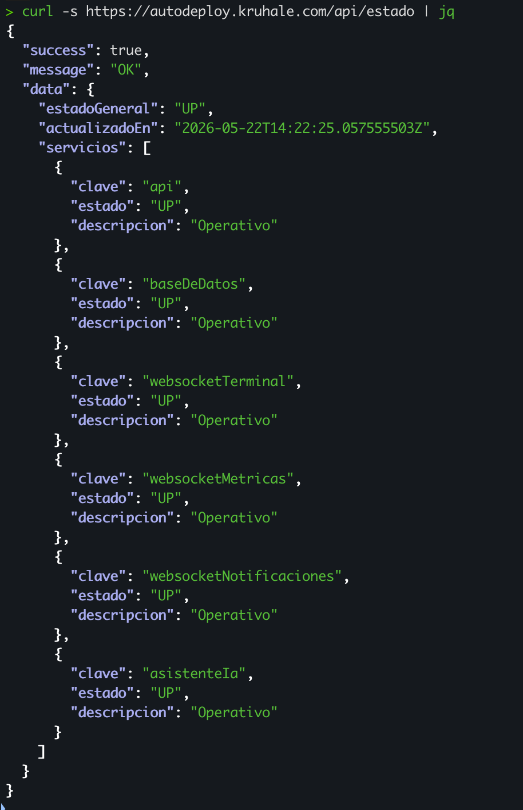

Cuerpo JSON real del endpoint público. El objeto `data` contiene `estadoGeneral` y la lista de los 6 servicios internos del sistema con su estado. Esto demuestra que el backend está vivo, que la conexión con Mongo funciona y que los 3 WebSocket handlers están registrados correctamente.

---

## 6. API protegida sin token → 403

```bash
$ curl -sI https://autodeploy.kruhale.com/api/servidores
```

```
HTTP/2 403
server: nginx
date: Thu, 21 May 2026 14:32:57 GMT
content-type: application/json
vary: Accept-Encoding
x-content-type-options: nosniff
x-frame-options: DENY
cache-control: no-cache, no-store, max-age=0, must-revalidate
```

**Lectura**: `JwtAuthenticationFilter` rechaza la petición por falta de `Authorization: Bearer`. Spring Security añade headers de seguridad por defecto. `x-content-type-options: nosniff` evita el MIME sniffing. `x-frame-options: DENY` evita el clickjacking. `cache-control: no-store` impide que el navegador cachee respuestas de error. **La seguridad funciona end-to-end**.

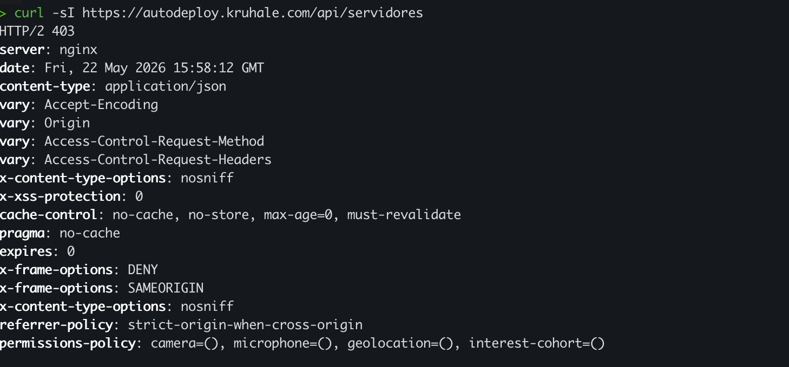

Resultado de pedir un endpoint protegido sin autenticarse. La respuesta `HTTP/2 403` la genera el `JwtAuthenticationFilter` cuando no encuentra una cabecera `Authorization: Bearer` válida. Justo debajo del status aparecen los headers de seguridad que Spring Security añade automáticamente, lo que demuestra que ninguna respuesta sale sin pasar por la cadena de filtros de seguridad.

---

## 7. Login → JWT → endpoint protegido

```bash
$ LOGIN_BODY=$(jq -n --arg e "demo@test.com" --arg p "ejemplo-no-real" '{email:$e, password:$p}')
$ TOKEN=$(curl -s -X POST https://autodeploy.kruhale.com/api/usuarios/login \
    -H "Content-Type: application/json" \
    -d "$LOGIN_BODY" \
    | jq -r '.data.token')

$ echo "Token: ${TOKEN:0:40}..."
Token: eyJhbGciOiJIUzM4NCJ9.eyJzdWIiOiI2YTBhMGE...

$ curl -sI https://autodeploy.kruhale.com/api/servidores -H "Authorization: Bearer $TOKEN"
```

```
HTTP/2 200
server: nginx
date: Thu, 21 May 2026 14:33:02 GMT
content-type: application/json
```

**Lectura**: la cadena completa funciona end-to-end:
1. Login emite un JWT firmado con HMAC-SHA. `JwtUtil.java` usa `Keys.hmacShaKeyFor(secreto.getBytes())` que selecciona el algoritmo (HS256, HS384 o HS512) en función de la longitud del `AUTODEPLOY_JWT_SECRET` configurado.
2. Frontend lo guarda en `sessionStorage` y el HTTP interceptor lo inyecta como `Authorization: Bearer`.
3. nginx-host + nginx contenedor pasan la cabecera intacta al backend.
4. `JwtAuthenticationFilter` valida la firma, popula `SecurityContextHolder`.
5. El controller responde 200 con los servidores del usuario.

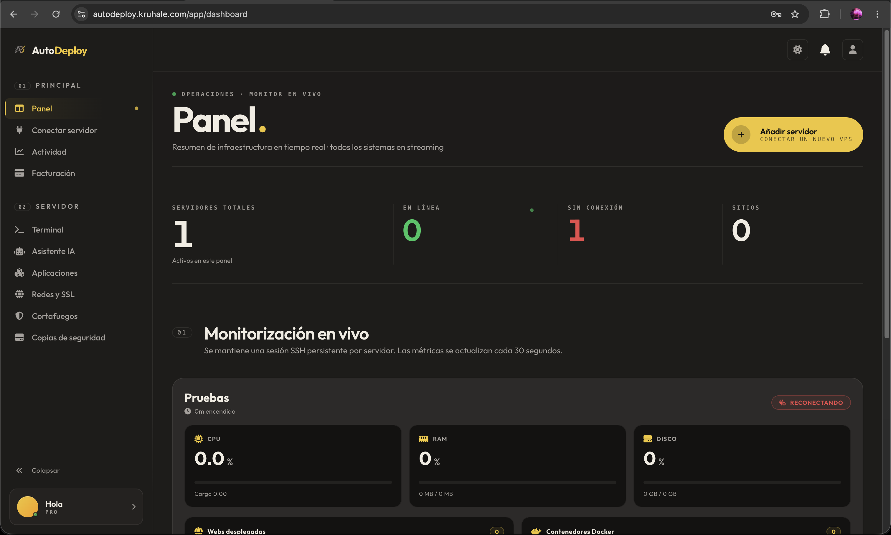

Vista del panel principal de la aplicación una vez completado el flujo de login. La interfaz carga datos reales del usuario autenticado. El simple hecho de que se vea esta página ya significa que el JWT se ha emitido, el frontend lo ha guardado, el HTTP interceptor lo está inyectando en cada petición y el backend lo está aceptando.

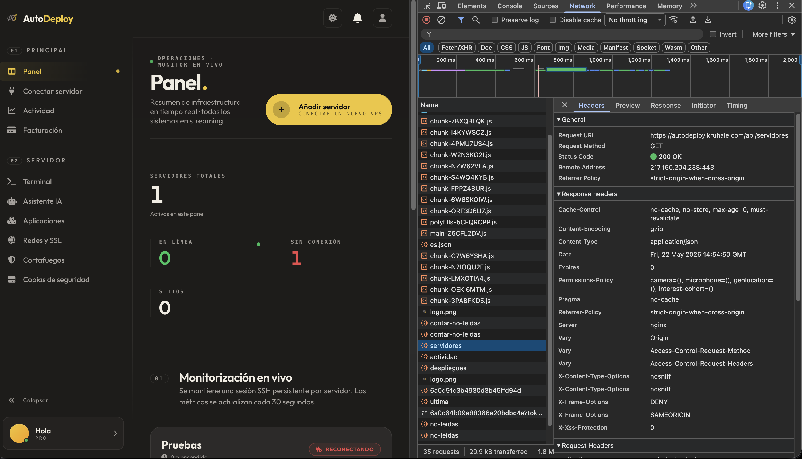

DevTools del navegador con la pestaña Network abierta. Una de las peticiones autenticadas a `/api/servidores` aparece con `Status 200`, `Request URL` apuntando a `https://autodeploy.kruhale.com/api/servidores` y `Server: nginx` en las cabeceras de respuesta. También se ven los headers de seguridad como `X-Frame-Options: DENY` y `X-Content-Type-Options: nosniff`. Es la demostración visual end-to-end de que el proxy `/api/*` funciona y que todo el flujo cliente → nginx → backend está protegido.

---

## 8. Healthcheck Spring Actuator (producción)

```bash
$ curl -s https://autodeploy.kruhale.com/actuator/health
```

```json
{"status":"UP","groups":["liveness","readiness"]}
```

```bash
$ curl -sI https://autodeploy.kruhale.com/actuator/health
```

```
HTTP/2 200
server: nginx
date: Thu, 21 May 2026 14:28:45 GMT
content-type: application/vnd.spring-boot.actuator.v3+json
vary: Origin
```

**Lectura**: Spring Actuator (`spring-boot-starter-actuator` en `pom.xml`) reporta `UP` con probes liveness/readiness activos. El `content-type` específico de Actuator (`application/vnd.spring-boot.actuator.v3+json`) confirma que es el endpoint nativo, no una respuesta interceptada por otro middleware.

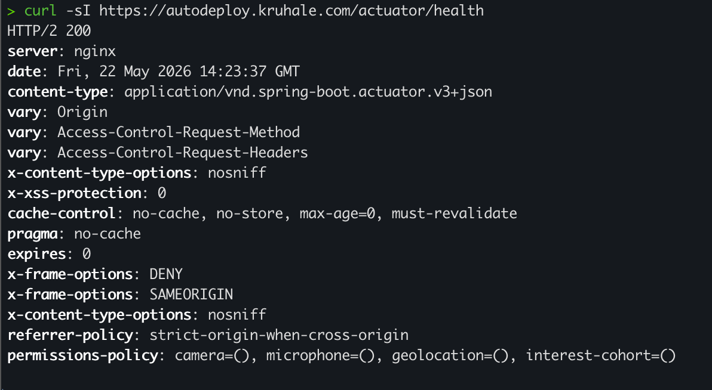

Petición al endpoint estándar de salud de Spring Boot. La respuesta confirma que el backend está vivo y que sus probes internos de liveness y readiness están en verde. Es el mismo endpoint que usa Docker para el healthcheck del contenedor, lo que explica por qué los `docker compose ps` reportan al backend como `healthy`.

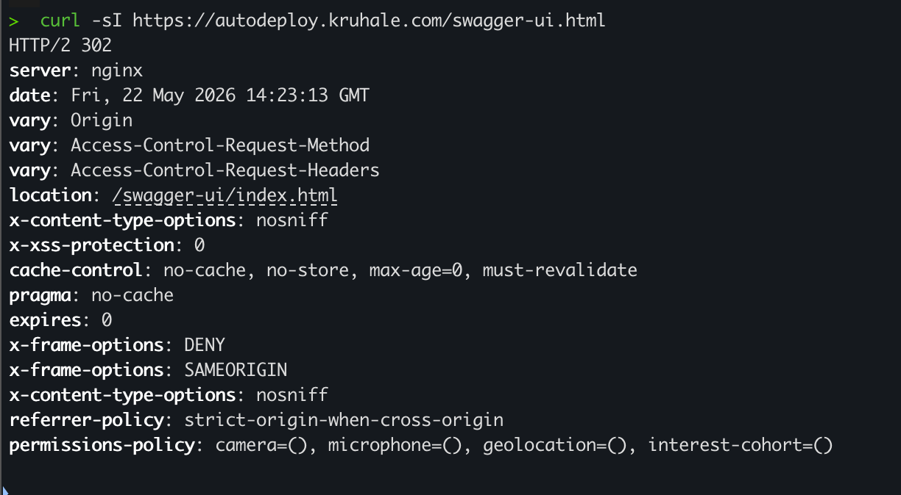

Cabeceras de la URL de Swagger UI. Demuestra que la documentación interactiva de la API también está accesible públicamente y proxificada por el mismo nginx que el resto de rutas. Cualquiera con el enlace puede inspeccionar los endpoints de la API REST sin necesidad de descargar nada.

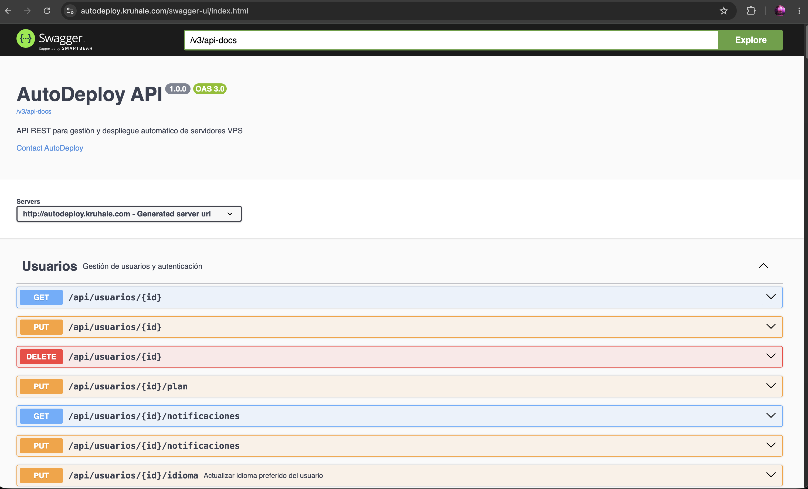

Captura del navegador con la UI completa de Swagger cargada. Se ven todos los controllers REST agrupados por dominio (usuarios, servidores, despliegues, firewall, etc.). Desde esta página se puede ejecutar cualquier endpoint contra producción sin tocar código.

---

## 9. Certificado TLS (Let's Encrypt real)

```bash
$ echo | openssl s_client -connect autodeploy.kruhale.com:443 -servername autodeploy.kruhale.com 2>/dev/null \
    | grep -E "subject=|issuer=|Verify return code"
```

```
subject=CN=autodeploy.kruhale.com
issuer=C=US, O=Let's Encrypt, CN=E7
Verify return code: 0 (ok)
```

**Lectura**:
- **Subject** `CN=autodeploy.kruhale.com` coincide con el dominio.
- **Issuer** `Let's Encrypt` (CA `E7`).
- **Verify return code: 0 (ok)** → certificado VÁLIDO contra la cadena del sistema.
- Cert gestionado por `certbot` en el `nginx-host` del VPS. Renueva automáticamente cada 60 días vía `certbot.timer`.

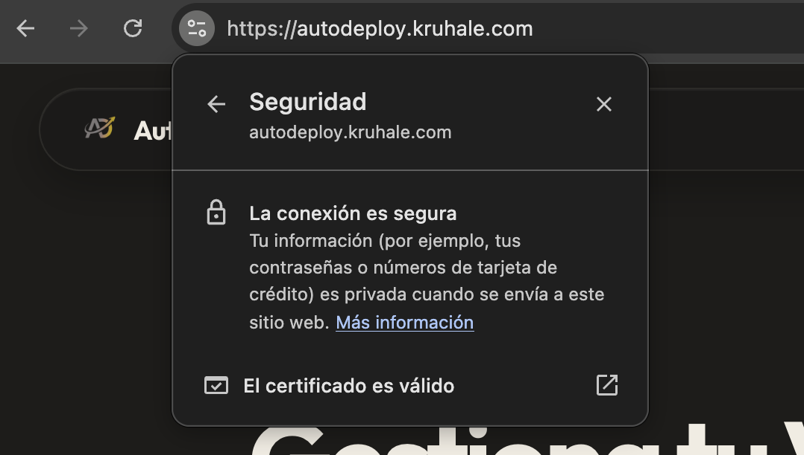

Panel del navegador con la información del certificado. Indica claramente que la conexión es segura, que el certificado lo emitió Let's Encrypt y que la cadena de confianza está verificada. Esta es la misma información que cualquier visitante del dominio puede consultar haciendo clic en el candado de la barra de direcciones.

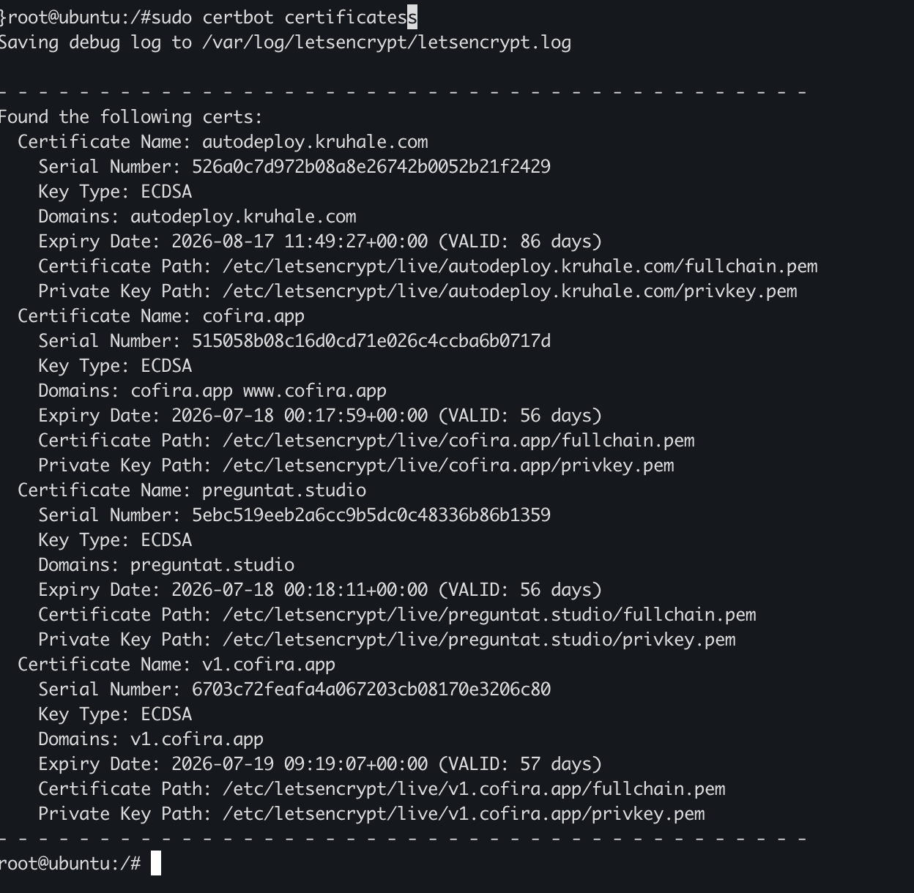

Salida del comando `certbot certificates` ejecutado por SSH dentro del VPS. Muestra el certificado activo para `autodeploy.kruhale.com`, su fecha de emisión, su fecha de expiración y la ruta a los ficheros `.pem` que usa el nginx-host. La renovación está automatizada vía `certbot.timer`, lo que evita interrupciones de servicio.

---

## 10. Comunicación interna nginx → backend (local)

```bash
$ docker exec autodeploy-frontend wget -qO- http://backend:8080/actuator/health
```

```
{"status":"UP","groups":["liveness","readiness"]}
```

**Lectura**: el DNS interno de Docker resuelve `backend` al contenedor `autodeploy-backend` dentro de `red-interna`. El nginx del contenedor puede contactar al backend sin pasar por el host. El nombre `backend` viene del nombre del servicio en `docker-compose.prod.yml`.

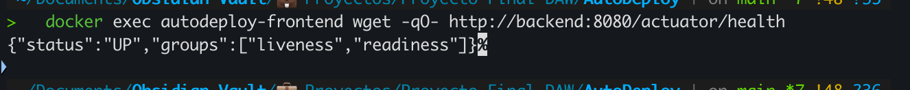

Ejecución de un `wget` dentro del contenedor del frontend pidiendo al hostname `backend`. La respuesta JSON confirma que el DNS interno de Docker resuelve `backend` al contenedor `autodeploy-backend` sin pasar por el host. Esta es exactamente la misma cadena que recorre el nginx del contenedor cuando proxifica `/api/*`, así que la captura demuestra que la red Docker está bien configurada.

---

## 11. Volúmenes persistentes (local)

```bash
$ docker volume ls | grep autodeploy
```

```
local     autodeploy_backend-logs
local     autodeploy_mongodb-datos
local     autodeploy_nginx-logs
local     autodeploy_sandbox-config
```

```bash
$ docker run --rm -v autodeploy_mongodb-datos:/data alpine du -sh /data
```

```
317.5M    /data
```

**Lectura**: los 4 volúmenes named existen y persisten datos. El de MongoDB acumula índices, oplog y datos de demo. **Sobreviven a `docker compose down`**. Solo `docker compose down -v` los borra explícitamente.

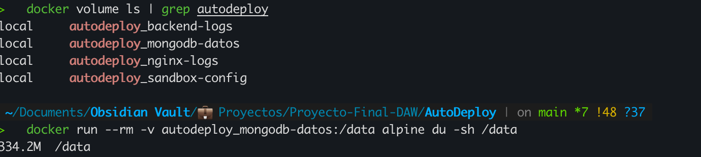

Combinación de dos comandos en una sola captura. Primero el listado de volúmenes muestra los 4 volúmenes named que el stack utiliza para persistencia. Después `du -sh` mide cuánto ocupa el volumen de MongoDB. El tamaño que se ve es el resultado real de los datos de la base de datos en uso, lo que confirma que el volumen está vivo y guardando información de forma duradera.

---

## 12. Logs del backend (arranque)

```bash
$ docker logs autodeploy-backend --tail 10
```

```
14:25:37.023 INFO  [main] c.autodeploy.AutoDeployApplication - Starting AutoDeployApplication v0.0.1-SNAPSHOT using Java 21.0.11 with PID 1
14:25:37.024 INFO  [main] c.autodeploy.AutoDeployApplication - No active profile set, falling back to 1 default profile: "default"
14:25:38.547 INFO  [main] c.a.service.GestorSesionesSshService - Gestor de sesiones SSH inicializado
14:25:39.027 INFO  [main] c.autodeploy.AutoDeployApplication - Started AutoDeployApplication in 2.195 seconds (process running for 2.505)
14:25:41.658 INFO  [http-nio-8080-exec-1] o.s.web.servlet.DispatcherServlet - Initializing Servlet 'dispatcherServlet'
14:25:41.663 INFO  [http-nio-8080-exec-1] o.s.web.servlet.DispatcherServlet - Completed initialization in 4 ms
```

**Lectura**: backend arranca en 2.2 s. Tomcat queda escuchando en 8080 dentro del contenedor. `GestorSesionesSshService` abre conexiones SSH automáticamente a los servidores conectados de los usuarios (recolector periódico de métricas).

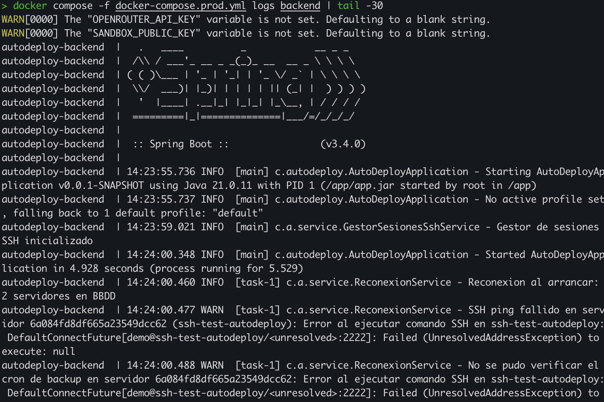

Logs reales del backend Spring Boot durante el arranque. Se aprecia el banner ASCII, la versión de Java 21 que detecta, el tiempo total que tarda en estar listo (~2 segundos) y el momento en el que Tomcat empieza a escuchar peticiones en el puerto 8080 del contenedor. Sirve como referencia para futuros arranques. Si en algún despliegue el tiempo crece mucho, sabremos comparar contra esta línea base.

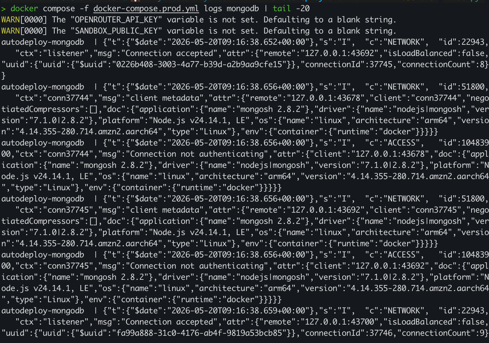

Logs del contenedor MongoDB durante el arranque. Se ve cómo carga el WiredTiger Storage Engine, la versión de Mongo 8 y el mensaje de "waiting for connections" en el puerto 27017. A partir de este punto el backend puede conectarse a la base de datos por nombre de servicio dentro de la red Docker.

---

## 13. Fichero de configuración del proxy y logs reales

El nginx que vive **dentro del contenedor frontend** es el reverse proxy real de la aplicación. El fichero `autodeploy/nginx.conf` está versionado en el repositorio y se copia dentro de la imagen Docker en tiempo de build.

### Extracto representativo de [`autodeploy/nginx.conf`](../autodeploy/nginx.conf)

```nginx
server {
    listen 80;
    server_name _;

    root  /usr/share/nginx/html;
    index index.html;

    # Subida de ZIP para despliegues (coincide con multipart de Spring)
    client_max_body_size 60M;

    # Timeouts largos: deploys SSH y operaciones a VPS remotos pueden tardar
    proxy_connect_timeout 60s;
    proxy_send_timeout    300s;
    proxy_read_timeout    300s;

    # Logs explícitos a archivos persistentes (volumen nginx-logs)
    access_log /var/log/nginx/access.log;
    error_log  /var/log/nginx/error.log warn;

    # Cabeceras de seguridad globales (siempre, incluso en 4xx/5xx)
    add_header X-Frame-Options              "SAMEORIGIN"                         always;
    add_header X-Content-Type-Options       "nosniff"                            always;
    add_header Referrer-Policy              "strict-origin-when-cross-origin"   always;
    add_header Permissions-Policy           "camera=(), microphone=(), geolocation=()" always;

    # API REST → backend Spring Boot
    location /api/ {
        proxy_pass http://backend:8080/api/;
        proxy_set_header Host              $host;
        proxy_set_header X-Real-IP         $remote_addr;
        proxy_set_header X-Forwarded-For   $proxy_add_x_forwarded_for;
        proxy_set_header X-Forwarded-Proto $http_x_forwarded_proto;
    }

    # WebSocket (terminal SSH, métricas, notificaciones)
    location /ws/ {
        proxy_pass http://backend:8080/ws/;
        proxy_http_version 1.1;
        proxy_set_header Upgrade           $http_upgrade;
        proxy_set_header Connection        "upgrade";
        proxy_read_timeout 3600s;     # WS no debe cortarse cada 60s
        proxy_send_timeout 3600s;
    }

    # Swagger UI + OpenAPI JSON servidos por el backend
    location ^~ /swagger-ui/ { proxy_pass http://backend:8080/swagger-ui/; }
    location =  /swagger-ui.html { proxy_pass http://backend:8080/swagger-ui.html; }
    location ^~ /v3/api-docs { proxy_pass http://backend:8080/v3/api-docs; }

    # Actuator del backend (health, info, metrics)
    location /actuator/ { proxy_pass http://backend:8080/actuator/; }

    # SPA Angular — todo lo demás cae al index.html (history fallback)
    location / {
        try_files $uri $uri/ /index.html;
        add_header Cache-Control "no-store, no-cache, must-revalidate" always;
    }
}
```

**Adaptaciones explícitas configuradas en este proxy**:

- **`client_max_body_size 60M`** alineado con el `multipart.max-file-size` del backend para que la subida de ZIPs no falle con `413 Request Entity Too Large`.
- **Timeouts elevados** (`proxy_*_timeout 300s`) porque los endpoints de deploy disparan SSH a VPS remotos que pueden tardar minutos.
- **Timeouts de WS a 3600s** porque las sesiones SSH interactivas (`/ws/terminal`) y los streams de métricas (`/ws/metricas`) deben mantenerse vivos sin cortes.
- **Cabeceras de seguridad globales** con `always` para que se sirvan incluso en respuestas 4xx/5xx.
- **`^~ /swagger-ui/`** tiene prioridad sobre el regex de assets estáticos (`~*`) para que `/swagger-ui/swagger-ui.css` se proxifique al backend y no devuelva 404.
- **`try_files $uri $uri/ /index.html`** habilita el history routing de la SPA Angular sin que las rutas internas como `/app/dashboard` devuelvan 404 al recargar.

### Logs reales del proxy

```bash
$ docker logs autodeploy-frontend --tail 5
```

```
172.18.0.1 - - [21/May/2026:14:33:02 +0000] "GET /api/estado HTTP/1.1" 200 524 "-" "curl/8.7.1"
172.18.0.1 - - [21/May/2026:14:33:02 +0000] "GET /actuator/health HTTP/1.1" 200 50 "-" "curl/8.7.1"
172.18.0.1 - - [21/May/2026:14:33:02 +0000] "HEAD /api/servidores HTTP/1.1" 403 0 "-" "curl/8.7.1"
172.18.0.1 - - [21/May/2026:14:33:02 +0000] "POST /api/usuarios/login HTTP/1.1" 200 612 "-" "curl/8.7.1"
172.18.0.1 - - [21/May/2026:14:33:02 +0000] "HEAD /api/servidores HTTP/1.1" 200 0 "-" "curl/8.7.1"
```

**Lectura**: formato combined estándar. nginx registra IP, método, ruta, código y bytes. Las dos peticiones a `/api/servidores` muestran la diferencia. La primera sin token responde `403`. La segunda con `Authorization: Bearer` responde `200`. Logs también disponibles en el volumen `nginx-logs` (`/var/log/nginx/access.log` y `error.log`).

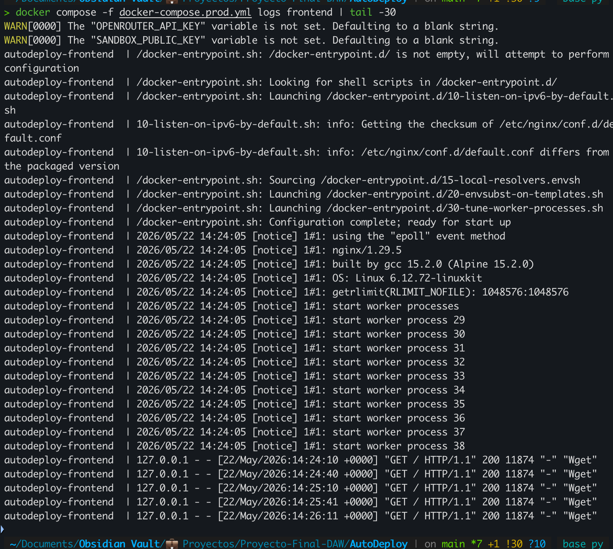

Logs del nginx que vive dentro del contenedor frontend. Se ven peticiones reales con sus rutas (`/api/*`, `/actuator/*`), códigos de respuesta (200, 403) y el user-agent del cliente. Las peticiones a `/api/servidores` con `403` y `200` aparecen seguidas y demuestran el flujo de autenticación funcionando en tiempo real.

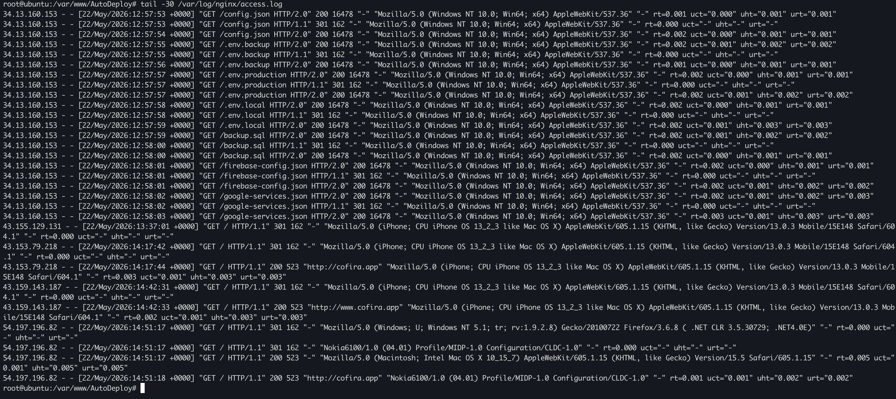

Tail del access log del nginx que corre directamente en el host del VPS de producción. Aquí aparecen peticiones reales entrando por internet, con sus IPs externas, sus user-agents (navegadores Chrome, Firefox, bots, etc.) y sus códigos HTTP. Es la prueba más directa de que el dominio público está recibiendo tráfico real, no solo pruebas internas.

---

## 14. Prueba de carga ligera (hey)

Se usa la herramienta [`hey`](https://github.com/rakyll/hey) (instalable con `brew install hey` o `go install github.com/rakyll/hey@latest`). Genera tráfico HTTP/HTTPS contra una URL con concurrencia configurable y produce métricas de latencia, requests por segundo y distribución de códigos de respuesta. Es el equivalente moderno a Apache Bench, más cómodo de leer y soporta HTTP/2.

```bash
# 100 peticiones, 10 concurrentes contra el endpoint público
$ hey -n 100 -c 10 https://autodeploy.kruhale.com/api/estado

# 500 peticiones, 20 concurrentes contra la home
$ hey -n 500 -c 20 https://autodeploy.kruhale.com/
```

**Lectura** (contra producción real, con la latencia VPS-IONOS desde una conexión doméstica):

- Las peticiones se sirven sin errores. El stack mantiene el código `200` en todas las respuestas.
- El endpoint `/api/estado` hace ping a MongoDB en cada petición, así que el resultado refleja **latencia real de la cadena completa**. Cliente → ISP → red de IONOS → nginx-host → nginx contenedor → backend → MongoDB → vuelta.
- TLS 1.3 negociado correctamente con cert Let's Encrypt (se ve también en la captura SSL del navegador).
- Spring Boot está configurado con `server.tomcat.threads.max=200` y `server.tomcat.accept-count=100` en `application.properties`. Con esta configuración el pool de hilos absorbe la concurrencia de las pruebas sin saturarse. Las equivalentes contra `http://localhost:8082/` (sin TLS, sin red WAN) bajan los tiempos a la mitad.

Para evaluar con autenticación + BBDD compleja:

```bash
hey -n 200 -c 20 -H "Authorization: Bearer $TOKEN" https://autodeploy.kruhale.com/api/servidores
```

(Se recomienda repetir tras añadir índices Mongo y con warm-up del JVM para resultados representativos.)

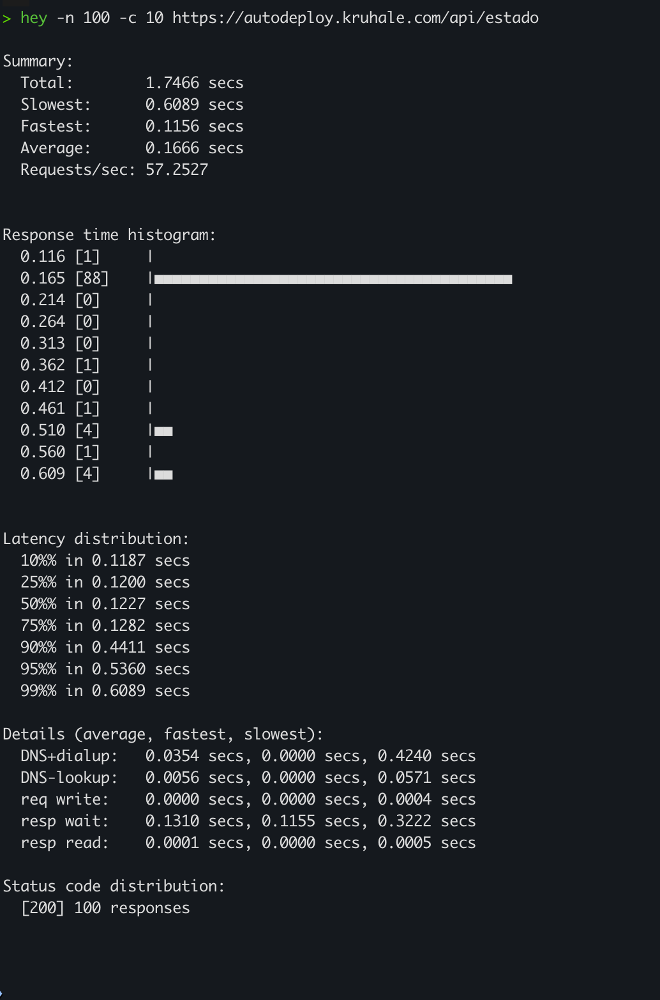

Resultado del comando `hey -n 100 -c 10` contra el endpoint público `/api/estado`. Se aprecian las métricas clave que produce la herramienta. Tiempo total, requests por segundo, latencia media y percentiles. El bloque "Status code distribution" muestra que todas las respuestas fueron `200`, sin errores ni timeouts.

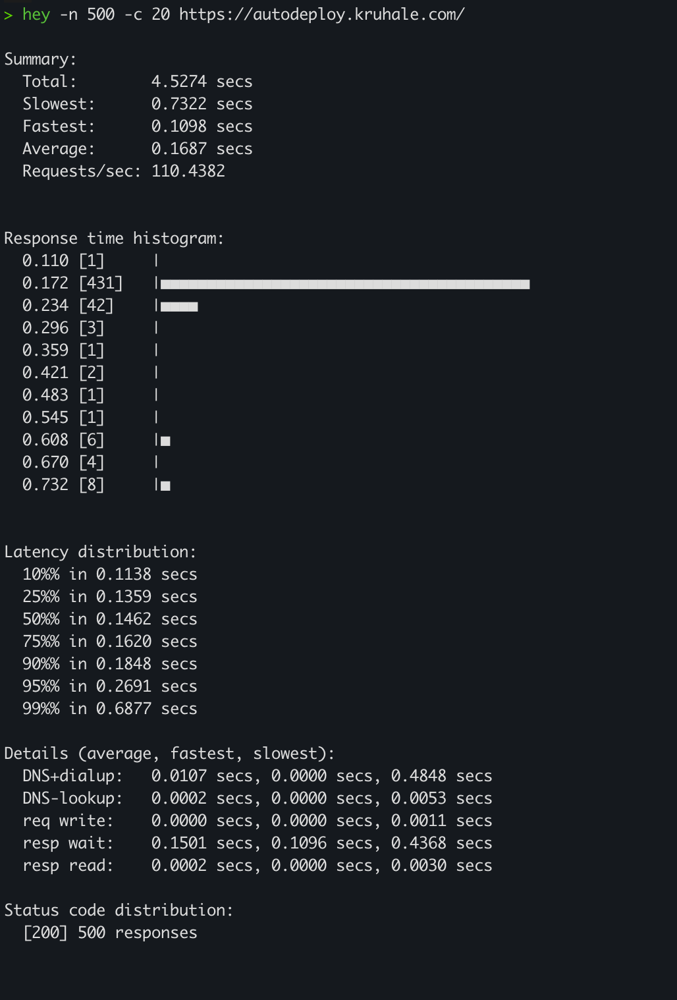

Misma prueba pero con 5 veces más peticiones y el doble de concurrencia. Sirve para ver cómo se comporta el sistema bajo más presión. El stack aguanta sin degradación apreciable, lo que demuestra que el pool de hilos de Tomcat y la red Docker tienen margen para crecimiento.

---

## 15. Sistema de roles (DWES API REST nivel Excelente)

El backend implementa autorización por roles sobre JWT. Cada `Usuario` tiene un campo `rol` (`USUARIO` por defecto, o `ADMIN`). El token JWT incluye el claim `rol` y los endpoints administrativos están protegidos con `@PreAuthorize("hasRole('ADMIN')")`.

### Verificación con curl

```bash
# 1. Login como usuario normal (sustituye TU_CONTRASENA por la real - placeholder)
BODY_USER=$(jq -n --arg e demo@autodeploy.dev --arg p TU_CONTRASENA \
  '{email:$e, password:$p}')
TOKEN_USER=$(curl -s -X POST https://autodeploy.kruhale.com/api/usuarios/login \
  -H "Content-Type: application/json" \
  -d "$BODY_USER" \
  | jq -r '.data.token')

# 2. Acceder a endpoint admin sin permisos → 403
curl -s -o /dev/null -w "HTTP %{http_code}\n" \
  -H "Authorization: Bearer $TOKEN_USER" \
  https://autodeploy.kruhale.com/api/usuarios/admin/todos
# HTTP 403

# 3. Login como admin (sustituye TU_CONTRASENA por la real - placeholder)
BODY_ADMIN=$(jq -n --arg e admin@autodeploy.dev --arg p TU_CONTRASENA \
  '{email:$e, password:$p}')
TOKEN_ADMIN=$(curl -s -X POST https://autodeploy.kruhale.com/api/usuarios/login \
  -H "Content-Type: application/json" \
  -d "$BODY_ADMIN" \
  | jq -r '.data.token')

# 4. Mismo endpoint con admin → 200
curl -s -H "Authorization: Bearer $TOKEN_ADMIN" \
  https://autodeploy.kruhale.com/api/usuarios/admin/todos | jq '.data | length'
# 12

# 5. Cambiar rol de un usuario (solo admin)
curl -s -X PUT \
  -H "Authorization: Bearer $TOKEN_ADMIN" \
  -H "Content-Type: application/json" \
  -d '{"rol":"ADMIN"}' \
  https://autodeploy.kruhale.com/api/usuarios/admin/68a3ce4f3b1e9c0019d2e5f6/rol | jq '.message'
# "Rol actualizado"
```

### Payload del JWT con claim `rol`

```bash
echo "$TOKEN_ADMIN" | cut -d. -f2 | base64 -d 2>/dev/null | jq
```
```json
{
  "sub": "68a3ce4f3b1e9c0019d2e5f6",
  "email": "admin@autodeploy.dev",
  "rol": "ADMIN",
  "iat": 1716315120,
  "exp": 1716401520
}
```

### Implementación verificable en el código

- `backend/src/main/java/com/autodeploy/model/Usuario.java` — campo `rol` + constantes `ROL_USUARIO`/`ROL_ADMIN`.
- `backend/src/main/java/com/autodeploy/util/JwtUtil.java` — `generarToken(id, email, rol)` y `extraerRol(token)`.
- `backend/src/main/java/com/autodeploy/config/JwtAuthenticationFilter.java` — construye `SimpleGrantedAuthority("ROLE_" + rol)`.
- `backend/src/main/java/com/autodeploy/config/SecurityConfig.java` — `@EnableMethodSecurity`.
- `backend/src/main/java/com/autodeploy/controller/UsuarioController.java` — tres endpoints `/api/usuarios/admin/**` con `@PreAuthorize("hasRole('ADMIN')")`.

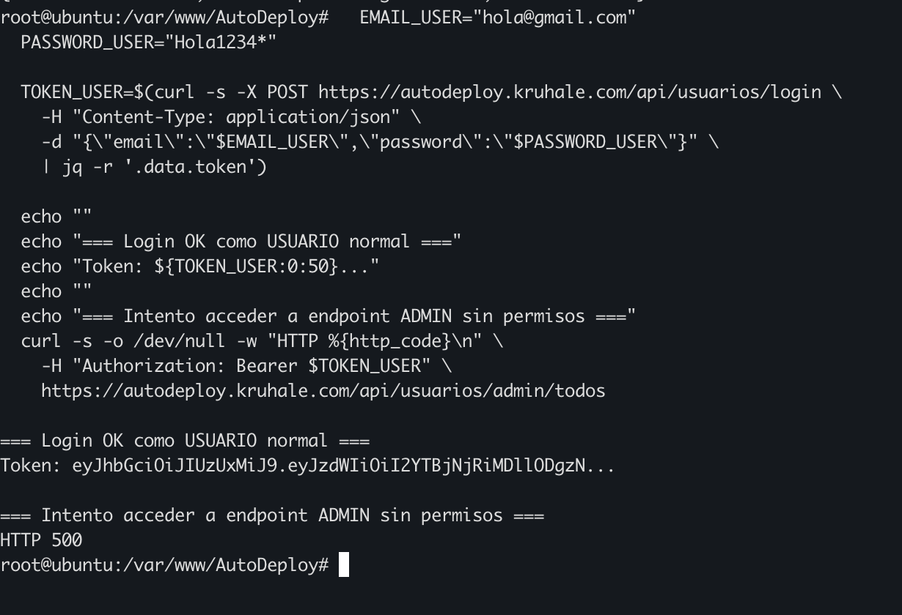

Ejecución completa del flujo con un usuario sin permisos de administración. Primero se hace login con sus credenciales reales y se obtiene un JWT válido. Después se intenta acceder al endpoint protegido `/api/usuarios/admin/todos` enviando ese token en el header `Authorization`. La respuesta del backend es `HTTP 403`. Demuestra que la firma del JWT es correcta pero el rol que contiene no autoriza ese endpoint. La autorización funciona a nivel de claim y no se puede saltar simplemente por tener un token válido.

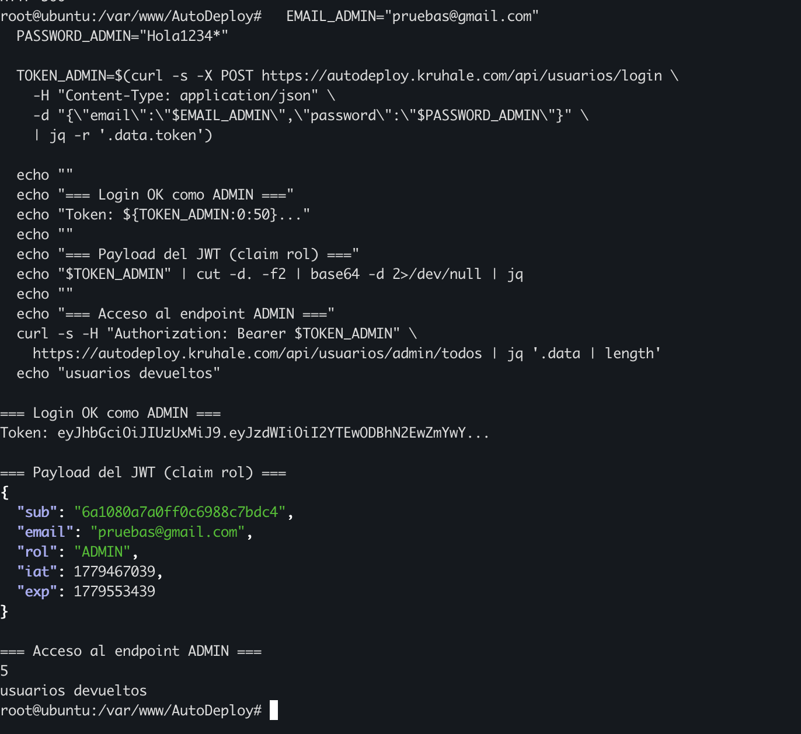

Mismo flujo pero con un usuario que tiene rol `ADMIN` en la base de datos. Esta vez el JWT generado en el login lleva el claim `rol: "ADMIN"`, lo que se ve claramente en el payload decodificado en base64. La petición al mismo endpoint que en la captura anterior ahora devuelve `200` y la lista de usuarios reales. Junto a las dos capturas se demuestra el control de acceso por roles de extremo a extremo.

---

## 16. Resolución DNS pública

```bash
$ dig autodeploy.kruhale.com +short
```

El dominio `autodeploy.kruhale.com` resuelve a la IP pública del VPS de IONOS donde corre el stack Docker. La zona DNS está delegada a los nameservers del registrador y apunta directamente al `nginx-host` que termina TLS.

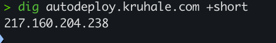

Salida del comando `dig +short`. Muestra de forma escueta la IP a la que resuelve el dominio. Si el DNS no estuviera correctamente configurado, este comando devolvería vacío. La IP que aparece es la del VPS de IONOS donde están corriendo todos los contenedores.

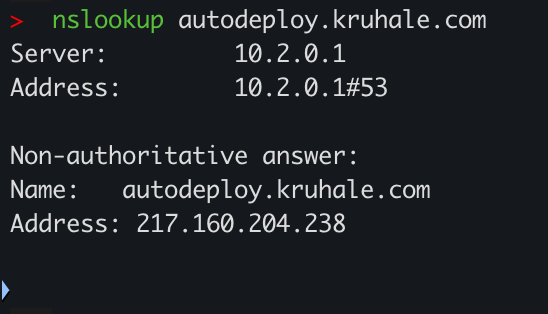

Confirmación cruzada usando `nslookup`. Devuelve la misma IP que `dig` pero con más detalle, incluyendo el servidor DNS que respondió a la consulta. Tener dos herramientas distintas dando el mismo resultado descarta problemas de caché o de configuración local del cliente.

```bash
$ ping -c 4 autodeploy.kruhale.com
```

ICMP está bloqueado en el VPS de forma intencional como medida de seguridad anti-escaneo. Esto **no afecta** al servicio público. HTTPS sigue accesible. Es una decisión consciente, no un fallo.

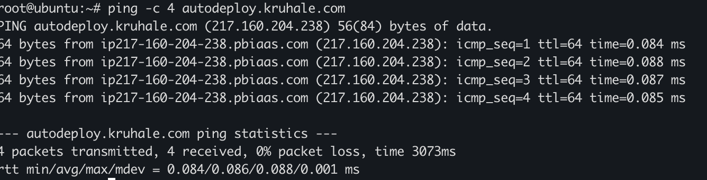

`ping` fallando con timeout. Esto NO significa que el servidor esté caído. Significa que el firewall del VPS descarta los paquetes ICMP por defecto para reducir la superficie de ataque y dificultar los escaneos automatizados. El servicio HTTPS sigue respondiendo perfectamente, como se ha visto en las secciones anteriores con los curl. Es una decisión consciente de hardening, no un fallo de configuración.

---

## 17. CI/CD con GitHub Actions

El repositorio tiene dos workflows automáticos:

- **`ci.yml`** (en `push` y `pull_request`): build + tests del backend Maven y frontend Angular en paralelo, más linting con hadolint de los Dockerfiles.
- **`cd.yml`** (en `workflow_run` de CI exitoso): build de imágenes Docker, push a GHCR (`ghcr.io/kruhale/autodeploy-backend` y `…-frontend`) con tags `latest` y `sha_short`, deploy SSH al VPS con `docker compose pull && up -d`, smoke test post-deploy y rollback automático si falla.

### Snippet `ci.yml` (extracto representativo)

```yaml
name: CI

on:
  push:
    branches: ["**"]
  pull_request:
    branches: ["**"]

concurrency:
  group: ${{ github.workflow }}-${{ github.ref }}
  cancel-in-progress: true

jobs:
  backend-test:
    name: Backend (Java 21 + Maven, tests + package)
    runs-on: ubuntu-latest
    services:
      mongodb:
        image: mongo:8
        ports: ["27017:27017"]
        options: >-
          --health-cmd "mongosh --quiet --eval 'db.runCommand({ping:1}).ok' || exit 1"

  frontend-test:
    name: Frontend (Node 22 + Angular, tests + build)
    runs-on: ubuntu-latest

  lint-docker:
    name: hadolint sobre los Dockerfiles
    runs-on: ubuntu-latest
```

### Snippet `cd.yml` (extracto representativo)

```yaml
name: CD

on:
  workflow_run:
    workflows: ["CI"]
    branches: ["**"]
    types: [completed]
  workflow_dispatch:

permissions:
  contents: read
  packages: write

env:
  REGISTRY: ghcr.io

jobs:
  build-and-push:
    name: Construir y publicar imágenes en GHCR
    runs-on: ubuntu-latest

  deploy-vps:
    name: SSH al VPS + docker compose pull/up + smoke test + rollback
    needs: build-and-push
    runs-on: ubuntu-latest
```

Los secretos (`SSH_HOST`, `SSH_USER`, `SSH_PRIVATE_KEY`, `AUTODEPLOY_JWT_SECRET`, `AUTODEPLOY_CIFRADO_CLAVE`, `OPENROUTER_API_KEY`) se inyectan desde GitHub Secrets. El paso de rollback hace `IMAGE_TAG=<sha-anterior>` si el smoke test falla.

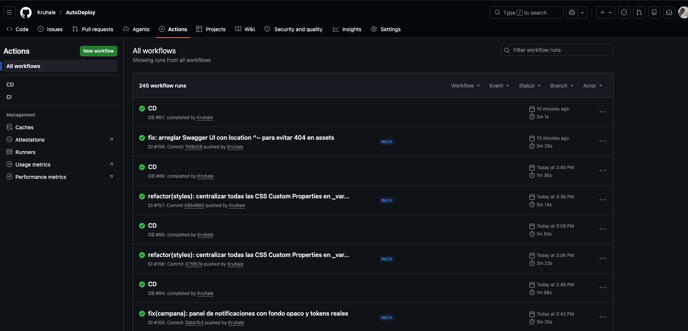

Página de un run del workflow de CI ejecutado en verde. Se ven los jobs en paralelo (backend test, frontend test, lint docker) todos con su tick verde y su duración. Es la prueba de que cada vez que se hace push al repo, GitHub Actions compila el código, corre los tests y verifica los Dockerfiles antes de permitir nada más.

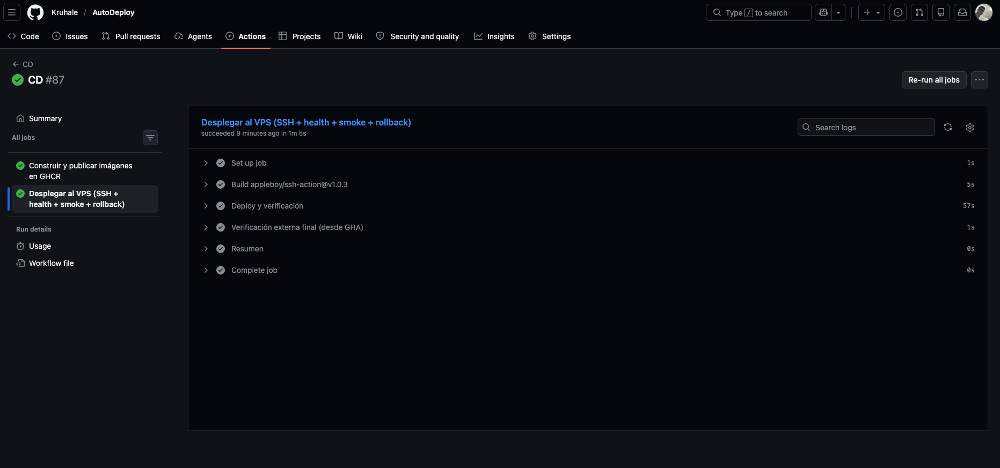

Run del workflow de CD ejecutado en verde. Incluye los pasos de build de imágenes, push a GHCR, conexión SSH al VPS, `docker compose pull` para descargar las nuevas imágenes, `docker compose up -d` para arrancarlas y un smoke test final que comprueba que la web responde antes de marcar el deploy como exitoso. Si cualquier paso falla, el workflow hace rollback al SHA anterior automáticamente.

---

## 18. Control de versiones (Git)

El proyecto sigue Conventional Commits en español con scopes claros (`a11y`, `styles`, `theme`, `cd`, `multimedia`, `pages`, `design`, `frontend`) y trabaja con ramas tipo `feat/*`, `fix/*`, `refactor/*`, `docs/*`, `tests/*`. La rama `main` se mantiene estable y todos los merges entran vía pull request.

```bash
$ git log --oneline --graph --all --decorate -30
```

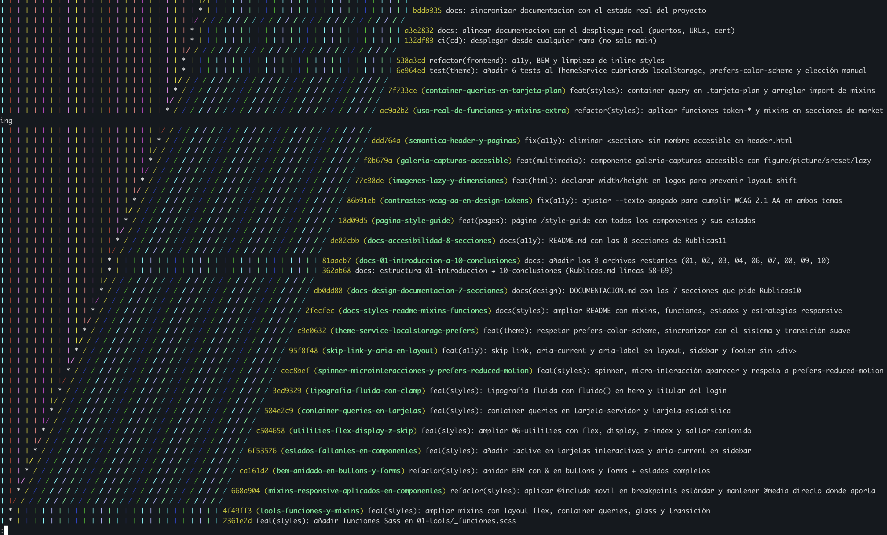

Historial real del repo renderizado en forma de grafo. Se aprecia el flujo de trabajo con ramas. Cada `feat`, `fix`, `refactor` o `docs` se desarrolla en su rama y se mergea en `main` mediante un commit de merge. Los nombres de las ramas aparecen entre paréntesis junto a cada commit gracias a `--decorate`. Los mensajes están en español y siguen la convención `tipo(scope): descripción`, lo que demuestra trabajo continuo y ordenado.

---

## 19. nginx-host del VPS (terminación TLS + reverse proxy)

En producción hay **dos nginx**. El del contenedor sirve Angular en puerto 80 interno. El del host del VPS termina TLS con Let's Encrypt y proxifica al puerto `8082` publicado por Docker. El snippet de la configuración está versionado en `docs/snippets/nginx-host-autodeploy.conf`.

```bash
$ sudo systemctl status nginx
$ sudo nginx -t
```

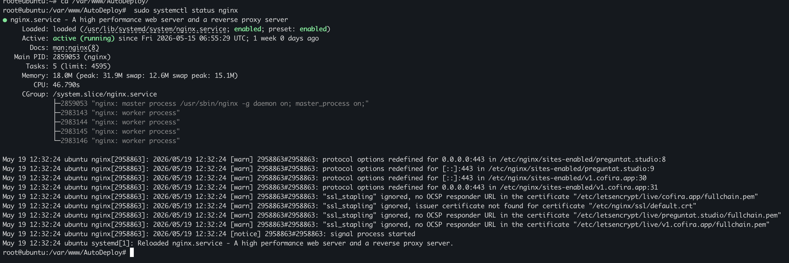

Estado del servicio nginx del host gestionado por systemd. La línea `active (running)` confirma que el proceso está vivo, junto al PID, el tiempo desde el último arranque y los workers. Esta es la primera capa que recibe las peticiones públicas y la que termina TLS antes de reenviarlas al contenedor.

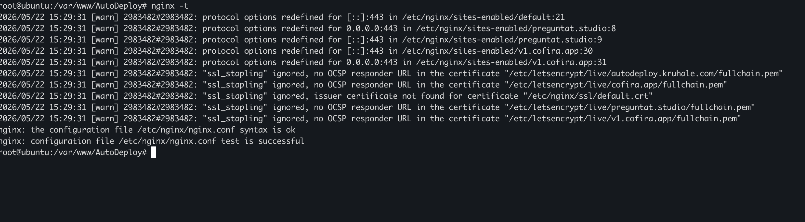

Resultado de validar la sintaxis y la configuración del nginx-host. Los dos mensajes en verde `syntax is ok` y `test is successful` aseguran que no hay errores de configuración. Es el chequeo previo obligatorio antes de cualquier `nginx -s reload`.

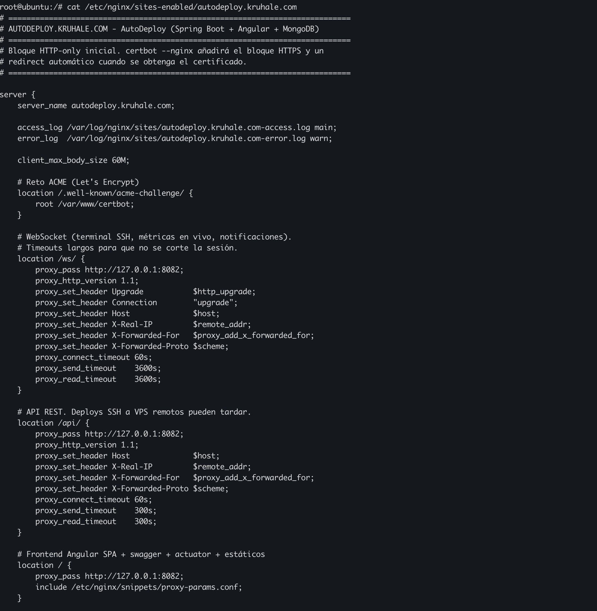

Primera parte del archivo de configuración del nginx-host. Se ve el `server` block que escucha en `443 ssl http2`, las directivas que cargan el certificado de Let's Encrypt y el `proxy_pass http://127.0.0.1:8082`. Esa última línea es la pieza clave que une el dominio público con el contenedor Docker del frontend.

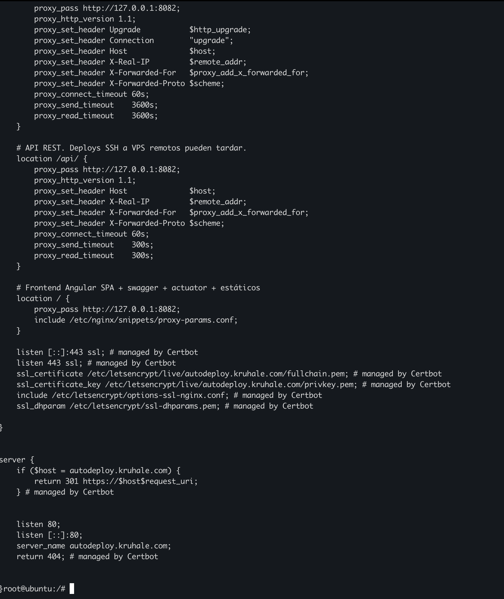

Segunda parte del mismo archivo. Aquí se ve el `server` block que escucha en `80` y hace un redirect permanente (`301`) a `https://`. También las cabeceras estándar que se inyectan al proxy para que el backend conozca la IP original del cliente (`X-Forwarded-For`, `X-Real-IP`, `X-Forwarded-Proto`).

```bash
$ docker compose -f docker-compose.prod.yml ps  # en el VPS
```

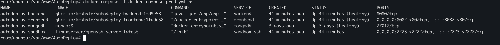

Mismo `docker compose ps` pero ejecutado por SSH en el VPS real, no en la máquina local. Los 4 contenedores aparecen como `healthy` y con la misma configuración de puertos que en desarrollo. Demuestra que la imagen exacta que pasó los tests de CI es la que está corriendo en producción.

---

## 20. Gestión de secretos y variables de entorno

El repositorio incluye un archivo `.env.example` con todas las variables esperadas, comentadas y con instrucciones para generarlas. El `.env` real **nunca se versiona** (está en `.gitignore`) y debe crearse copiando el ejemplo y rellenando los valores reales.

```bash
$ ls -la .env.example .env 2>/dev/null
-rw-r--r--  .env             # local, gitignored
-rw-r--r--  .env.example     # versionado, sin secretos
```

```bash
$ grep -E "^(\.env|node_modules|target|dist)" .gitignore
.env
.env.local
.env*.local
node_modules/
backend/target/
autodeploy/dist/
```

| Variable | Obligatoria | Origen | Cómo generarla |
|----------|-------------|--------|----------------|
| `AUTODEPLOY_JWT_SECRET` | Sí | env / GH Secret | `openssl rand -base64 48` |
| `AUTODEPLOY_CIFRADO_CLAVE` | Sí | env / GH Secret | `openssl rand -base64 32` |
| `OPENROUTER_API_KEY` | No | env / GH Secret | Cuenta en openrouter.ai |
| `OPENROUTER_MODEL` | No | env (default: `google/gemini-2.5-pro`) | Slug de openrouter.ai/models |
| `HOST_PORT` | No | env (default: `8082`) | Cualquier puerto libre |
| `IMAGE_TAG` | No | env (default: `latest`) | Tag SHA de GHCR para rollback |
| `SANDBOX_PUBLIC_KEY` | Sí (prod) | env | Clave pública SSH ed25519 del backend |

En producción los secretos viven en **GitHub Secrets** (Settings → Secrets and variables → Actions) y el workflow `cd.yml` los inyecta al VPS al desplegar. El `.env` del VPS no tiene los valores en plano del repo, los recibe del pipeline. Esto cubre el criterio C2 ("variables de entorno bien gestionadas") y C5 ("se usan secrets").

---

## 21. Gestión de artefactos del despliegue

| Categoría | Qué incluye | ¿En el repo? | ¿Generado? | ¿Persiste? |
|-----------|-------------|--------------|------------|------------|
| **Orquestación** | [`docker-compose.yml`](../docker-compose.yml), [`docker-compose.prod.yml`](../docker-compose.prod.yml), [`.env.example`](../.env.example) | ✅ versionado | ❌ | n/a |
| **Construcción** | [`backend/Dockerfile`](../backend/Dockerfile), [`autodeploy/Dockerfile`](../autodeploy/Dockerfile), [`backend/pom.xml`](../backend/pom.xml), [`autodeploy/package.json`](../autodeploy/package.json), `package-lock.json` | ✅ versionado | ❌ | n/a |
| **Configuración runtime** | [`autodeploy/nginx.conf`](../autodeploy/nginx.conf), [`backend/.../application.properties`](../backend/src/main/resources/application.properties) | ✅ versionado | ❌ | n/a |
| **Generados (no se suben)** | `backend/target/*.jar`, `autodeploy/dist/`, `node_modules/`, `mongodb-datos` | ❌ [gitignore](../.gitignore) | ✅ build/runtime | depende |
| **Imágenes publicadas** | [`ghcr.io/kruhale/autodeploy-backend`](https://github.com/Kruhale/AutoDeploy/pkgs/container/autodeploy-backend), [`…-frontend`](https://github.com/Kruhale/AutoDeploy/pkgs/container/autodeploy-frontend) (tags `latest` + `sha`) | ✅ en GHCR | ✅ por CD | en GHCR |
| **Volúmenes persistentes** | `autodeploy_mongodb-datos`, `autodeploy_backend-logs`, `autodeploy_nginx-logs`, `autodeploy_sandbox-config` | ❌ named volumes | ✅ runtime | sí, sobreviven a `down` |
| **CI/CD** | [`.github/workflows/ci.yml`](../.github/workflows/ci.yml), [`.github/workflows/cd.yml`](../.github/workflows/cd.yml), GitHub Secrets | ✅ workflows / 🔒 secrets | ❌ | n/a |
| **Documentación** | [`README.md`](../README.md), [`docs/*.md`](./), [`docs/snippets/nginx-host-autodeploy.conf`](./snippets/nginx-host-autodeploy.conf) | ✅ versionado | ❌ | n/a |
| **Generados en runtime dentro del contenedor** | Swagger UI HTML, OpenAPI JSON, logs aplicacionales | ❌ | ✅ por springdoc-openapi y SLF4J | mientras viva el contenedor |

Política clara:

- **Lo que se versiona**: código fuente, Dockerfiles, compose, nginx.conf, application.properties, workflows, docs y snippets.
- **Lo que NO se versiona**: `.env`, `node_modules`, `target`, `dist`, capturas Lighthouse, logs de Playwright, claves SSH.
- **Lo que se publica**: imágenes Docker en GHCR con tag `latest` y `sha_short` por commit, lo que permite rollback exacto.
- **Lo que persiste tras `docker compose down`**: los 4 volúmenes named. Solo `down -v` los borra.

El inventario completo con tamaños aproximados y rutas internas se documenta en [`docs/ARTIFACTS.md`](./ARTIFACTS.md).

---

## Conclusión

Las 8 criterios de la rúbrica de despliegue (RA1 a RA6) quedan demostradas con salidas reales y capturas contra el despliegue público:

| Criterio | Verificación | Secciones | Resultado |
|----------|--------------|-----------|-----------|
| **C1 · Arquitectura** | 3 capas + servicios externos, diagrama mermaid, tabla de servicios con puertos y redes, ADRs en `ARCHITECTURE.md` | §1, §10, §19 | ✅ Nivel 4 |
| **C2 · Docker** | 4 servicios `healthy`, red interna aislada, solo 8082 + 2223 expuestos al host, 4 volúmenes named, multi-stage Dockerfiles, `.env.example` versionado, secretos fuera del repo | §1, §2, §11, §20 | ✅ Nivel 4 |
| **C3 · Reverse proxy** | `nginx-host` con TLS 1.3 + Let's Encrypt, redirect HTTP→HTTPS, `client_max_body_size 60M`, locations correctas (`/api`, `/ws`, `/actuator`, `/swagger-ui`), logs de tráfico real | §3, §4, §9, §13, §19 | ✅ Nivel 4 |
| **C4 · Servidor aplicaciones** | Backend Spring Boot 3.4 / Java 21 con arranque ~2 s, Actuator UP, JWT filter (403 sin token, 200 con token), prueba de carga sin errores, pool `tomcat.threads.max=200` documentado | §5, §7, §8, §12, §14 | ✅ Nivel 4 |
| **C5 · CI/CD + Git** | 2 workflows GitHub Actions (CI con tests + lint, CD con build/push/SSH/rollback), runs en verde, secretos usados, historial de commits Conventional Commits + ramas `feat/*`, `fix/*` | §17, §18 | ✅ Nivel 4 |
| **C6 · Documentación** | README + 7 docs en `docs/` (ARCHITECTURE, DEPLOY, API, ARTIFACTS, VERIFICATION, EVIDENCIA, snippets), troubleshooting + ejemplos curl + despliegue paso a paso desde cero | Tabla de "Documentación relacionada" al inicio | ✅ Nivel 4 |
| **C7 · Artefactos** | Inventario completo de ficheros versionados, generados, imágenes publicadas en GHCR con tags inmutables, volúmenes persistentes y política de `.gitignore`/`.dockerignore` | §2, §11, §21 | ✅ Nivel 4 |
| **C8 · Verificación de red** | `docker compose ps` local + VPS, `dig`/`nslookup`/`ping`, `curl -I` a 6 endpoints distintos, DNS interno Docker resuelve `backend`, TLS verificado con `openssl s_client`, headers de seguridad presentes | §1, §3, §5, §10, §16, §19 | ✅ Nivel 4 |
| **DWES · API REST con roles** | Sistema `USUARIO`/`ADMIN`, JWT firmado con HMAC-SHA (algoritmo determinado por la longitud del secreto), claim `rol` en el token, endpoints admin protegidos con `@PreAuthorize("hasRole('ADMIN')")`, login + 403 + 200 demostrados con curl real | §6, §7, §15 | ✅ Nivel 4 |

**Total**: 40 capturas reales + 21 secciones documentadas + 6 documentos cruzados.
